# Games202

## Real-Time Shadows

### Shadow Mapping

Shadow是一个2 Pass的算法。第一次先从Light Pass中，生成Light能看到的最浅深度。接下来在相机位置出发，配合Shadow Map进行场景渲染。

这是一个完全在图像空间中的算法， 为了得到阴影，只需要map。但这样，会出现自遮挡现象和锯齿。Shadow Mapping是最著名的阴影渲染，在早期离线渲染也使用过这种方法。

Pass 1：从Light出发，生成深度图，是一个depth buffer

Pass 2：从Eye出发，判断看到的距离和深度图记录的距离

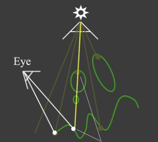

在透视投影的过程中，点都会被推向远平面。此时的$z$不是点到light的距离，此时在比较既可以使用 新的$z$值，也可以使用实际距离。

那么Shadow Mapping有什么问题呢？由数值精度会造成一些奇怪的纹路。

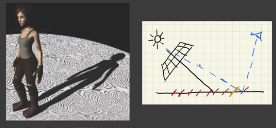

每个像素要记录一个深度，那么在一个像素内部，深度是一个常数。如果从Light看向场景，在Shadow Map看来，场景离散成一系列常值的深度，依据像素出发。在渲染Pass的时候，可能两条光线虽然差的不多，但是却打到了更浅的地方，导致自遮挡现象。

当Light非常大，几乎平行的照向地面，会导致非常严重的自遮挡。

纠正这个问题，最简单的方法是设一个bias，在$[h-E,h+E]$都认为未发生遮挡。这个容忍区间可以和光线与地板的夹角挂钩，夹角小一点就容忍范围大一点，除去自遮挡的情况。

可是引入bias，就引入了另外一个问题：detached shadow

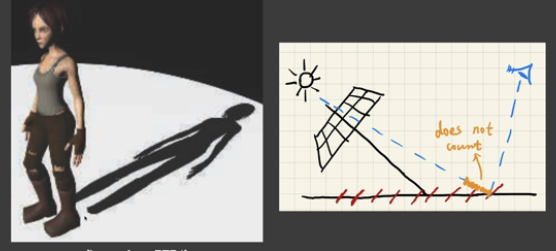

在比较接近的地方会失去阴影。所以工业界主要是通过调参解决。

学术界提出了Second-depth shadow mapping：每个像素不仅存最小深度，同时维护一个次小深度。用最小深度和次小深度中间的深度来进行比较，就可以得到结果。

但是，这种做法由很多问题。首先模型需要有反面（watertight），但比如一张纸是很麻烦的。同时，想要记录次小深度，虽然复杂度是$O(n)$，但是实现要更为复杂。

> RTR does not trust in COMPLEXITY.
>
> 在实时渲染中，要求非常苛刻，所以每一帧只有很少的时间在做一些效果。

另外，Shadow mapping存在aliasing，如果分辨率不够，就可能出现锯齿。

### Math Behind Shadow Mapping

在实时渲染中，比起不等号，我们更倾向于近似性——于是我们将不等式拿来当作近似式，也就是
$$
\int_\Omega f(x)g(x) dx \simeq \frac{\int_\Omega f(x)dx}{\int_\Omega dx} \cdot \int_\Omega g(x)dx
$$
 将乘积积分近似当作两个积分来求解。这个分母是一个归一化的常数，不妨假设$f(x)=2$，$\Omega:[0,3]$，那么$2\int g(x)dx = 6/3 \int g(x)dx$。

当

- $g$的support很小（类似于积分域）
- $g$足够smooth（在积分域变动不大）

那么，我们将其带入渲染方程中，

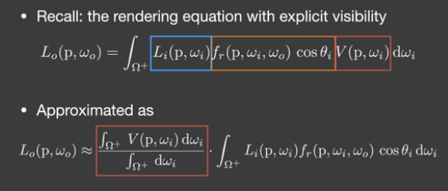

对于点光源和平行光源，由于support很小，而BRDF为diffuse、光照为面光源的时候，变化都不会很大，所以近似成立。

拆出来的这项就是Shadow Mapping。

### Percentage Closer Soft Shadows(PCSS)

Shadow Mapping得到的是硬阴影，但我们更倾向于软阴影。

我们需要一个工具，即Percentage Closer Filtering(PCF)。这个方法本来是被开发用来anti-aliasing的，现在被应用在软阴影上。它的核心就是对一系列结果的Filtering。

在比较的时候，我们还是判断是否在阴影里。我们去找投影到的方向对应的Shadow Map多个像素，比如3x3的像素。每个点都进行比较，然后加权平均。比如我们得到结果是`1 0 1 ; 1 0 1 ; 1 1 0`，再取平均值，获取到的是visibility。它所filter的是shading points做的很多阴影的比较结果。

如果用比较小的Filter size，得到的结果会很锐利；如果用比较大的filter，结果会比较糊。那么我们是不是能用比较大的Filter做PCF，得到的就是软阴影？

容易发现一个很有意思的现象：离得物体比较近的地方，阴影比较硬；比较远的地方，阴影比较软。也就是阴影的软硬程度取决于和遮挡物的距离，那么我们应该在不同位置上取不同大小的filter size。我们将遮挡物和接受物的距离定义为blocker distance

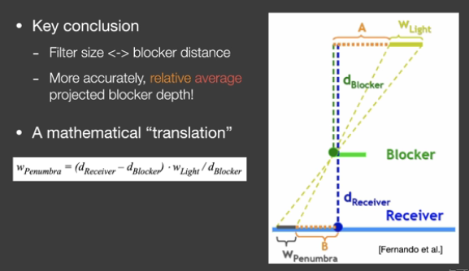

这个图可以解释很多问题。当$d_{receiver}$很小的时候，这个$w_p$，即filter的范围就会很小。从相似三角形就可以算出来$w_p$的值。

总体来说，PCSS分成三步：

- 计算Blocker平均深度（Blocker Search）
- 决定Filter size
- 进行PCF

对Blocker Search，可以取固定面积在上面求平均距离，也可以连向Map看覆盖区域

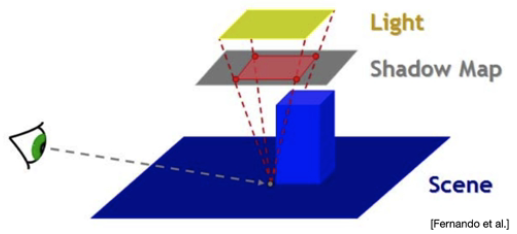

事实上，这一过程本质是一种卷积。即
$$
[w*f](p) = \sum_{q\in N(p)} w(p,q) f(q)
$$
而在PCSS中，我们做的实际上是Shadow Map上周围一圈对应的
$$
V(x) = \sum_{q\in N(q)} w(p,q) \cdot \chi^+ [D_{SM}(q) - D_{Scene}(x)]
$$
其中$\chi^+(x) = \begin{cases}1, x > 0 \\ 0, x < 0\end{cases}$，按照这种形式进行加权。

因此，PCF并非对ShadowMap进行Filter，即
$$
V(x) \ne \chi^+\{[w*D_{SM}](q) - D_{scene}(x)\}
$$
也不是在结果上进行模糊，即
$$
V(x) \ne \sum_{q \in N(q)} w(p,q)V(q)
$$
在这一系列过程中，哪些过程比较慢呢？就是因为第一步和第三步需要记录所有深度再进行比较，对于比较大的filter范围就会比较慢。一种比较简单的方法是在其中随便取一些样本，可能会造成Noise，这也是作业的实现方法。工业界则一般只取其中的若干个，也就是一种稀疏采样。在得到噪声的结果之后，可以再做一次图像空间的降噪。

这还有可能出现flicker的现象，就是因为在时间上采样结果不同，所以noisy的结果也不同。因此就会觉得游戏播放的时候会有些闪烁。

### Variance Soft Shadow Mapping(VSSM)

在这个搜索过程中，我们实际需要求解的是有多少texel比$t$要多。这就类似于想知道自己的排名，需要把其他人的成绩都看一遍。

但是有这样一种近似。如果我们知道成绩的直方图，而我知道我落在哪个区间中，那么就能直接得到自己排名的近似——更进一步，我们可以用正态分布，来估计出最后结果。

所以VSSM的核心就在于对正态分布的假设，而我们需要的只是均值和方差。

给一个区域，要快速求平均值，应该如何求解呢？——MipMap。另一种更精确的数据结构是Summed Area Tables，也就是SAT。

方差更复杂一点，但是我们知道
$$
D(X) = E(X^2) - E^2(X) 
$$
只需要对深度图求一遍平方，就可以得到平方的期望。得到之后可以用Gauss积分，得到数值解。

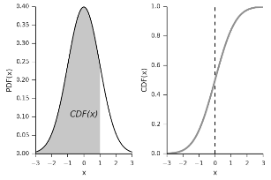

VSSM更进一步，使用Chebychev不等式直接估计
$$
P(x>t) \le \frac{\sigma^2}{\sigma^2+(t-\mu)^2}
$$
可以把它直接当成面积。这一不等式作为应用条件，需要对$t>\mu$，但是即便如此这个近似还是比较优秀的。也就是
$$
P(x\le t) = \frac{(t-\mu)^2}{\sigma^2+(t-\mu)^2}
$$
这样，求平均和计算的复杂度都降到了$O(1)$。

注意，如果有物体和光源移动，都需要重新做MipMap，所以这个操作还是有一定开销的。但是生成MipMap等步骤GPU支持非常优秀，所以速度会很快。

上面的一系列问题实际上解决的是PCSS的第三步，但是第一步还没有解决，也就是求解遮挡物的平均深度。比如

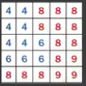

可能只有蓝色的一部分是遮挡物，我们需要求的是这部分的深度平均值。

假设物体的深度是$t$，那么定义遮挡物的平均深度为$z_{occ}$，非遮挡物的平均深度为$z_{unocc}$。假设遮挡物数量为$N_1$，非遮挡物深度为$N_2$，那么一定满足
$$
\frac{N_1}{N}z_{occ} + \frac{N_2}{N} z_{unocc} = z_{avg}
$$
由于
$$
\frac{N_2}{N} \simeq P(x > t)
$$
更进一步，我们大胆假设$z_{unocc} = t$，因为阴影接收者几乎是平面。
$$
z_{occ} = \frac{z_{Avg} - P(x>t)\cdot t}{1-P(x>t)}
$$
VSSM充满大胆的假设和精妙的观察。由于我们对图像空间的降噪手段越来越多，所以我们对噪声容忍度变高了。当平面和光源不平行的时候，VSSM就会出现一些错误。

### MIPMAP and Summed Area Table

MIPMAP做的是快速的近似的方形的查询。由于查询涉及到插值，所以可能会出现近似。

为此，我们引入Summed Area Table（SAT）。

首先引入一维前缀和的概念。定义前缀和数组
$$
s[i] = s[i-1]+a[i]
$$
那么$[l,r]$的和
$$
q(l,r) = s[r] - s[l-1]
$$
推广到2D，对行和列都分别做一遍，查询的时候
$$
Q(l,r,s,w)=S(s,w)-S(l-1,w)-S(s,r-1)+S(l-1,r-1)
$$
这一做法要兼顾到GPU并行度，如果实现不好可能复杂度会比较高。

### Moment Shadow Mapping

VSSM的主要问题在于，比如下图

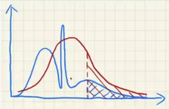

红色面积是估计挡不住的，而蓝色的是实际的，就有可能出现阴影突然变白，称这种现象叫做Light Leaking。那能不能让VSSM对分布的描述更准一些呢？我们用原点矩来进行估计。

VSSM实际上只用了二阶矩来进行估计。从结论而言，$m$阶矩可以表示由一系列由$\frac{m}{2}$个台阶的阶跃函数集合。

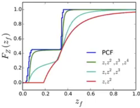

实际上这就类似于一种展开，让矩尽可能和实际结果近似。一般常常使用四阶矩，达到一个比较好的近似，所以可以使用$z,z^2,z^3,z^4$的Shadow Map进行求解。这个求解过程比较复杂，所以不做展开了。

### Distance Field Soft Shadows

这是一个非常快，但需要大量存储的技术。

Distance Field是空间中任意一个点到物体表面上的最小距离。这个距离场可以带正负号，即物体内部还是外部，所以这个时候这个距离是有向的（signed distance field, SDF）。比如

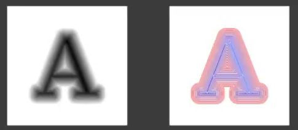

这样的图可以表示A的SDF。考虑下面的例子：

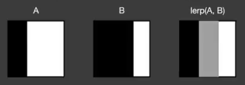

黑色的物体从A移动到B，黑色的就是边界。如果我们对两张图每一个像素都进行线性插值，得到的结果就是右边的图。

因此，简单的平均得到的并不是移动的边界，更像是一个过渡带。

而我们反过来，对SDF进行插值

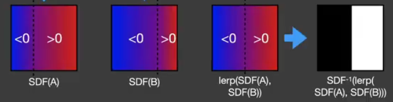

那么这张图恢复出来，对应的SDF反应了阴影的移动。所以SDF可以表示物体边界，表示物体之间的blending。

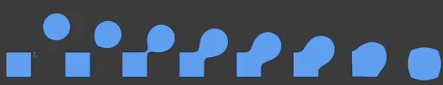

SDF的背后和最优传输理论关系较大。

第一种用法是Ray Marching。用光线追踪，假如有一根光线，光线和SDF隐含表面求交的方法就是sphere tracing。任意一点的SDF表示点到场景中其他物体的最小距离，那么在最小距离之内，点不可能和其他物体相交。

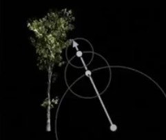

例如这张图，我们知道SDF，就可以在这个方向上根据SDF的距离进行trace，也就是图上的点。换言之，对任意p点，移动SDF(p)总是安全的。

SDF具有很好的性质，如果多个物体都有SDF，那么任意点的位置只需要取所有SDF的最小值，因此SDF的计算是独立的，对运动的物体可以直接修改。

第二种用法就是软阴影的生成。SDF实际上说明了一个安全角度：

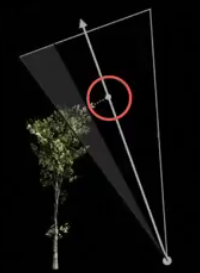

比如这个点，从shading point（下面的点）出发，就会有一个safe angle（白色边界和光线方向的夹角）。所以现在的问题就是，如何得到这个安全角度？

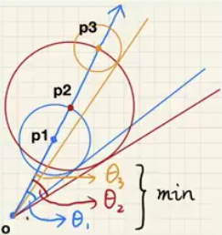

我们可以按ray marching的思路，依循o->p1->p2->...，得到一系列的安全角度。在这些角度中取最小，得到的安全角就是对阴影偏黑还是偏白的估计。

很直观的，我们用
$$
\arcsin \frac{SDF(\vec p)}{||\vec p-\vec o||}
$$
求安全角。为了简化操作，一般直接使用
$$
\min \{\frac{kSDF(\vec p)}{||\vec p -\vec o||},1.0\}
$$
来作为量度。引入k可以方便的表示出来在什么时候有较好的过渡，k大的话很小的安全角度也会被当成1，得到的阴影比较硬。

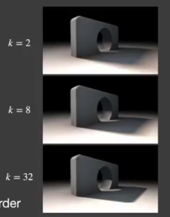

下面是一张可视化的distance field：

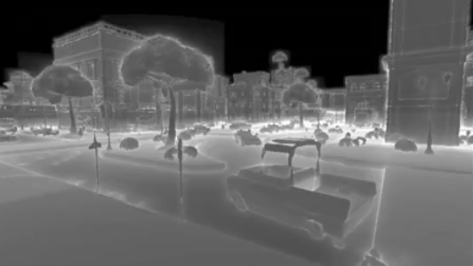

在Ray Marching的体系下，软阴影和硬阴影是没有复杂度区别的。但是这样的速度是建立在距离场的生成上的，所以预计算复杂度较高，存储空间很大，只能针对静态物体。现在很多研究是针对场景建立数据结构，并依据节点内距离变化程度来划分子节点。

## Realtime Environmental Mapping

### Image-Based Lighting(IBL)

环境光照一般由Cube Map或Sphere Map给出。首先讨论给出环境光照，如何进行shading呢？

考虑Rendring Equantion，Visibility项并不考虑。IBL定义了$L_i$项，接下来就是用Monte Carlo Integration得到无偏估计。但这种做法需要大量样本，所以这个做法会非常慢。因此，sampling一般都不在shader中使用。那么如何避免它呢？

先考虑两种情况。如果是很glossy的BRDF，它覆盖的球面范围其实非常小；如果是很diffuse的BRDF，覆盖区域很大，但是非常Smooth，只有类似$\cos$的平滑过渡。所以我们考虑经典的近似方案
$$
L_o = \frac{\int_{\Omega_G} L_i(p,w_i) dw_i }{\int_{\Omega_G} dw_i} \int_{\Omega^+} f_r(p,w_i,w_o) \cos \theta_i dw_i
$$
由于brdf往往覆盖区域小，或者很平滑，所以这种近似成立。而第一项实际上就是一种模糊，所以实质上就是做pre-filtering，预处理一系列filter后的值。

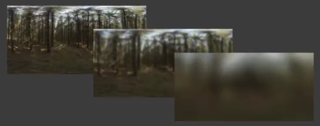

那么这个时候我们得到了和mipmap非常相似的结果——比如，我们需要用5的滤波核，可以在4、8的图上进行三线性插值，得到任意大小filter之后的值。

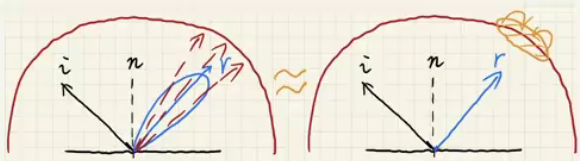

这个操作，相当于把一系列的环境光，先做一次filtering，也就是求加权平均，然后在镜面反射方向上查找环境光。

接下来，前一段已经没有采样了，问题就是对后一部分进行解决。我们也需要进行一个预计算，考虑所有参数的可能性。考虑Microfacet BRDF是一个有Fresnel和Roughness的东西，存储量是非常浩大的。

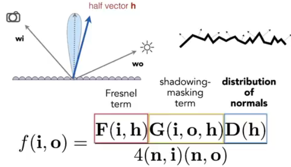

> 在实时渲染中，入射光夹角、反射光夹角、入射反射半角、入射光和半向量的夹角一般都近似互换。

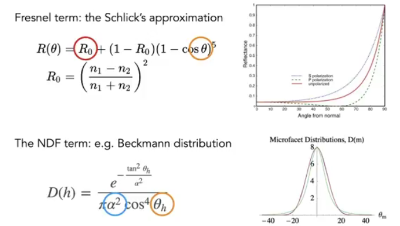

如果对这样一种模型，我们实际上只需要考虑$R$、$\theta$、$\alpha$三个参量。$\theta$为half angle，得到一个三维参量。

我们把Schlicks近似带入积分中

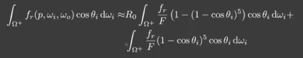

那么$R_0$拆到了积分外边。这个时候，只需要对$\alpha$和$\theta$进行打表：

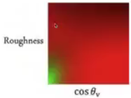

对这张纹理，直接进行查找，得到的就是查表的纹理。这样，我们就完全的回避掉了采样，可以在环境光下渲染不同物体。

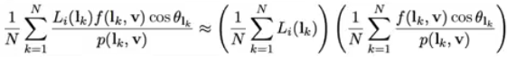

这种思路叫做Split Sum，也是UE PBR所使用的技术。

### Shadow from Environment Lighting

环境光照可以认为是一个多光源（many-light）问题。一种视角中，对于每一个光源，如果都生成一个shadow map，那么这个代价是非常昂贵的。另一种视角是把环境光照看成一个采样问题，去采样各个方向上的Visibility项。由于从shading point往各个方向上看，四面八方的遮挡情况非常复杂。由于V和BRDF都可能并不是很smooth，所以直接拆出来是不太可能的。但是无论哪种视角，处理起来都比较复杂。

工业界一般用的方法是，在环境光中选取一个比较重要的光源，生成一个或多个阴影。除此之外，还有一些相关研究：

- Imperfect shadow maps，主要做全局光照的阴影。
- Light Cuts，离线渲染的里程碑式工作，把场景光照看作一系列小的光源，然后近似整体照亮的结果，可以解决many-light问题。
- Real time ray-tracing（RTRT），可能是一个终极解决方案
- Precomputed Radiance Transfer，可以得到非常准确的环境光的阴影。

### Math

在games101中，我们已经提到过Fourier级数的概念。将函数用一系列直流和交流的函数展开，通过增加项得到一个更好的逼近，这是Fourier函数的应用。

频率描述了信号变化的速度，是在空间上信号变化剧烈与否的描述。对于一张图，代表的二元函数，我们就可以建立其频谱。频谱的中心是低频，外侧是高频，对于一张图片，绝大多数部分都是低频内容。

如果把最低频部分留下，就得到了相对模糊的图。滤波实质上就是去掉一部分频率内容，低通滤波器留下了低频信号。

在时域上做卷积，实际上就是模糊操作，正好对应了频域上的滤波。

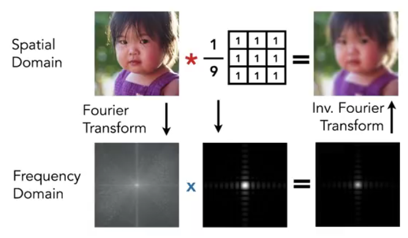

更通用的，对乘积的积分和卷积或者说滤波是相同的，也就是
$$
\int_{\Omega} f(x)g(y) dx
$$
我们称之为product integral。低频实质上就是一个比较smooth的函数，积分结果的频率是由$f(x)$和$g(x)$二者频率的较低值构成的。

接下来引入基函数。我们可以把一个函数描述成一系列函数的线性组合，
$$
f(x) = \sum_i c_i \cdot B_i(x)
$$
 Fourier级数就构成了一套基函数。同理，多项式的系列$1, x, x^2, \cdots, x^n, \cdots$构成了一套基函数。后者某种意义上就是Taylor展开。

### Spherical Harmonics(SH)

球谐函数是一系列二维基函数。每个函数都是二维的，并且定义在球面上；从这层意义上，它是对方向的一个函数。因此，球谐函数就类似于一维平面上的二维基函数：

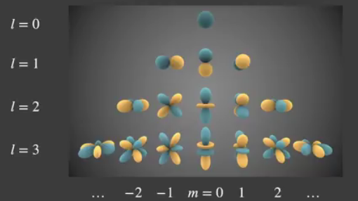

每种频率上有几种不同二维函数，有不同的取向和形状。$l=k$的时候有$2k+1$个基函数，称为第$k$阶的SH。其编号从$-l$到$l$；前$n$阶有$n^2$个基函数。

为什么我们不对$\theta, \varphi$做Fourier变换，而采用SH呢？这是因为这种变换有可能会出现比较复杂的边界情况，而不够光滑。

每一个基函数$B_i(w)$由Legendre多项式确定。我们试图将其作为基函数，用其线性组合表述原先的函数。那么如何将函数展开成一系列的多项式呢？事实上，
$$
c_i = \int_\Omega f(\omega) B_i(\omega) d\omega
$$
其中$c_i$是第$i$个基函数的系数。求系数的过程我们称作投影（projection）；知道所有投影就可以恢复原函数。取前几阶的频率用来近似，就能得到一个比较好的结果。取得阶数越多，高频信号保留越多。这个过程和对向量用基向量的坐标描述本质上是没有区别的。Product Integral的本质，实际上就是一种点乘；基函数相互投影结果是0，那么这种基函数是正交的。

如果我们先对环境光做一个Prefiltering，沿着镜面反射方向去查询就和diffuse材质一样。

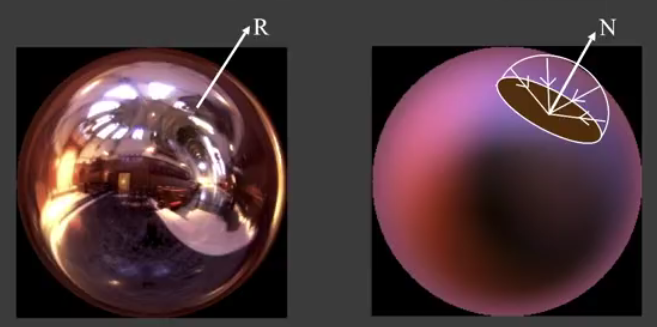

Diffuse BRDF非常Smooth，所以我们需要把环境光和低通滤波器Diffuse BRDF做product integral。那么我们就可以用SH来描述Diffuse BRDF项（包括cosine），只需要大约3阶就能得到一个很好的结果：

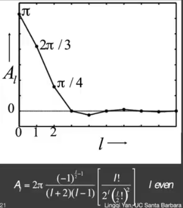

第三阶开始，后面的阶数影响非常小。这实际上是非常自然的，因为Diffuse BRDF几乎没有高频性。所以Ravi做了这么一个实验：

先引入第一阶

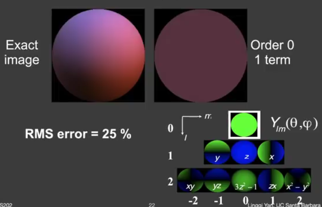

接下来引入第二阶

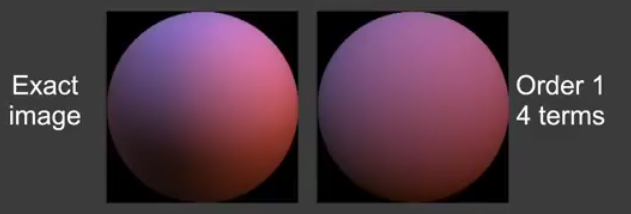

最后引入第三阶

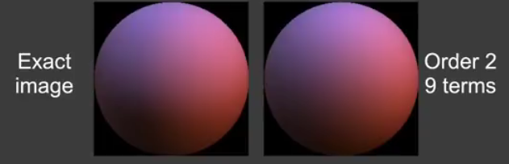

其误差小于1%。事实上，对任意一种光照，BRDF项误差恒小于$3\%$。最终，光照可以写成一种二次型$n^T Mn$。

我们试图在此基础上引入阴影，并解决任意BRDF的问题。为此我们引入PRT。

### Precomputed Radiance Transfer

PRT可以做全局光照和环境光照。考虑Rendering Equation

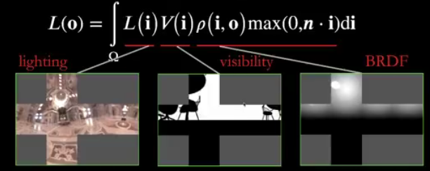

这三项都是球面函数。考虑采样，将对应像素的三个值乘起来，然后加起来，这是最直观的做法。如果要描述所有不同方向，复杂度非常之高。

*Precomputed Radiance Transfer for Real-Time Rendering in Dynamic, Low-Frequency Lighting*(SIG2002)具有里程碑性。假设$L(i)$项会发生变化，$V(i)f(i,o)\cos \theta$记为Light Transport，然后把Lighting拆成一系列的Basis functions，假设Lighting是发生变化的，其他东西都不变，那么Light transport对每个点是一个定值。所以可以在渲染之前把light transport预计算，作为某一个点的性质。同时，Light transport也可以写成基函数的形式。

对Diffuse来说，将BRDF拆出来，
$$
L(o) = k_d \int_{\Omega} L(i) V(i) \max (0, n \cdot i)di \simeq \rho \sum l_i \int B_i(i) V(i) \max(0, n\cdot i) di
$$
后者恰好是基函数的系数。那么，我们完全可以进行预计算，记为$T_i$，则
$$
L(o) = k_d \sum l_i T_i
$$
但是这样的代价是，Visibility项必须是固定的。也就是，场景不能动。只要环境光预计算过，那么光源是可切换的；可是光源本身不能发生变换，比如把光源旋转一下。所幸SH函数在旋转后可以直接修改。

SH函数有这样的一些良好性质：

- 基函数的正交性
- 易于投影
- 支持旋转，任意函数投影到基函数去，旋转原始函数等价于修改同阶基函数的系数

### Glossy Case

我们考虑另一种推导办法。假如
$$
L_i (p,\omega_i) = c_p \sum_p B_p(\omega_i),f_r V\cos \theta = c_q \sum_q B_q(\omega_i)
$$
那么
$$
L_o = \sum_p \sum _q c_p c_q \int_{\Omega^+} B_p(\omega_i) B_q(\omega_i) d\omega_i
$$
由于其具有正交性，所有只有$p=q$的时候，右侧结果才有值。

Glossy的情况，BRDF不是常数了。那么把Light transport投影到SH的时候，对任意一个o，得到的结果$\rho(\vec i, \vec o)$都不同。也就是说，Glossy的输出
$$
L_o = \sum l_i T_i(o)
$$
这样，我们把其在o方向上投影
$$
T_o = \sum t_{ij} B_j(o)
$$
进而
$$
L(o) = \sum (\sum l_i t_{ij}) B_j(o)
$$
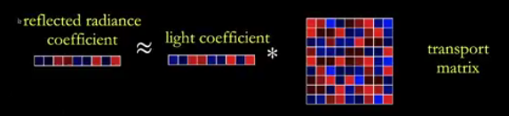

这样，我们得到的就是一个light transport matrix.存储代价得到了提高，运算复杂性也提高了。

一般人们通常用3/4/5阶的SH函数，Diffuse一般取3阶就够了，但是Glossy需要用4或5阶，科研领域甚至需要8-10阶。

如果是接近镜面反射，用SH的效果很差，可以考虑换一种基函数。

在渲染中，我们一般考虑三种介质，Diffuse、Specular和Glossy。考虑光线从发出到直接看到的过程，可以称作LE；如果打到了一个Glossy物体，可以称作LGE（`L(D|G)*E`）；如果在其中过程，光线发生反射，增多了bounce，那么可以称作LGGE（`LS*(DG)*E`）。这个过程无论多么复杂，中间过程都是Light transport，所以只要使用PRT的思路，计算复杂度和transport是无关的。

如果把Light Transport上进行投影，也就是
$$
T_i = \int_\Omega B_i(i) V_i(i) \max(0, \vec n \cdot \vec i) d\vec i
$$
这样可以看成一种叫做$B_i$的光照，就好像是用它来渲染一样。而我们可以用任何一种技术来解这个Rendering Equation——不论是Path tracing还是其它什么东西。

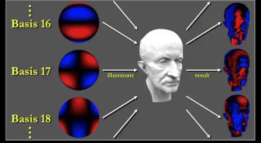

因此，预计算的本质就是渲染过程。图中的红色和蓝色表示正负，实际上是光照渲染结果。

SH有比较好的visibility，但是不适用于描述高频，如果要描述高频需要的阶数是很高的。

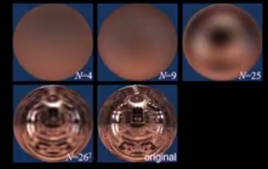

同时，场景不能随意改变，材质也不能更换。有很多之后的例子：

- 其它基函数的引入
- 把点乘换成三项相乘再积分
- 推广到动态场景和动态材质
- 用于半透明材质和毛发渲染
- 经过近似之后，求出解析解而不是预计算

### Wavelet

其它的基函数还有Wavelet、Zonal Harmonics、Spherical Gaussian、Piecewise Constant等。

小波也是一系列基函数，定义在一个图像块上。不同小波的定义域是不一样的，+-表示值的大小。这里的例子是Haar小波，但无论哪种小波都是一系列的函数。

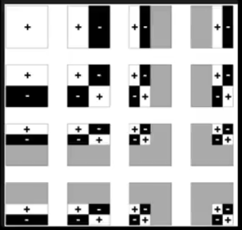

SH可以给出一个截断，所以能够通过若干方式来得到原始函数。小波则是投影到基函数上，然后大量基函数的系数是0，这个时候可以取那些接近0的信号，保留较大的几项。它的近似是非线性的，但是支持全频率，而不是SH的低频。

使用小波一般使用Cubemap，对每个图单独做Wavelet变换。jpeg格式用了一种类似小波变换的离散余弦变换（DCT），所以达到了很好的压缩率。小波的问题主要是无法进行直接旋转，无法方便的进行变换。

## Global Illumination

我们在讲Blinn-Phong的时候，曾经提过一个ambient项，类似于一个hack。但是看下面的这个图

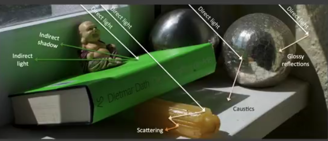

我们会发现，全局光照实际上很复杂，并不能视作一个常数。因此，实时渲染中实际上解决的是多一次bounce的间接光照：

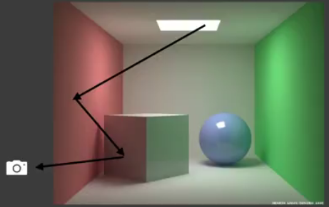

其要求是简单、快速。

在场景中，第一次被直接照亮的物体，可以看作一个新的光源。

### Reflective Shadow Maps(RSM)

我们需要知道两件事情：

- 谁是次级光源？Shadow map实际上已经告诉了我们答案。
- 如何从每个小块贡献到点p？

对于Shadow Map，一个像素对应了一个小片，这个小片是场景中的，有自己的normal。它可以独立的作为次级反射的光源，也就是对$512^2$的场景可以用$512^2$个面光源来刻画。

如果对一个次级光源，固定观察方向，那么Shading就可以确定。这里假设，所有的反射物**都是diffuse**，这样反射结果就和观察方向分离了。

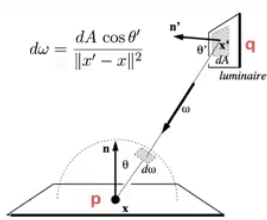

对于一个小的patch，也就是RSM的一个pixel，
$$
L_o = \int_{\Omega_{Patch}} LVf_r \cos \theta d\omega_i = \int_{A_{Patch}}L_i(q\to p) Vf_r \frac{\cos \theta_p \cos \theta_q}{||q-p||^2} d\omega_i
$$
对于diffuse reflective，$f_r = \rho / \pi$，$L_i = f_r \dfrac{\Phi}{dA}$。这里要注意的是，$f_r$是$q$的BRDF，而不是$p$的。现在，$dA$被消去了，得到的东西叫做Refelected Flux。
$$
E_p(x,n) = \Phi_p \frac{\max\{0, \cos \langle x-x_p, n'\rangle\}\max\{0, \cos \langle x_p-x, n\rangle\}}{||x-x_p||^2}
$$
所以我们需要存的实际上只有$\Phi_p$。

这里要注意的是，有些像素是不会计算到RSM中的：

- 不可见的Pixel
- 法线方向不一致的
- 距离过远的

那么，我们可以把世界坐标上的距离直接投影到Shadow Map上的距离：在Shadow Map周围的一个范围内可以直接查找。这个时候，我们可以通过某些采样方案，对某个Shading Point取几百个Texel就可以实现GI。

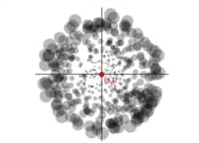

因此，RSM实际上就是在Shadow map的基础上多存储了世界坐标、法线和flux。RSM特别擅长用来做手电筒，会得到比较好的效果。

RSM最大的好处在于，实现很容易，实际上就是在Shadow map的流程基础上多几个采样。但是只要使用ShadowMap，那么随光源数量增加，代价也会增加；对于间接光照，无法考虑其visibility项；diffuse和depth的假设可能会对质量造成影响；采样率也需要一种妥协。

RSM实际上是离线渲染中Virtual Point Light(VPL)方法在实时渲染中的使用。