# Fluid

$$
\newcommand\pd[2]{\dfrac{\partial #1}{\partial #2}}
\newcommand\pdn[3]{\dfrac{\partial^{#3} #1}{\partial #2^{#3}}}
\newcommand\ve[1]{\mathbf{\boldsymbol{#1}}}
\newcommand\dd{\operatorname{d}}
\newcommand\eps{\varepsilon}
$$

## GAMES103

### Euler Method

#### Basics

我们常常用的是一个规则的网格。

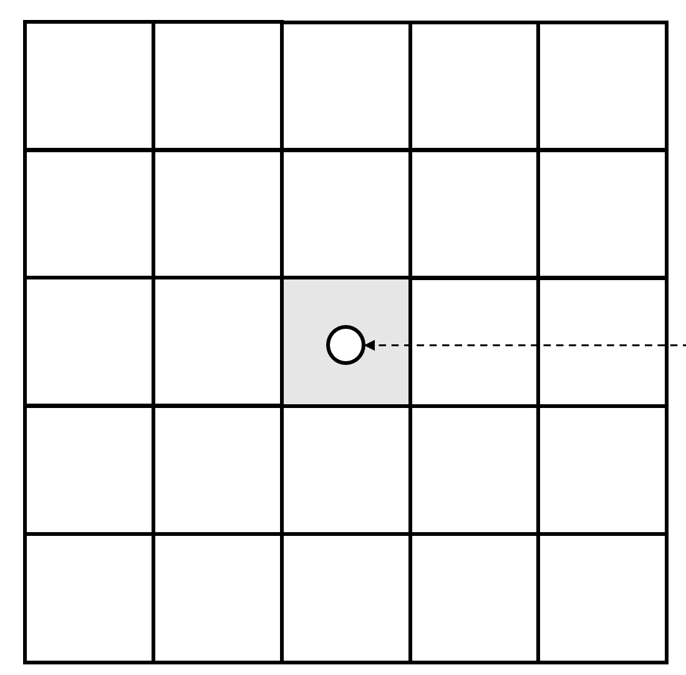

每个格子可以赋值标量或者矢量，表示一个物理值，这样就构成一个场。于是，算导数和微分计算就很容易了。比如，有中心差分
$$
\frac{df}{dt}\approx \frac{f(t_0+\Delta t)-f(t_0-\Delta t)}{2\Delta t}
$$
这样很容易构造出来一个边界上的交错网格：

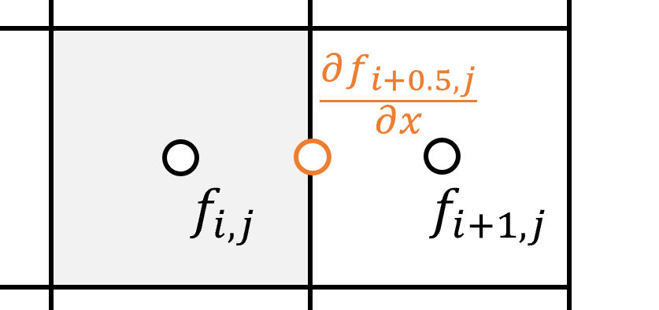
$$
\pd{f_{i+0.5,j}}{x}\approx \frac{f_{i+1,j}-f_{i,j}}{h}
$$
我们进一步扩展一下：

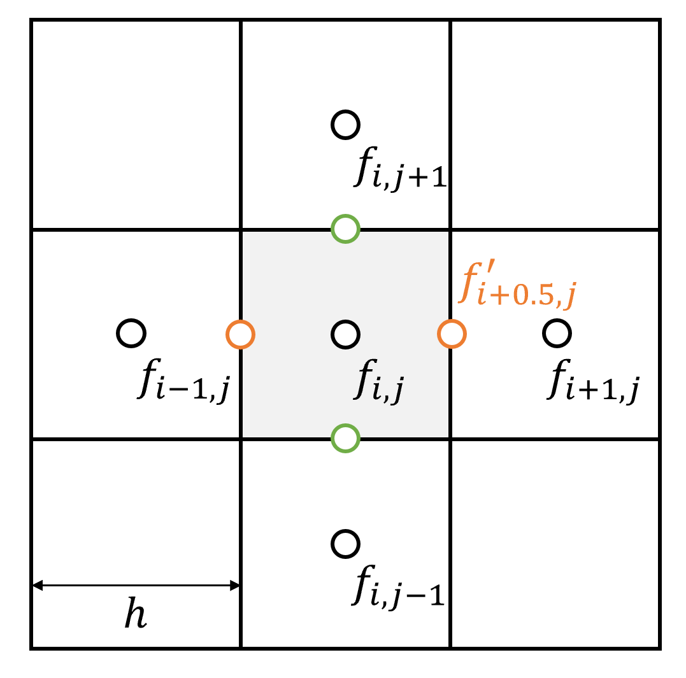

于是有
$$
\pdn{f}{x}{2} = \frac{f_{i-1,j}+f_{i+1,j}-2f_{i,j}}{h^2}
$$
同理，
$$
\pdn{f}{y}{2} = \frac{f_{i,j-1}+f_{i,j+1}-2f_{i,j}}{h^2}
$$
这就是有限差分。从而，拉普拉斯算子
$$
\grad^2f=\frac{f_{i-1,j}+f_{i+1,j}+f_{i,j-1}+f_{i,j+1}-4f_{i,j}}{h^2}
$$
类似的，有两种边界条件：

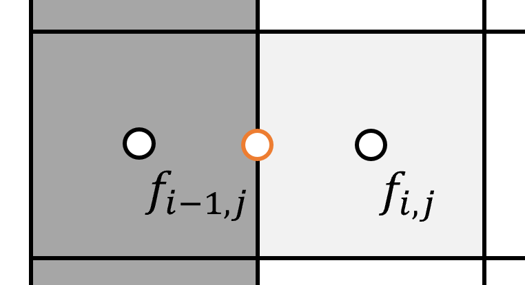

- Dirichlet boundary, 也就是$f_{i-1,j}=C$
  $$
  \grad^2f=\frac{C+f_{i+1,j}+f_{i,j-1}+f_{i,j+1}-4f_{i,j}}{h^2}
  $$

- Neumann boundary，比如$f_{i-1,j}=f_{i,j}$
  $$
  \grad^2f=\frac{f_{i+1,j}+f_{i,j-1}+f_{i,j+1}-3f_{i,j}}{h^2}
  $$

接下来我们讨论一个例子：如何求解Laplacian方程
$$
\grad^2 f=0
$$
这里要求边界条件至少有一个是Dirichlet boundary，而不能全部是Neumann boundary，否则这个问题会有无穷多的解——所有值都加上一个常数，也会变成合理解。换言之，以格子为变量，构造的线性系统会变成一个singular matrix。接下来就可以解线性系统了，比如用Jacobi迭代法：

```
Initialize f
for k in 0...K:
	for i,j
		f_ij(new) = f_ij + alpha(4f_ij-f_{i-1,j}-f_{i,j-1}-f_{i+1,j}-f_{i,j+1})
	for i,j
		f_ij = f_ij(new)
```

这一项也称为**Diffusion**。

但是中心差分有什么问题？这里的一阶导数没有出现在格子的中间，而在格子中间的墙上。如果直接用左右去求差分，就相当于忽略了自身的函数值，而这是不太合理的。为此，有两种方式：

- 使用迎风差分
- 使用交错网格（staggered grid）

我们介绍后一种。

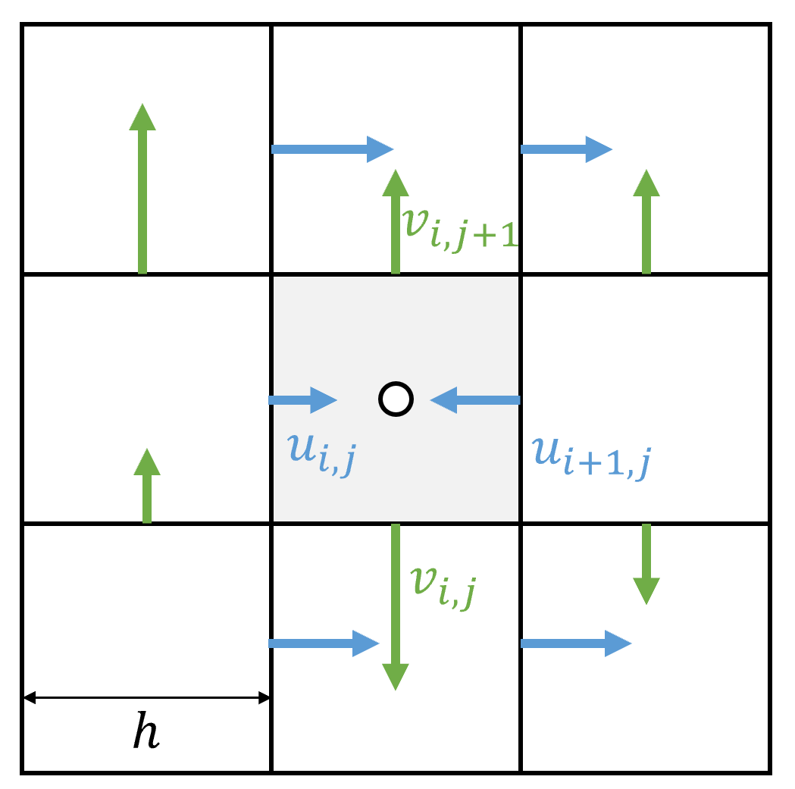

每个“墙”都有一个流速，这个可以是正的也可以是负的，而我们把**速度**直接定义到这个网格的边缘上。在引入交错网格之后，每个格子的水的净流出是
$$
u_{i+1,j}+v_{i,j+1}-u_{i,j}-v_{i,j}
$$
假如我们让流体不可压，那么这个场就是一个无散场：
$$
\grad \cdot u\approx u_{i+1,j}+v_{i,j+1}-u_{i,j}-v_{i,j} = 0
$$
还需要考虑双线性插值的问题。在不同的网格里，插值方式是不一样的。对于交错网格，速度项和其他项的处理方式是不一样的：

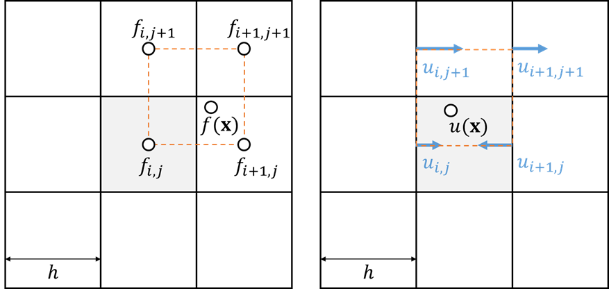

可以看到，由于网格自身的定义（我们假设中心是整数），在求解一个场$f(x)$的时候，用的$i=\lfloor x\rfloor$，$j=\lfloor y\rfloor$。而对于速度场，求解x和y方向要分开计算：对于x方向，$i=\lfloor x-0.5\rfloor$，$j=\lfloor y\rfloor$；对于y方向，$i=\lfloor x\rfloor$，$j=\lfloor y-0.5\rfloor$.

#### Incompressible viscosity N-S equation

N-S方程是这样的：
$$
\pd{f}{t}=-(\mathbf{u}\cdot \grad)\mathbf{u}-\frac{1}{\rho}\grad p+\nu \grad^2\mathbf{u}+\mathbf{g}
$$
以及不可压条件
$$
\grad \cdot \mathbf{u}=0
$$
分别代表advection项、pressure项、diffusion项和external项。它的求解思路非常简单：拆分成很多步分别处理。

- 首先根据$g$更新$\pd{\ve u}{t}=\ve g$
- 其次更新advection项 $\pd{\ve{u}}{t}=-(\ve u\cdot\grad)\ve u$
- 然后做一次laplacian $\pd{\ve u}{t}=\nu\grad^2\ve u$
- 最后做一次压强 $\pd{\ve u}{t}=-\dfrac{1}{\rho}\grad p$

**外部力更新**

可以直接用显式积分：
$$
\ve u_{i,j}^{new}=\ve u_{i,j}+\ve g\Delta t
$$
**对流项更新**

我们知道
$$
(\ve u\cdot \grad)\ve u = u_x \pd{u}x + u_y\pd{u}{y}
$$
能不能直接做欧拉积分？会导致不稳定。我们换个视角：从粒子的角度来看，

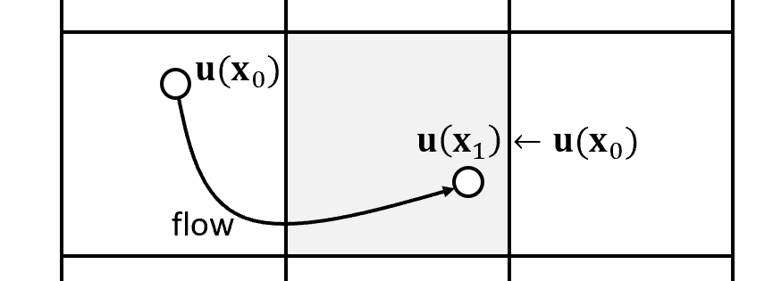

粒子从x0移动到x1，就相当于把速度带到了x1。如果用粒子法，顶点位置不变，变量自然就带去了；但网格模拟下，速度不是定义在水分子上，而是网格上。

为此，我们只好引入**半拉格朗日法**：要求$\ve x_0$的速度，就相当于去寻找哪个水分子移动到了$\ve x_0$，然后我们倒推回去。假设要求解x方向上的速度，那么对应的墙是$(i-0.5,j)$，就会找到上一个时刻的对应点，然后把$u_x$赋值过来。同理，对交错网格的每个格点都要分开计算各个值。

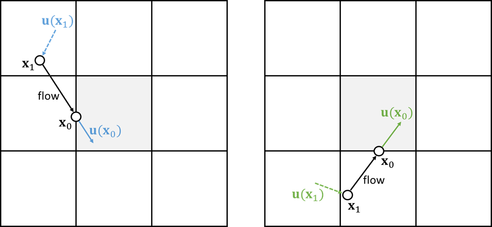

这里给出一个比较形式化的表达：

- $\ve x_0 = (i-0.5,j)$
- $\ve x_1 = \ve x_0-\Delta t\ve u(\ve x_0)$
- $\ve y_0 = (i,j-0.5)$
- $\ve y_1 = \ve y_0 - \Delta t\ve u(\ve y_0)$
- $u_{ij}^{new}=\text{bilerp}(u(\ve x_1)), v_{ij}^{new}=\text{bilerp}(v(\ve y_1))$

也就是分别在x和y方向上输送出来更新，并通过双线性插值来拿过来。

当然，这个步骤也可以多细分几回。如果倒退的位置在边界，可以直接clamp一下。

**扩散项更新**

扩散项由u和v两部分构成，可以分别进行求解：
$$
u_{i,j}^{new} = u_{ij}+\nu \Delta t \frac{u_{i-1,j}+u_{i+1,j}+u_{i,j-1}+u_{i,j+1}-4u_{i,j}}{h^2}
$$
对于v也同理。如果$\nu \Delta t$比较大，也会导致不稳定，可以分几个步长，或者按隐式积分来做。

**压力项更新**

接下来我们需要做压力项。这个也比较简单：
$$
u_{i,j}^{new}=u_{i,j}-\frac{\Delta t}{h\rho} (p_{i,j}-p_{i-1,j})
$$

$$
v_{i,j}^{new}=v_{i,j}-\frac{\Delta t}{h\rho} (p_{i,j}-p_{i,j-1})
$$

但是压强怎么办？压强产生的原因是流体不可压缩，所以给流体压力就会传导到整个流体上。因此，压强的目标是形成一个不可压条件
$$
\grad \cdot \ve u^{new}=0
$$
也就是
$$
u_{i+1,j}^{new}+v_{i,j+1}^{new}-u_{i,j}^{new}-v_{i,j}^{new}=0
$$
带入上式，得到
$$
u_{i+1,j}-\frac{\Delta t}{h\rho} (p_{i+1,j}-p_{i,j})+v_{i,j+1}-\frac{\Delta t}{h\rho} (p_{i,j+1}-p_{i,j})-u_{i,j}+\frac{\Delta t}{h\rho} (p_{i,j}-p_{i-1,j})-v_{i,j}+\frac{\Delta t}{h\rho} (p_{i,j}-p_{i,j-1})=0
$$
再整理一下
$$
4p_{i,j}-p_{i,j}-p_{i+1,j}-p_{i,j+1}=\frac{h\rho}{\Delta t}(-u_{i+1,j}-v_{i,j+1}+u_{i,j}+v_{i,j})
$$
这其实就是一个laplacian方程。有边界条件

- Dirichlet: $p_{i-1,j}=P$
- Neumann: $p_{i-1,j}=p_{i,j}$

#### Air and Smoke

我们希望烟和水的效果。烟怎么处理？

- 更新速度的$u$
- 更新其它的物理量：比如密度、颜色、温度，用semi-lagrangian做一次投影来带过来物理量
- 一般在开放空间使用Neumann条件，容器壁使用Dirichlet条件

而水呢？水是有形状的，我们模拟的是水的表面，水只占据了一部分空间，需要额外的表达方式：

- 体素表达，每个小格子存百分比 Volume-of-fluid（VoF），这种方式不精准，不知道界面在哪里
- SDF，每个点存储到表面的距离，模拟更新到水面的距离

更新则有两种方式：

- 半拉格朗日法
- Level set method，对距离进行更新

二者都会带来问题：体积改变。如果水的波动很剧烈，模拟完只剩半杯了，那就很麻烦。可以用粒子来矫正。

### SPH

SPH用很多粒子表达流体。每个粒子都有物理量，附在粒子上，跟着一起运动，比如位置、速度、质量。在图形学里遇到比较现实的问题：现代GPU没办法直接渲染这些粒子，所以需要把粒子转化成三角网格。游戏里则一般直接用带纹理的球或者方块来表示。

假设每个粒子都有物理变量$A$，那么smooth模型是假如给空间中某个位置，想要知道这个值是多少。所以它是从周围估计来的：
$$
A_i^{smooth}=\frac{1}{n}\sum_j A_j， ||\ve x_i - \ve x_j||<R
$$
但它没有考虑分布的问题。比如：

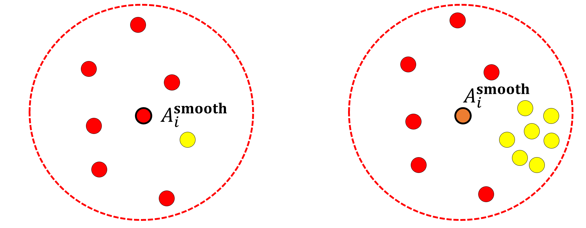

会发现这个红色的在右边黄色采了很多的时候变成橘色的。而这些黄色在一个很小的区域，黄颜色区域比较少、红颜色反而区域比较大，所以它的贡献应该反而少，还要考虑空间问题。所以我们考虑每个点占的空间，因此引入另一个量：体积$V$，把$V$作为一个权重
$$
A_i^{smooth}=\frac{1}{n}\sum_jV_jA_j
$$
但还有问题：这个函数不够smooth。当这个点的位置发生变化，我们希望这个函数是连续变化的，而很显然，当位置发生变化，球的点数可能会陡变。所以再引入一个权重：粒子到球心的距离。在边界上的粒子贡献应该比较小，而靠近中心的粒子贡献比较大。所以
$$
A_i^{smooth}=\frac{1}{n}\sum_j V_jA_jW_{ij}
$$
我们称$W_{ij}$是一个Smoothing kernel。

上面我们预设了体积的存在性，而体积并不是一个常数，因为粒子是在运动的，体积应该是动态计算的。为此，考虑到
$$
V_i = \frac{m_i}{\rho_i}
$$
那么对$\rho_i$也用来smooth
$$
\rho_i^{smooth}=\sum_j V_j \rho_j W_{ij} = \sum_j m_jW_{ij}
$$
于是，带入上式得到
$$
A_i^{smooth}=\sum_j \frac{m_j}{\sum_k m_kW_{jk}}A_jW_{ij}
$$
这样就很容易做微分算子的操作了。比如梯度算子
$$
\grad A_i^{smooth}=\sum_j \frac{m_j}{\sum_k m_kW_{jk}}A_j\grad W_{ij}
$$
拉普拉斯算子
$$
\grad^2A_i^{smooth}=\sum_j \frac{m_j}{\sum_k m_kW_{jk}}A_j\grad^2 W_{ij}
$$
我们常用的是这样的一个Kernel function：
$$
W_{ij}=\frac{3}{2\pi h^3} \begin{cases}
\frac{2}{3}-q^2+\frac{1}{2}q^3 ,&0\le q<1\\
\frac{1}{6}(2-q)^3,&1\le q<2 \\
0, &q\ge 2
\end{cases}
$$
其中$q=\frac{||\ve x_i-\ve x_j||}{h}$，$h$称为smoothing length。

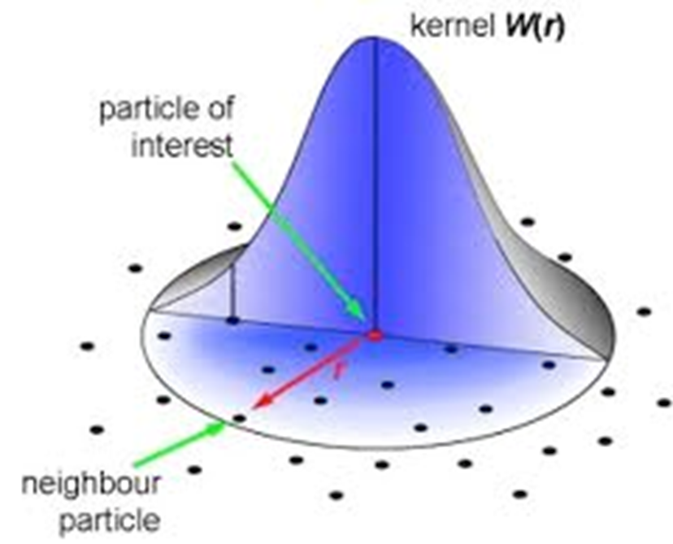

可以计算得到
$$
\grad_i W_{ij} = \pd{W_{ij}}{q}\grad_i q=\pd{W_{ij}}{q}\frac{\ve x_i-\ve x_j}{||\ve x_i-\ve x_j||h}
$$

$$
\grad_i^2 W_{ij} = \pdn{W_{ij}}{q}{2} \frac{1}{h^2}+\pd{W_{ij}}{q}\frac{2}{h}
$$

这个东西如何用在流体上呢？我们一般考虑重力、压强和粘性力三个方面。重力可以直接算，压强是和密度有关的：

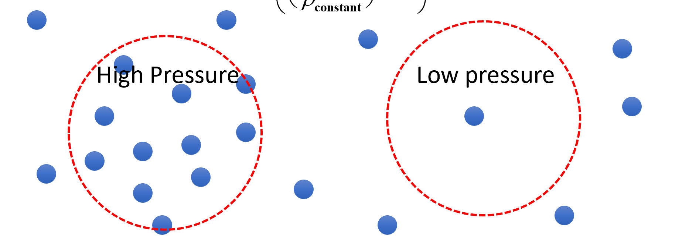

首先计算密度
$$
\rho_i=\sum_jm_jW_{ij}
$$
于是有经验公式
$$
p=k\left( \left(\frac{\rho_i}{\rho_0}\right)^7-1 \right)
$$
有了压强怎么计算压强产生的力呢？压力是压强不平衡导致的，指向梯度方向。
$$
\ve F_i^{press}= -V_i \grad_i p_i^{smooth}
$$
带入得到
$$
\ve F_i^{press}=-V_i \sum_j V_j p_j \grad_i W_{ij}
$$
最后是粘滞力。它希望所有粒子的方向一样，laplacian相当于一个平滑操作，所以
$$
\ve F_i^{viscosity}=-\nu m_i \grad^2 \ve u^{smooth}
$$
从而
$$
\ve F_i^{viscosity}=-\nu m_i \sum_j V_j \ve v_j \grad^2_i W_{ij}
$$
这个算法就比较简单了，当然这个比较近似：

1. 找邻居
2. 算力
   1. 加重力
   2. 加邻居
   3. 加粘滞
3. 算速度，$v_i=v_i+t\cdot F/m$
4. 算距离，$x_i=x_i+t\cdot v_i$

## LBM

### Kinect theory

#### 分布函数

我们首先讨论气体的动力学模型。它是一种介于宏观和微观之间的描述方式，原本是用于描述稀薄气体的。首先引入一个**分布函数** $f(\ve x,\ve \xi,t)$ 。可以认为，
$$
\rho=f(\ve x, \ve \xi, t)
$$
表示了一个在3D物理空间和3D速度空间下的密度函数。

> Example. 一个$L_x\times L_y \times L_z$的盒子，总质量是$\int_V \rho \dd^3x$。盒子左半侧所有向右移动的粒子的总质量就是
> $$
> \int_{x=0}^{x=L_x/2} \int_{\xi_x>0} f\dd^3\xi\dd^3x
> $$

根据上面的定义，我们可以给出下面几个对应到经典力学的基本物理量的公式：

1. 密度随空间的分布函数。
   $$
   \rho(\ve x, t)=\int f(\ve x,\ve \xi, t)\dd^3\xi
   $$

2. 动量密度。
   $$
   \rho \ve u(\ve x,t) = \int \ve \xi f(\ve x, \ve \xi, t)\dd^3\xi
   $$

3. 能量密度。
   $$
   \rho E(\ve x,t)= \frac{1}{2} \int|\ve \xi|^2f(\ve x,\ve \xi,t)\dd^3\xi
   $$

4. 内能密度，由分子热运动引起的内能
   $$
   \rho e(\ve x,t) = \frac{1}{2}\int|\ve v|^2 f(\ve x, \ve \xi, t)\dd^3\xi
   $$
   其中，$\ve v = \ve \xi - \ve u$表示与局部平均速度的速度差。与此对应的，扩散项内能是$\frac{1}{2}\rho |\ve u|^2$.

对于一个自由度为$q$的系统，它的内能密度
$$
\rho e=\frac{q\rho RT}{2}=\frac{qp}{2}
$$
从而有
$$
p = \frac{2}{q}\rho e = \frac{1}{q}\int|\ve v|^2 f(\ve x,\ve \xi, t)\dd^3\xi
$$
#### 稳态分布

下面讨论分布状态的稳态。由于电磁力的存在，两个分子在接触过程中就会出现相互作用。而当经过足够长时间，分布$f(\ve x,\ve \xi,t)$就会进入一个平稳分布$f^{eq}(\ve x,\ve \xi,t)$。此时，在速度空间$\ve \xi =\ve u$周围呈现各向同性，换言之，对相对速度$\ve v$，上述分布可以写成$f(\ve x,|\ve v|,t)$。

我们还需要一个假设：分布函数是可分离的，也就是
$$
f^{eq}(|\ve v|^2)=f^{eq}(v_x^2+v_y^2+v_z^2)=f_{1D}^{eq}(v_x^2)f_{1D}^{eq}(v_y^2)f_{1D}^{eq}(v_z^2)
$$
如果有这样的形式成立：
$$
\ln f_{1D}^{eq}(v_x^2)=a+bv_x^2
$$
那么
$$
f^{eq}(|\ve v|)=\exp(\ln f_{1D}^{eq}(v_x^2)+\ln f_{1D}^{eq}(v_y^2)+\ln f_{1D}^{eq}(v_z^2))=e^{3a}e^{b|\ve v|^2}
$$
事实证明，
$$
f^{eq}(\ve x,|\ve v|,t)=\rho \left( \frac{3}{4\pi e} \right)^{3/2}\exp\left(-3\frac{|\ve v|^2}{4e}\right)
$$
这一分布也称为Maxwell-Boltzmann分布。

对$f$求全微分，得到
$$
\frac{\dd f}{\dd t}=\pd{f}{t}+\pd{f}{x_\beta}\frac{\dd x_\beta}{\dd t} + \pd{f}{\xi_\beta}\frac{\dd \xi_{\beta}}{\dd t}
$$
这里的$x_\beta$表示对所有分量进行遍历。观察右边的项，容易发现第二项的结果是$\xi_\beta$，第三项的结果是$\frac{F_\beta}{\rho}$，于是有**Boltzmann方程**：
$$
\pd{f}{t}+\xi_\beta\pd{f}{x_\beta}+\frac{F_\beta}{\rho} \pd{f}{\xi_\beta}=\Omega(f)
$$
它对应一个对流方程，前两项实际上是一个对位置的全导数，而第三项则是加在速度上的作用力。右侧则描述了这些力产生的原因，我们称为Collision Operator。

碰撞符合质量、动量、能量守恒，因此需要满足下面三个条件：
$$
\begin{cases}
\int \Omega(f) \dd^3\xi=0 \\
\int \ve \xi \Omega(f)\dd^3 \xi = \ve 0 \\
\int |\ve \xi|^2\Omega(f)\dd^3 \xi=0
\end{cases}
$$
Boltzmann自己提出的碰撞运算非常复杂，包括粒子间作用的所有情况。而我们一般使用的BGK条件则较为简单：
$$
\Omega(f)=-\frac{1}{\tau}(f-f^{eq})
$$
但无论哪种碰撞函数，都会要求遵守守恒定律且逐渐接近平稳分布。但BGK条件没有Boltzmann自己给出的条件精确，认为流体的普朗特数（动量扩散率与热扩散率的比值）是1，而实际测量则约为2/3.

#### 宏观控制方程

下面讨论流体的各个方程和微观方程之间的联系。首先引入符号来表示力的冲量：
$$
\Pi_{\alpha\beta\gamma} = \int \xi_\alpha \xi_\beta\xi_\gamma f\dd^3\xi
$$
特别的，
$$
\Pi_0=\int f\dd^3\xi = \rho, \Pi_\alpha=\int\xi_\alpha f\dd^3\xi=\rho u_{\alpha}
$$
我们还需要知道冲量怎么计算：
$$
\int \pd{f}{\xi_\beta}\dd^3\xi=0
$$

$$
\int\xi_\alpha\pd{f}{\xi_\beta}\dd^3\xi = -\int \pd{\xi_\alpha}{\xi_\beta}f\dd^3\xi =-\rho \delta_{\alpha\beta}
$$

$$
\int \xi_{\alpha}\xi_{\alpha}\pd{f}{\xi_\beta}\dd^3\xi=-\int \pd{(\xi_\alpha\xi_\alpha)}{\xi_\beta}f\dd^3\xi=-2\rho u_\beta
$$

**连续性方程**

对Boltzmann方程进行积分：
$$
\pd{}{t} \int f\dd^3\xi+\pd{}{x_\beta}\int \xi_\beta f\dd^3\xi+\frac{F_\beta}{\rho} \int \pd{f}{\xi_\beta} \dd^3\xi=\int \Omega(f) \dd^3\xi
$$
带入碰撞条件和冲量条件，得到
$$
\pd{\rho}{t}+\pd{(\rho u_\beta)}{x_\beta}=0
$$
这就是连续性方程。

**动量方程**

两侧同时乘$\xi_\alpha$后积分，得到
$$
\pd{(\rho u_\alpha)}{t}+\pd{\Pi_{\alpha\beta}}{x_\beta}=F_\alpha
$$
这里的$\Pi_{\alpha \beta}$也称为momentum flux density tensor，若应力张量是$\sigma_{\alpha\beta}$，那么
$$
\Pi_{\alpha\beta}=\rho u_\alpha u_\beta -\sigma_{\alpha\beta}
$$
由于应力张量的定义是
$$
\sigma_{\alpha\beta}=-\int v_\alpha v_\beta f\dd^3 \xi
$$
这个形式是不封闭的，所以我们需要一些特殊的近似方法。

**能量守恒方程**

对两边乘上$\xi_\alpha\xi_\alpha$然后做积分，得到
$$
\pd{(\rho E)}{t}+\frac{1}{2}\pd{\Pi_{\alpha\alpha\beta}}{x_\beta}=F_\beta u_\beta
$$
经过某些运算，得到
$$
\pd{(\rho e)}{t}+\pd{(\rho u_\beta e)}{x_\beta}=\sigma_{\alpha\beta} \pd{u_\alpha}{x_\beta} - \pd{q_\beta}{x_\beta}
$$
其中$q$是能量密度
$$
q_\beta = \frac{1}{2}\int v_\alpha v_\alpha v_\beta f\dd^3 \xi
$$
Chapman-Enskog 分析常用来分析非稳态情况下的展开式，也就是
$$
f = f^{eq}+\eps f^{(1)}+\eps^2 f^{(2)}+\cdots
$$
这里的$\eps$表示了Knudsen数 Kn，当$Kn\to 0$，流体性质由碰撞决定，那么$f$与$f^{eq}$就非常接近。当使用0阶近似的时候，就会得到欧拉模型；而使用1阶近似的时候，得到的是Navier-Stokes-Fourier模型，包括了粘性剪切力和传热。而当使用的二阶的时候，得到的是Burnett模型。

#### H理论

熵是热力学的重要概念。对于一个分布函数$f$，它的熵是永远减少的，并且在达到稳态的时候取到极小值：
$$
\mathcal{H}=\int f\ln f \dd^3 \xi
$$
可以对Boltzmann方程两侧同时乘上$(1+\ln f)$得到
$$
\pd{}{t}\int f\ln f\dd^3\xi + \pd{}{x_\alpha}\int \xi_\alpha f\ln f\dd^3\xi = \int \ln f\, \Omega(f)\dd^3\xi
$$
这就给出了$\mathcal{H}$的稳态方程。为此，定义$\int \xi_\alpha f\ln f\dd^3\xi=\mathcal{H}_\alpha$是熵的通量，并可以分解成$u$和$v$两部分。对于BGK碰撞条件，
$$
\int \ln f\,\Omega(f)\dd^3\xi = \int \ln \left( \frac{f}{f^{eq}} \right)\Omega(f)\dd^3\xi + \int \ln (f^{eq})\,\Omega(f)\dd^3\xi \\
=\frac{1}{\tau} \int f^{eq} \ln \left( \frac{f}{f^{eq}} \right) \left(1- \frac{f}{f^{eq}} \right)\dd^3\xi\le 0
$$
当$f=f^{eq}$的时候，上式取到最小值0。带入上式，有
$$
\pd{\mathcal{H}}{t}+\pd{\mathcal{H}_\alpha}{x_\alpha}\le 0
$$
换言之，系统的熵永远不会增加，只会减小，直到系统达到平稳分布。这就是Boltzmann H-theorem。

### Particle based fluid simulation

#### Molecular Dynamics

使用分子之间的相互作用来模拟分子运动，用Verlet积分来计算：
$$
\ve x_i(t+\Delta t)=2\ve x_i(t)-\ve x_i(t-\Delta t) + \frac{\ve f_i(t)}{m_i}\Delta t^2
$$
它可以用来做化学反应、蛋白质折叠和相变，但追踪的分子太小了，对于NS方程求解器来说是不能用的。

#### Lattice Gas Model

Hardy、Pomeau和de Pazzis提出了格子气模型对2D气体动力学仿真，称为HPP模型。每个粒子存在于一个正方形的格子中，相互之间存在碰撞。由于每个粒子都有四个可能的速度，可以在一个时间单位内移动到隔壁。1986年Frisch、Hasslacher和Pomeau则将它用到了流体仿真领域，称为FHP模型。FHP使用三角网格和六个速度，在它之中也孕育出了LBM。

 下面介绍FHP的符号。$\ve c$表示一个粒子的速度，它的取值是6个速度之一。取$n_i(\ve x, t)$称为occupation number，表示在时刻$t$粒子是否以速度$\ve c_i$存在于位置$\ve x$，因此它是一个布尔值。它的质量密度是
$$
\rho(\ve x,t) = \frac{m}{v_0} \sum_i n_i(\ve x,t)
$$
动量密度是
$$
\rho\ve u(\ve x,t) = \frac{m}{v_0} \sum_i \ve c_i n_i(\ve x,t)
$$
而一个比较复杂的问题是碰撞。当多个粒子在一个node中遇到的时候，需要重新分布。一般来说，我们写作
$$
n_i^\star (\ve x,t)=n_i(\ve x,t) + \Omega_i(\ve x,t)
$$
其中$\Omega_i = \{-1,0,1\}$.碰撞必须满足约束 $\sum _i \Omega_i(\ve x,t)=0$且$\sum_i \ve c_i \Omega_i(\ve x,t)=0$。比如下面的例子

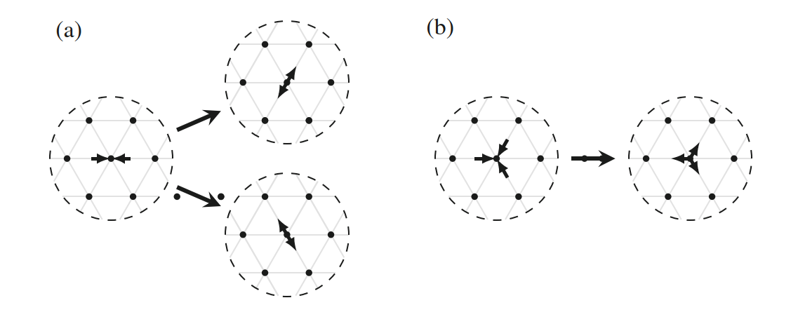

这些策略都是随机选择的。在碰撞之后，我们需要streaming：也就是移动到相应的格子。换言之，

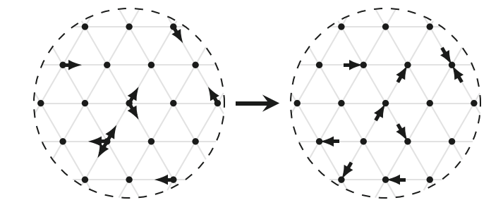
$$
n_i(\ve x+\ve c_i \Delta t) = n_i^\star (\ve x,t)
$$
将上面的公式综合起来，得到
$$
n_i(\ve x+\ve c_i\Delta t,t+\Delta t)=n_i(\ve x,t)+\Omega_i(\ve x,t)
$$
其它的改进基本是针对速度和碰撞的规则，并满足各向同性。

Lattice Gas的最大问题在于统计学噪声。由于格子气使用了微观层级的方案，即便是在均衡态下，划很小的网格，密度也会波动很厉害。这也让格子气可以捕捉到实际气体的热力学波动，但对于宏观流体来说这种波动是噪声。

#### Dissipative Particle Dynamics

DPD类似于LBM是一种介观的描述方法，由Hoogerbrugge和Koelman 1992年提出。它可以认为是一种粗糙的MD，可以用来描述更长的距离和更大的时间，具有天然的伽利略不变性和各向同性。

考虑一系列质量为$m$的粒子，表示了分子的聚类。它通过三种力连接：保守力（conservative, C）、耗散力（Dissipative, D）、随机力（Random, R）。DPD的保守力是比较软的，允许更大的时间步长。耗散力模仿了流体的粘性摩擦，而随机力则充当一个恒温器。DPD是动量守恒的，这些力描述了粒子之间的作用对。
$$
f_i = f^{ext}+\sum_{j\ne i} f_{ij} = f^{ext}+\sum_{j\ne i} (f_{ij}^C+f_{ij}^D+f_{ij}^R)
$$
具体的公式描述可以见其它文献，它也使用了时间积分。DPD遵守波动耗散理论，适用于介观下有限肯德森数的复杂流体，比如细胞和多相流。但它涉及到的参数过多，很难调整。

#### Multi-particle Collision Dynamics

1999年，Malevanets和Kapral提出了一种多粒子碰撞动力学的方法MPC，在软物质物理领域变成了一种很流行的方法。MPC常用于模拟较小的平均分子自由程的系统，而它的修改，DSMC（Direct Simulation Monte Carlo）则用于具有很高平均分子自由程的稀薄气体，也适合于胶体、聚合物、囊泡和生物细胞。

它有几个核心特征：

- 交替的streaming和collision步骤
- 局部质量、动量、能量守恒
- 各向同性的离散化

后两者保证了它可用于N-S方程。它的步骤也比较直接，在直线上做移动：
$$
\ve x_i(t+\Delta t)=\ve x_i(t)+\ve c_i(t)\Delta t
$$
这一步骤称为Propagation，然后进行碰撞。

SRD（Stochastic Rotation Dynamic）是一种比较特殊的算法。所有粒子都分散在格子常量是$\Delta x$的立方晶胞里，平均每个胞体有$N_c$个粒子。每个粒子的速度分解成$\bar {\ve{v}}$和$\delta \ve v$，前者表示晶胞中所有粒子的平均速度。于是碰撞后
$$
\ve v_i^\star = \bar{\ve v}+\ve R\delta \ve v_i
$$
$\ve R$是一个旋转矩阵，在2D下旋转$\pm \alpha$，符号随机选择；在3D下则选取一个随机轴。可以证明，这样最终的稳态是一个Maxwell分布。当然，这一算法是违反伽利略不变性的，为此可以把格子移动一个随机的距离$d\in[-\Delta x/2, \Delta x/2]$。

#### Direct Simulation Monte Carlo

DSMC常用于解决高肯德森数的流体，将问题直接抛到模拟过程中。DSMC直接追踪一系列的统计学表示的粒子，通过概率来近似碰撞。它有四个基本步骤：

- 移动粒子，并与边界条件相适应
- 给粒子编号
- 模拟碰撞。粒子对随机选择，然后根据碰撞模型来进行碰撞操作
- 对流域进行采样。根据位置和速度对宏观物理量进行计算

它的精度正比于$N$，$N$是采样的粒子数。因此它的计算成本会很高。

#### LBM

LBM从HPP中孕育而出，它并不关注于每个粒子，而是关注于粒子的分布。它有很强的物理背景，对弱可压N-S方程来说有二阶精度，也就是马赫数接近1的情况。传统CFD的难点在于离散化扩散项，而在LBM中则是“局部非线性，非局部线性”——节点之间的交互是线性的，而局部的碰撞则提供了非线性。所以LBM很适合在GPU上实现，在很多场景性能更高。

> Non-linearity is local, non-locality is linear. —— Sauro Succi

下面是一些比较：

**简洁性和效率**

- \+ 对不可压缩的N-S方程，LBM类似于一种伪可压的方法，具有很好的扩展性
- \+ 不涉及泊松方程
- \+ 高复杂度计算是局部的，容易并行
- \-  内存密集，传播需要很多访存
- \-  不适合模拟平流

**几何**

- \+ 适合多孔介质仿真
- \+ 容易实现动边界条件，适合软物质

**多相和多组分流**

- \+ 适用于多相和多组分流
- \+ 适合复杂几何体上的模拟
- \-  在液液界面存在伪流
- \-  没有充分利用动力学原理
- \-  粘性和密度的取值范围有限

**热效应**

- \+ 将热效应置于介观描述
- \-  能量守恒不直观

**声音和可压流体**

- \+ 适合声和流的耦合，比如气动生成
- \-  不适合直接模拟长距离声波传输
- \-  不适合强可压流

总的来说，LBM适合介观物理仿真。

### 速度离散

我们来介绍如何从Boltzmann方程导出LBM，首先介绍速度离散。$f$本身是一个7维分布函数，而例如动量本来就是在速度空间上的积分，因此可以把连续的3D速度空间简化成一系列离散的速度空间，并最终到达N-S的层面。我们会使用Hermite级数的方式。简单来说，我们要看到一个简化的稳态$f^{eq}$和离散速度空间对于是得到正确宏观守恒定律的关键。

相比于不知道分布的函数$f$来说，$f^{eq}$是一个可以通过指数来表示的埃尔米特多项式权重函数。而质量和冲量也可以表示为$f^{eq}$和埃尔米特多项式的乘积积分。

因此，我们可以把$f^{eq}$通过对埃尔米特多项式的截断和来表示成简化形式，于是积分就变成了一个多项式空间的离散的求和运算，于是$f^{eq}$是一个速度空间的离散函数。

#### 非尺度化

一个玻尔兹曼方程的稳态分布
$$
f^{eq}(\rho, \ve u, T, \ve \xi) = \frac{\rho}{(2\pi RT)^{d/2}}\exp \left( -\frac{(\ve \xi - \ve u)^2}{2RT} \right)
$$
其中，$R = \frac{k_B}{m}$，$k_B$是Boltzmann常数。