# 数据库

## 数据库系统引论

### 数据管理系统的发展

数据管理：对数据分类、组织、编码、存储、检索、维护

发展：人工管理、文件系统、数据库系统

- 40-50年代 人工管理 数据不保存，没有专门软件管理数据，应用程序完全依赖于数据，数据不能共享
- 50年代末-60年代中 文件系统阶段 硬件有磁盘磁鼓，数据可以长期保存，数据面向应用，数据冗余度大，缺乏统一控制
- 60年代末 数据库系统阶段 有大容量磁盘和数据库管理系统
  - 1968 IBM研究世界上第一个商品化数据库管理系统IMS
  - 1969 网状数据模型报告DBTG
  - 1970 关系模型的论文提出
  - 主要特征：数据结构化；独立性高：独立性体现在物理独立性和逻辑独立性，通过数据库系统所提供的二级映像的实现；减少数据冗余：数据面向系统，集中管理；数据共享；统一的数据保护功能

### 数据库

数据库是长期存储在计算机内，有组织的数据集合，根据数据间的联系组织在一起，具有较高的数据独立性，减少数据冗余，能够为各种用户共享。

数据库需要一个软件系统统一管理，这个软件系统是数据库管理系统（DBMS）

### 数据模型

模型方法是一种抽象表示，把表示事物的主要特征抽象的用一种形式化的描述反映。数据模型是将事物之间的联系，转化为数据和数据间的联系。

数据模型是数据特征的抽象，包含三个要素：

- 数据结构，对数据静态特征的描述
- 数据操作，对数据动态特性的描述
- 数据的完整性约束，数据间的制约和依存关系

概念模型不涉及信息在计算机的表示，面向用户，只要用户需求不变，概念模型也不变。狭义的数据模型是按照计算机系统的观点建模，又包含两个部分

- 逻辑数据模型：用户看到的数据模型
- 物理数据模型：数据存储结构和存取方法

数据结构是最重要的部分，不同数据模型由数据结构来表征。

### 数据库系统结构

数据库系统中，用户可以逻辑地、抽象地处理数据，而不必考虑数据在计算机中如何组织、存放。

数据库系统结构是一个多级结构，方便用户存取数据，同时高效地组织数据，以最佳形式在物理存储器存放。

数据库系统分成三个层次，称为三级结构：

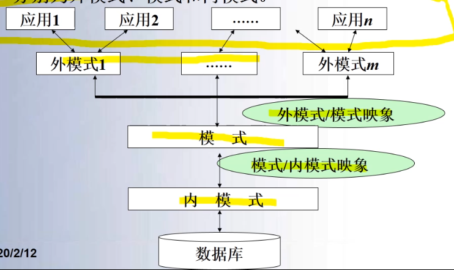

- 模式，也叫逻辑模式， 是全体数据的逻辑结构和特征的描述
- 外模式，是数据库用户能看见的最终表示。外模式是模式的子集，一个数据库可以有多个外模式，不同用户有不同外模式。外模式与应用也是一对多的关系。外模式是保护数据库安全的措施，用户只能看见或访问外模式的数据。
- 内模式，也称存储模式，是数据物理结构和存储方式的描述，一个数据库只有一个内模式。

总的来说，三级模式是对数据的视图级、概念级、物理级的抽象级别。

三级模式之中有两级映像。这种映像目的是数据库内部实现三个抽象层级的联系和转化。

- 外模式与模式之间的映像，定义局部数据逻辑结构和全局逻辑结构的对应关系。当模式结构改变，只需要修改外模式与模式的对应关系，不必修改外模式的局部逻辑结构，实现数据逻辑独立性；

- 模式与内模式之间的映像，定义全局数据逻辑结构和物理数据存储间的对应关系。当物理存储结构改变的时候，仅需要修改模式与内模式间的影响关系，而使模式保持不变，实现数据的物理独立性。

### 数据库管理系统

其功能有

- 定义功能。包括模式定义、外模式定义、内模式定义。
- 操纵功能。
- 保护功能。包括安全性、完整性、并发控制、恢复。
- 维护功能。包括转储、数据装入、统计、存储等。

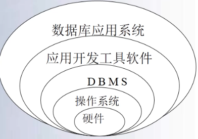

### 数据库系统的不同试图

其人员分成四类：数据库管理员、系统分析员、应用程序员、用户。

不同人员设计数据抽象级别不同。

- 数据库管理员，决定数据库存储结构和策略
- 系统分析员，涉及需求分析
- 设计人员，确定数据库的数据和各级模式
- 应用程序有，编码实现
- 用户，使用系统

### 数据库技术的发展

- 第一代60年代末研制的层次、网状数据库系统
- 第二代关系数据库系统，现在仍占据主流
- 围绕面向对象数据模型的研究，OODBMS

## 数据模型

数据模型是对现实世界数据信息的抽象和表示，分成概念模型和数据模型，对应用户观点的数据模型和狭义的物理存储上的数据模型。

本章主要介绍概念模型和逻辑数据模型，核心是E-R概念模型。对四种逻辑模型只做简单介绍，在第三章重点介绍关系模型。

### E-R概念模型

概念模型是对信息世界的建模，是数据库设计的有力工具。它需要较强的语义表达能力，简单清晰、易于理解。

一、E-R模型中的基本概念

实体：客观存在并可相互区别的事物实体可以是具体对象，比如一个学生，一本书；也可以是抽象的概念或联系，比如一堂课。

属性：实体所具有的某一特征。一个实体可以由若干属性刻画，有类型和值的区分。类型是属性名，值是属性的具体内容。

联系：在现实世界中，事物内部以及事物之间是有联系的。在信息世界中，常被抽象为**实体内部的联系**和**实体之间的联系**。内部的联系是组成实体各属性的联系；之间的联系是不同实体集之间的联系。

实体之间的联系最简单的是两个实体之间的联系：

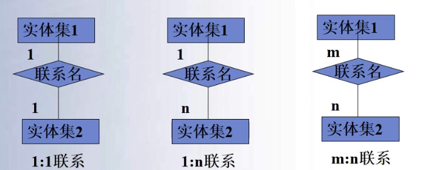

一对一联系：A中的一个实体至多与B的一个实体相对应

一对多联系：A中的一个实体与B中的多个实体相对应，反之B的一个实体至多与A的一个实体相对应

多对多联系：A、B中一个实体与另一个实体集多个实体联系

多个实体间也可以存在联系，称为 **多元联系**。例如

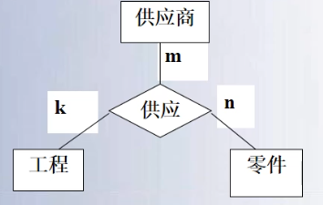

这样的联系称为`m:n:p`。

> 两两之间多对多的联系和三个实体的多对多的联系，语义有何不同呢？
>
> 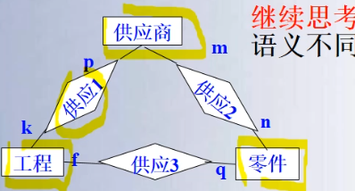
>
> 两两之间的多对多仅能表示一个工程需要哪些零件、由哪些供应商提供。
>
> 但是多对多联系可以描述一个工程所用的零件具体由哪个供应商供应。

实体集内部不同实体间的联系也存在一对一、一对多、多对多。比如，一个领导领导多个职工。

二、E-R模型

E-R（Entity-Relationship Approach）是最著名的概念模型，用矩形表示实体，椭圆表示属性，菱形框表示联系。

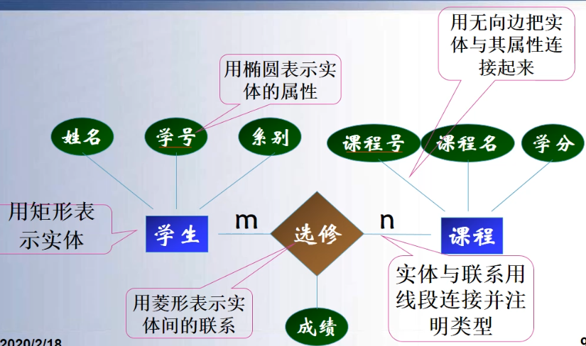

联系有比较多的语义

- 基数比约束，比如二元联系中1：1、1：n的联系
- 参与约束，根据实体是否全部参与联系描述
- 实体参与度，实体参与联系的最小和最大的次数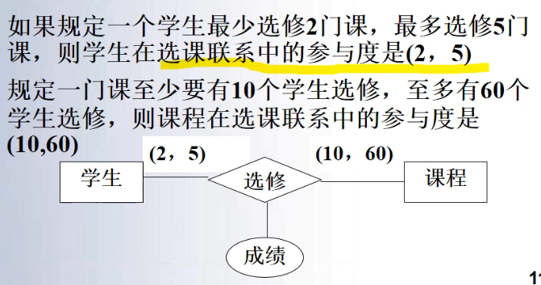
- 弱实体，实体存在依赖于其它实体存在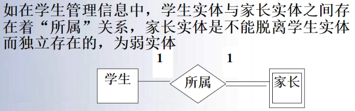
- 子类实体，根据不同特性分成多个子集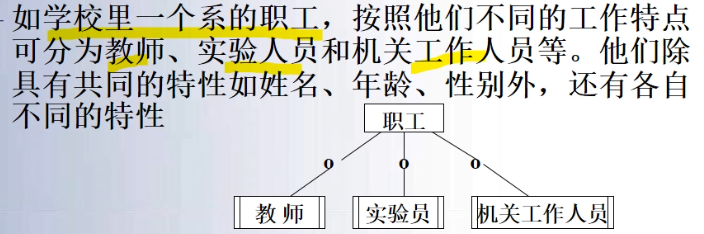

> 一个物资管理需求如下
>
> 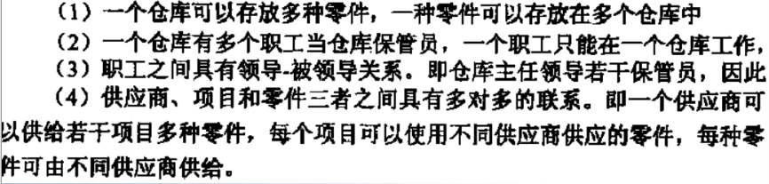
>
> 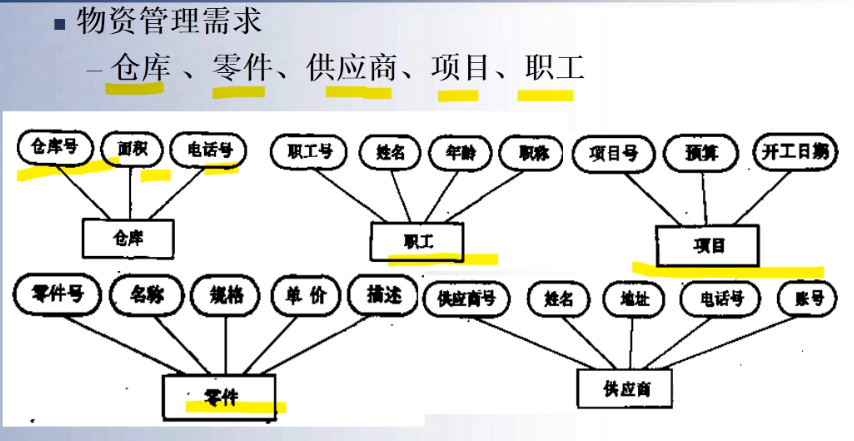
>
> 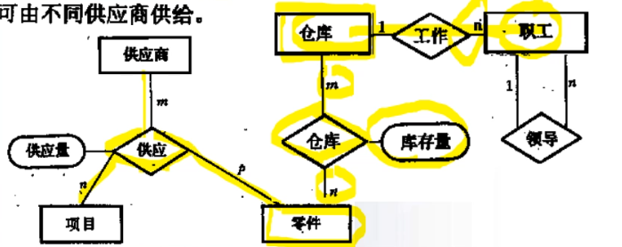
>
> 最后，得到
>
> 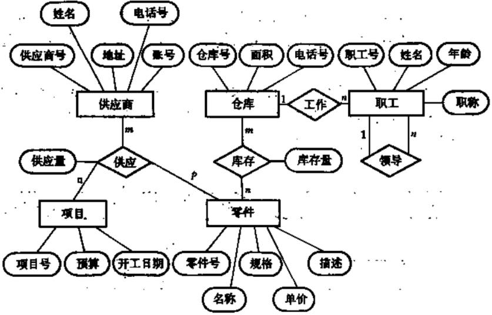

### 层次模型

层次模型是数据库系统最早出现的数据模型，用树形结构表示各类实体和实体间联系。层次模型满足两个条件：有且只有一个节点没有双亲结点，为根节点；根以外节点有且只有一个双亲结点。

比如下面一个层次：

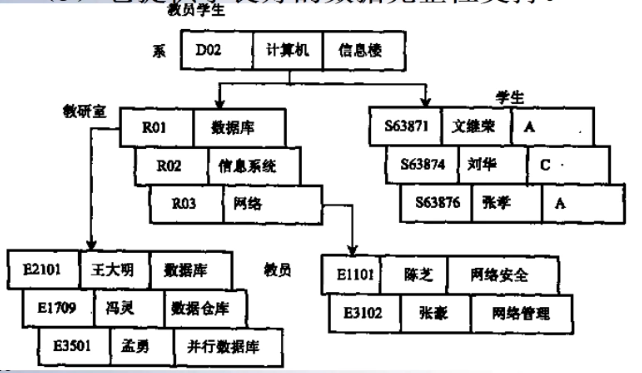

其特点是，数据结构简单清晰，查询效率高，提供了良好的数据完整性支持。

但这种模型不能表示两个以上实体间复杂联系和实体间多对多联系，只能通过引入冗余数据或虚拟节点来解决。对数据插入和删除涉及树的操作，所以工作量比较大，查询子女节点需要通过双亲结点。由于结构严密，层次命令趋于程序化。

### 网状模型

现实世界的联系很多的非层次的，所以用层次模型表达有非直观性。网状模型满足下面的条件：允许一个以上节点无双亲，一个节点可以有多于一个双亲。

网状模型能更直接的描述现实世界，如一个节点可以有多个双亲；同时它性能尚可。但是，它结构非常复杂，不利于用户掌握；DDL、DML语言复杂，不容易使用。

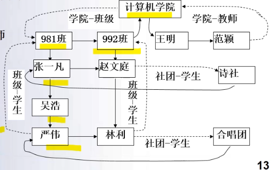

### 关系模型

1970年，E.F.Codd提出了关系数据模型，1977年出现了第一个关系数据库，而80年代依赖关系数据就占据主流。

（1）基本概念和结构

关系是一张二维表，一个关系描述一个实体集。实体有属性，二维表的列就是属性。一个属性对应的一个集合是域。

关系是元组的集合，一个元组对应实体集中的一个个体。一个元组由若干分量组成，一个分量对应一个属性值。

键是一个或多个属性构成的，能够唯一标识一个元组。一个关系中可能有多组属性都能起到标识元组的作用，所以一个关系可能有多个键。选择其中一个作为主键，其余为候选键。

（2）关系模式

对关系结构的描述称为关系模式。关系模式可表示为：

```
关系名(属性1,属性2,...,属性n)
```

（3）ER模式向关系数据模式的映射

关系数据模型中，基本的数据结构是关系。现实世界中，实体和实体间的联系都用关系表示。

联系可以用表来描述。比如，选课联系 -> 选课表。表中有来自学生和课程两个实体的属性，成绩是选课关联自身的描述属性。

关系必须是规范化的，关系的每一个分量必须不可分。也就是，不能存在表中表。

（4）完整性约束

关系数据需要有实体完整性、参照完整性、用户自定义完整性。

（5）数据操纵

允许进行增删改查。

这种关系运算都可以归结为关系代数和关系演算两类。

总的来说，关系数据模型可以表示为下表：

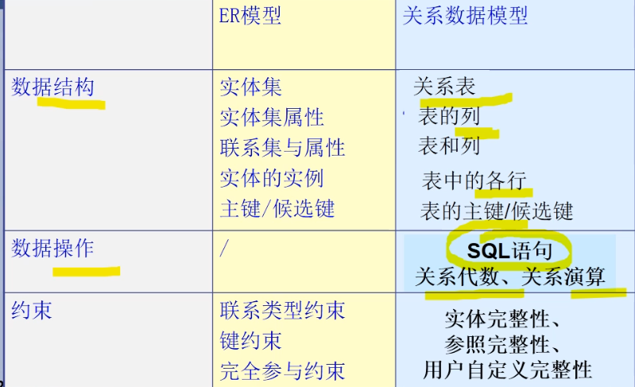

关系模型有下面的优点

- 数据结构简单
- 一体化数据子语言
- 数据独立性高
- 面向集合的存取方式
- 坚实的理论基础
- 有利于开展其他应用

### 面向对象数据模型

对象关系数据系统是面向对象数据模型和关系数据模型相结合的产物。一般来说，面向对象有两条路线，一条是建立新的数据库系统，另一种是走结合路径。

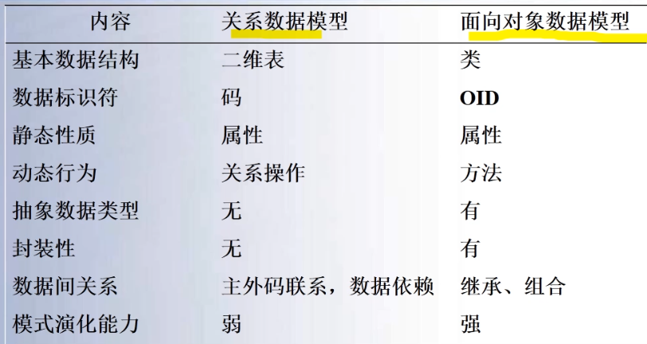

但缺乏通用数据模型、理论基础、查询优化，导致面向对象数据库理论技术没有成熟，关系数据库仍处于统治地位。

## 关系数据库

主要讨论基本概念和各种运算。

按照静态数据结构、动态数据操作、完整性约束来介绍。

### 关系模型基本概念

一、基本概念

域是一组具有相同数据类型的值的集合。

笛卡尔积：给定一组集合$D_1,D_2,\cdots D_n$，那么笛卡尔积$D_1\times D_2 \cdots D_n$就是所有域的所有组合。

笛卡尔积的每个元素叫做一个元组$(d_1,d_2,\cdots,d_n)$，每一个值$d_i$叫做一个分量。

$D_1\times\cdots\times D_n$上任一个子集称为$D_1,\cdots,D_n$上一个关系，$N$叫做关系的目或度。关系的每一行对应一个元组，用$t$表示，每一列对应一个域，列称为属性，$t[A_i]$表示$t$在$A_i$上的值。

按照定义，关系可以是一个无限集合。并且，笛卡尔积不满足交换律。但是无限的集合在数据库中是无意义的，所以 **关系是规范化的二维表中行的集合** ，关系必须是有限集合。

规范化关系有如下性质：

- 列是同质的，每一列的分量来自同一个域
- 不同列可出自一个域，每一列称为一个属性，不同属性给予不同属性名
- 列的顺序无所谓，次序可以交换
- 各个元组是不同的，不允许出现重复元组。（因为实体不能相同）
- 行的次序可以任意交换
- 分量必须为原子值，每一个分量都是不可分的数据项

二、关系模式和关系数据库

关系模式是对关系的描述。该描述包括关系名、属性名、属性的类型和长度、属性间固有的数据关联关系，记为R(A~1~,A~2~,...,A~n~)。

关系模式的集合是关系数据库模式，是对所有数据逻辑结构的描述，表示为R={R1,R2,...,Rp}。

三、键

为了区分不同元组，用一个或多个属性值标识，能够唯一标识元组属性或属性组称为关系的键。其标识作用的键是候选键，多个候选键其中之一为主键。如果关系的键由多个属性组成，则称为联合键。关系所有属性构成关系的键，称为全键。

四、完整性约束

为了保证数据域一致性，需要

- 实体完整性，一般自动支持

  - 主键的值不能为空或部分为空。
  - 实体完整性是针对基本关系而言的，基本表对应现实世界一个实体集。现实世界实体和实体是可区分的，而关系模型中主键是唯一性标识。主键的属性不能取空值。

- 参照完整性，一般自动支持

  - 如果$R_1$中A是$R_2$的主键，那么R~1~中让你一个元组在A上的值或者为空，或者为R~2~中某个元组主键的值。

  - 比如学生和专业信息，二者是参照关系和被参照关系。学生的专业信息要么是空，要么是专业信息中的某个数据项。这个时候，其取值局限在专业代码中。

  - 这个时候，外键参考主键信息。

    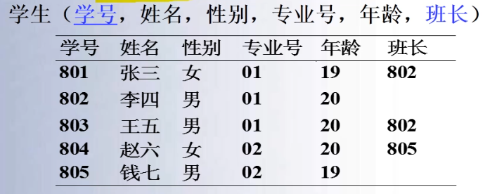

    比如这个图中，班长的取值一定是学号之中。

- 用户定义完整性，用户定义后系统支持

  - 用户定义完整性是针对某一具体关系数据库的约束条件。比如，成绩不能为负数、性别的输入条件。
  - 也叫做预定义完整性。

### 关系代数

一、关系代数概述

关系代数是抽象的查询语言，用对关系的运算表达查询。

它有三个要素：

- 运算对象：关系
- 运算结果：关系
- 运算符

按照运算符不同，关系代数分成两类：传统的集合运算和专门的关系运算。

二、集合运算

（1）并

假如R、S有相同的目，属性取自同一域，那么
$$
R \cup S = \{t|r\in R \or t \in S\}
$$
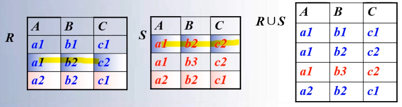

（2）差

假如R、S有相同的目，属性取自同一域，那么
$$
R-S = \{t | t \in R \and t \not \in S\}
$$
所以差可以代表删除。

（3）交

假如R、S有相同的目，属性取自同一域，那么
$$
R\cap S = \{t | t \in R \and t \in S\}
$$
（4）笛卡尔积

R是n目关系，有k~1~个元组，S是m目关系，有k~2~个元组，那么
$$
R \times S = \{t_rt_s | t_r \in R \and t_s \in S\}
$$


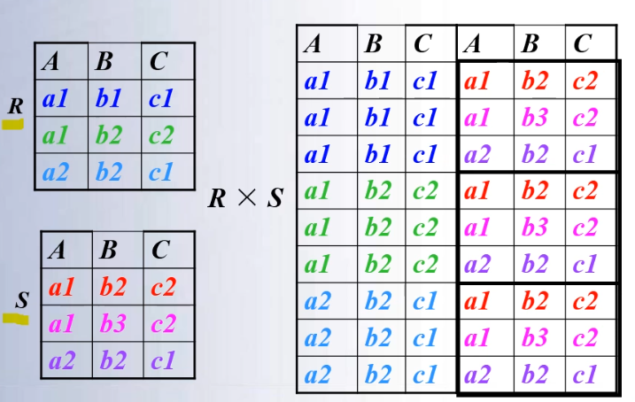

三、关系运算

先引入记号

$R$ 表示关系，$t$表示元组，$t[A_i]$表示分量，$t[A]$表示诸分量的集合，$\overline A$表示$\{A_1\cdots A_n\}$去掉$\{A_{i1}\cdots A_{in}\}$的属性组，$t_rt_s$表示元组连接

（1）选择
$$
\sigma_F(R) = \{t|t\in R \land t(F)\}
$$
其中$F$是布尔表达式，其含义是选$t(F)$为真的所有元组，从行的角度进行运算。

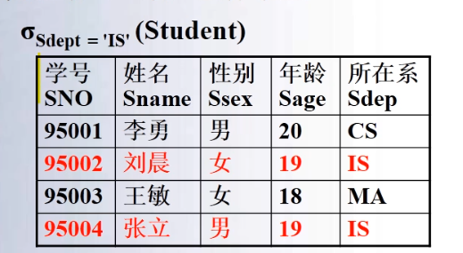

（2）投影
$$
\Pi_x(R)\{t[X]|t\in R\}
$$
从列的角度运算，选出若干属性列组成新的关系

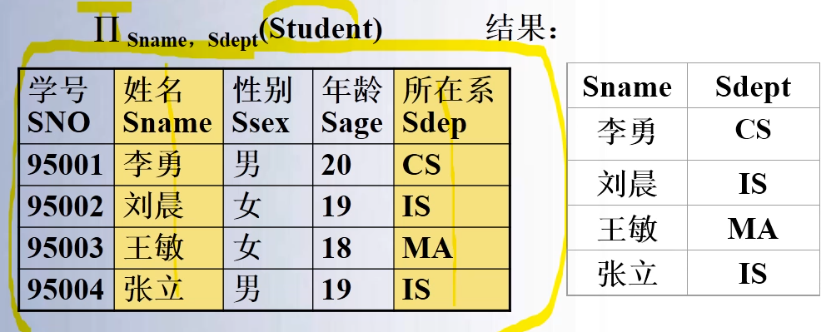

（3）连接

条件连接和自然连接

条件连接：
$$
R\underset{A \theta B}{\large \Join}S = \{t|t=t_rt_s, t_r\in R \land t_s \in S \land t_r[A]\ \ \theta\ \  t_s[B]\}
$$
$\theta$为条件。

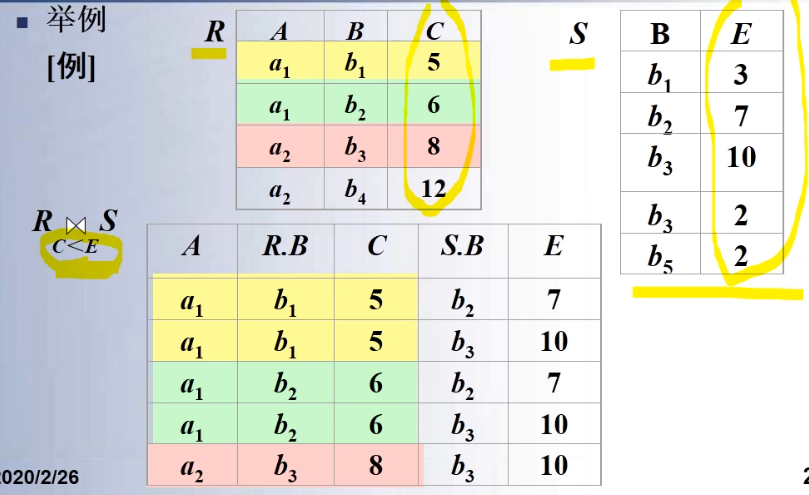

所以，条件连接相当于
$$
R \underset{A \theta B}{\large \Join} S = \sigma_{A \theta B} (R \times S)
$$
若$\theta$表示=，则称为等值连接。

自然连接是特殊的等值连接，要求两个关系中比较的分量是相同的属性组，并在结果集中把重复的属性列去掉。
$$
R \Join S = \{t|t=t_rt_s[\overline A], t_r\in R \land t_s \in S \land t_r[A] = t_s[A]\}
$$
比如下例

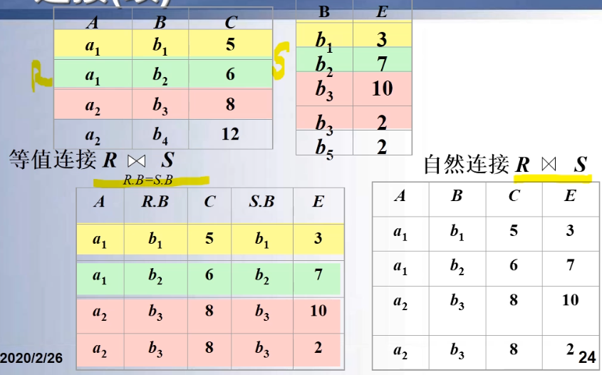

 如果有多列，也遵循相同规则

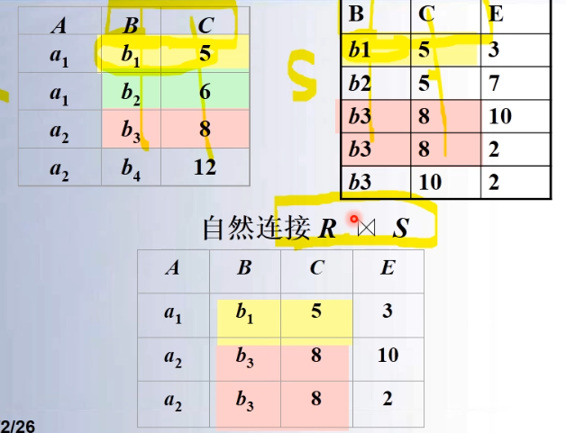

所有重复字段都必须严格相同。

（4）除

如果R、S有同一域上的属性或属性组，$R \div S$结果生成新关系$R'$。

设$R(X,Y), S(Y), R'(X)$，则
$$
R \div S = \{t|t\in R' \land tr \in R \land ts \in S \land tr[R']=t \land t \Join S \subseteq R\}
$$
也就是R的属性中去掉与S具有公共域属性的其他属性。

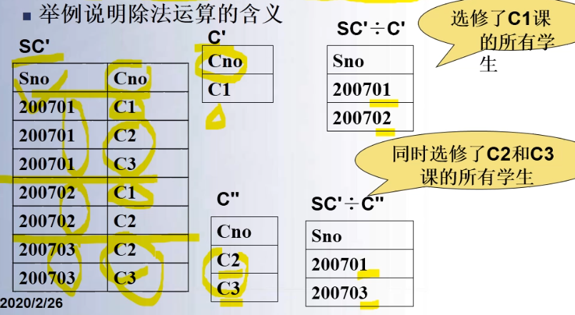

也可以这么表示除运算
$$
R \div S = \Pi_x(R) - \Pi_x(\Pi_x(R) \Join S - R)
$$
其中$X$为$R$中除去$S$属性相同的其余属性。

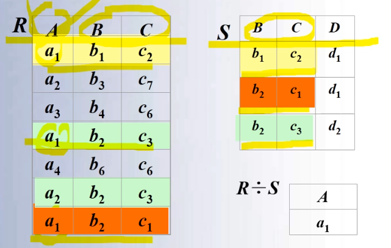

接下来，我们更进一步解释除运算。首先引入象集$Z_X$：给定关系R(X,Z)，X、Z为属性组，当$t[X]=x$时，定义
$$
Z_x = \{t[Z]|t\in R, t[X]=x\}
$$
表示R中属性组X上值为x的诸元组在Z上分量的集合。比如

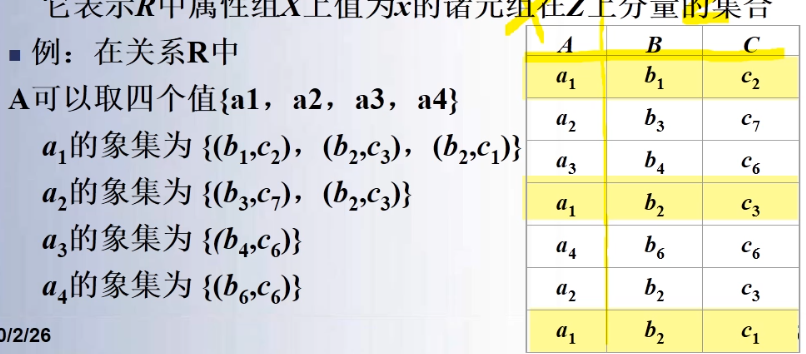

这样，我们定义除运算

给定关系R(X,Y)和S(Y,Z)，X、Y、Z为属性组，那么除运算得到的P(X)是满足下列条件的元组在X属性列上的投影：**元组在X上的分量值x的象集Y~x~包含S在Y上投影的集合**。再从上面的例子来看：

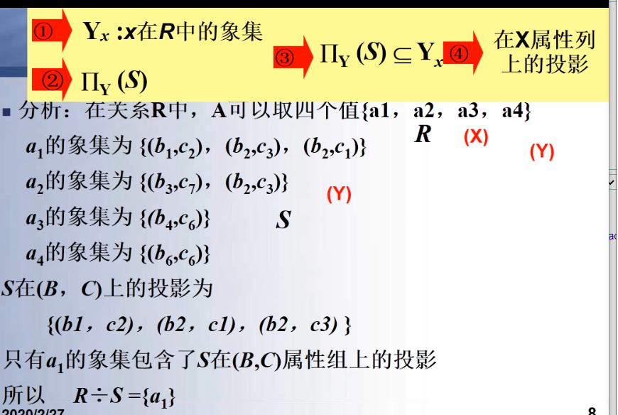

四、扩充关系运算

下面介绍几个扩充运算。

（1）属性重命名

r是R上一个关系，A是R的一个属性，B是属性名，那么
$$
r'(R') = \delta_{A\to B}(r)
$$
记为属性重命名。可以同时对一组属性操作，可以在同一个关系上做自然连接运算、做同一个关系的笛卡尔积、将两个关系的等值连接表示为自然连接。

（2）外连接

外连接是对自然连接的扩展，包含除了满足连接条件元组外包含未被连接的元组。

外连接包括左外连接、右外连接、全连接。

左外连接：关系R中不满足连接条件的元组，记为$R\Join_L S$

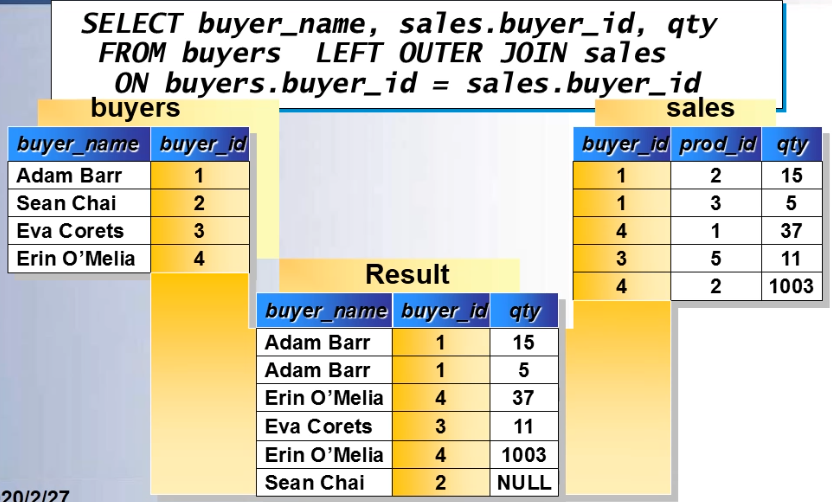

此时，比起自然连接，拓展了左面关系不满足条件的2号，并添加了NULL。

右外连接：关系S中不满足连接条件的元组，这些关系补空值，记为$R\Join_R S$

全外连接：关系R、S都进行考虑，记为$R\Join_F S$

> 实例
>
> （1）检索计算机系学生的学号和姓名
> $$
> \Pi_{id, name}(\sigma_{pro='计算机'}(Student))
> $$
> （2）查询选修2号课程学生学号
> $$
> \Pi_{id}(\sigma_{课程号='2'}(SC))
> $$
> （3）查询选修1号课程的学生姓名（数据表为Student和SC）
>
> 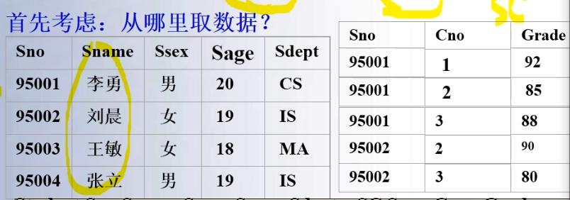
> $$
> \Pi_{sname}(\sigma_{Cno='1'}(\sigma_{sc.sno=student.sno}(SC \times Student)))
> $$
> 也可以直接自然连接
> $$
> \Pi_{sname}(\sigma_{Cno='1'}(SC \Join Student))
> $$
> 或
> $$
> \Pi_{sname}(\sigma_{Cno='1'}(SC) \Join Student)
> $$
> （4）
>
> 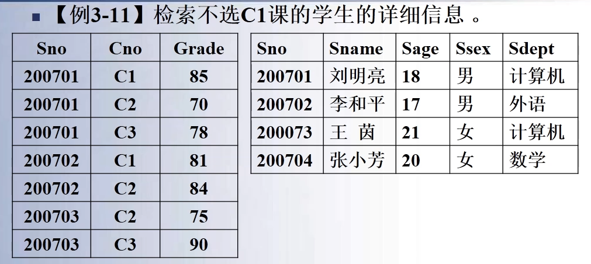
> $$
> Student - (\Pi_{Sno}(\sigma_{Cno='C1'}(SC)) \Join Student)
> $$
> （5）
>
> 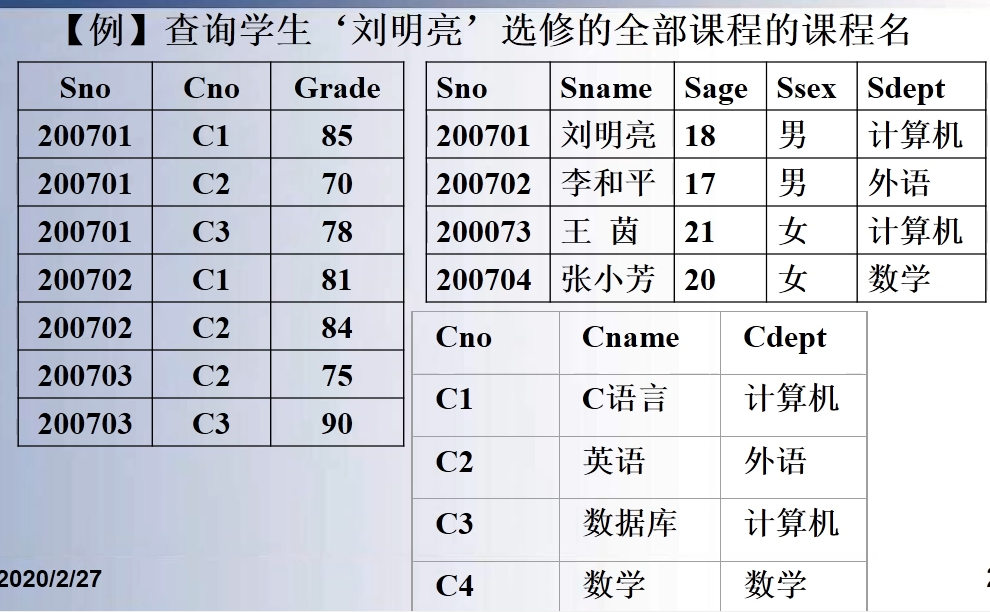
> $$
> \Pi_{Cname}(\sigma_{Sname='刘明亮'} (Course \Join SC \Join Student))
> $$
> （6）
>
> 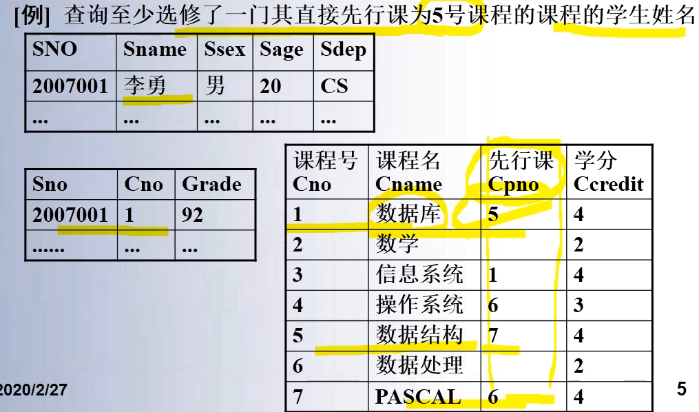
> $$
> \Pi_{Sname}(\sigma_{Cpno='5'} (Course \Join SC \Join Student))
> $$
> 也可以写成
> $$
> \Pi_{Sname}(\sigma_{Cpno='5'}(Course) \Join SC \Join \Pi_{Sno, Sname}(Student))
> $$
> 等。
>
> （7）
>
> 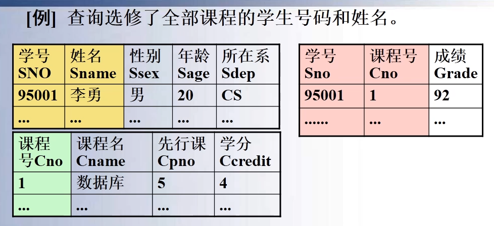
> $$
> \Pi_{Sno,Cno}(SC) \div \Pi_{Cno}(Course) \Join \Pi_{Sno,Sname}(Student)
> $$
> （8）查询选修1号课程和3号课程的学生的学号
>
> 首先建立临时关系$K$，Cno列为$1,3$。则答案为
> $$
> \Pi_{Sno,Cno}(SC) \div K
> $$
> （9）
>
> 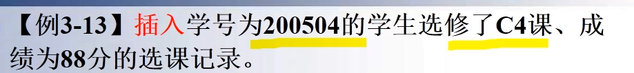
> $$
> SC \cup \{'200504','C4',88\}
> $$
> （10）删除学生刘明亮选修的英语课
> $$
> SC - (\Pi_{Sno}(\sigma_{Sname='刘明亮'}(Student))\Join SC \Join \Pi_{Cno}(\sigma_{Cname='英语'}(Course)))
> $$
> （11）
>
> 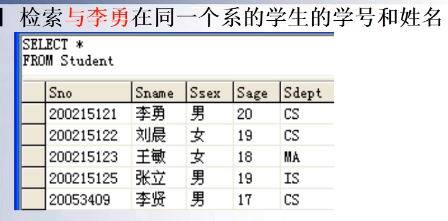
> $$
> \Pi_{Sname}( Student \div \Pi_{Sdept}(\sigma_{Sname='李勇'}(Student)))
> $$
>
> $$
> \sigma_{Sname='李勇'}(\Pi_{Sname,Sno',Sname'}(Student\Join \delta_{Sno,Sname,Sage,Ssex \to Sno',Sname',Sage',Ssex'}(Student)))
> $$

用关系代数可以完成数据的检索、插入、删除，一次一集合。交并差笛卡尔积，选择投影连交除。

### 元组关系演算

关系代数是用关系运算来表达查询，关系演算是用谓词来表达查询要求。进一步分为元组演算和域演算。

元组语言的语句格式是 操作语句 <工作空间名> (表达式) : 条件

- 检索语句Get
  - GET W (SC.Cno)
  - GET W (Student)
  - GET W (Student.Cno, Student.Sage) : Student.Sdept = 'IS'
- 更新操作
  - HOLD 将修改元组读到空间中
    - HOLD W (Student.Sno, Student.Sdetp) : Student.Sno = '95007'
  - MOVE 用宿主语言修改
    - MOVE 'IS' TO W.Sdept
  - UPDATE 将修改后元组送回
    - UPDATE W
  - PUT 插入操作
    - MOVE '8' TO W.Cno
    - MOVE '机组' To W.Cname
    - PUT W (Course)
  - DELETE 删除操作
    - HOLD W ...
    - DELETE W

### 域关系语言

域关系语言是基于屏幕表格的查询语言。

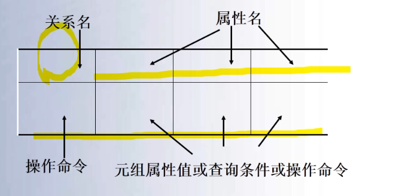

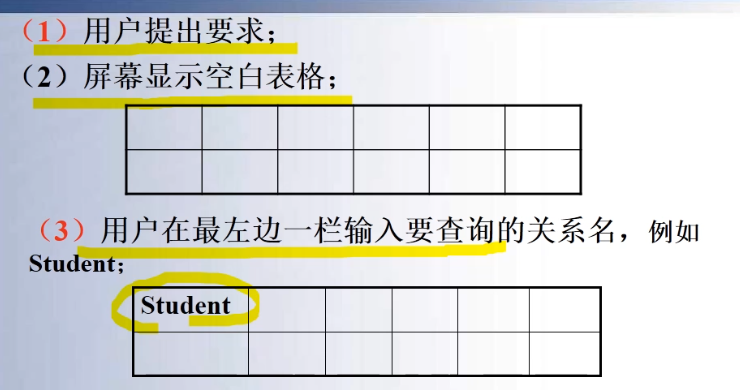

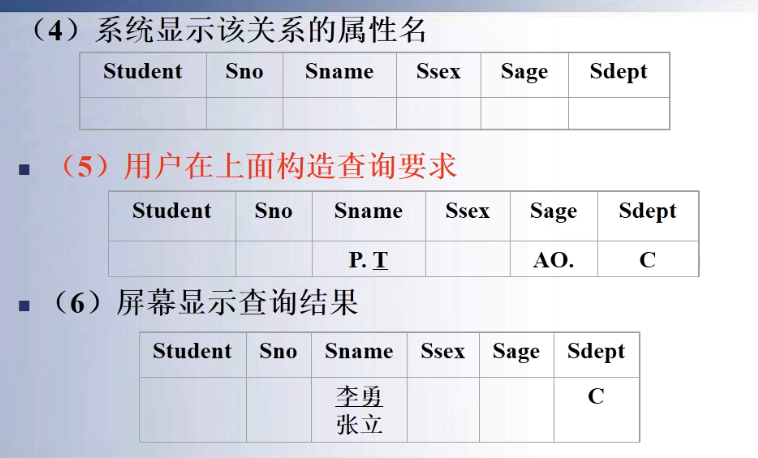

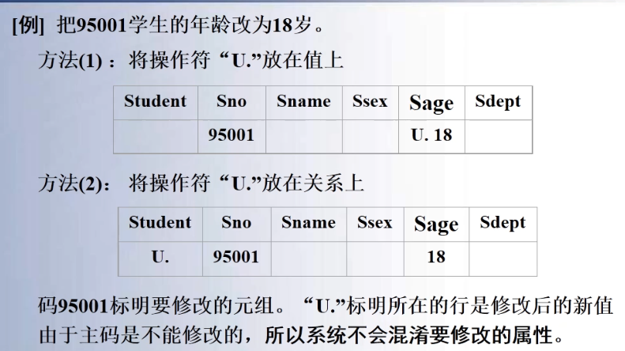

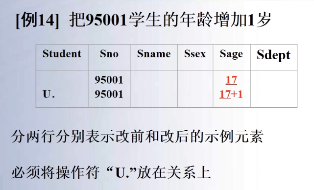

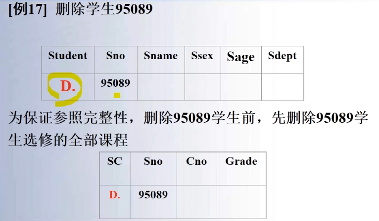

了解其特点即可。

### 关系数据语言

关系数据语言集关系代数和关系演算为一体。

- 关系数据语言是一种高度的非过程化的语言
- 存取路径选择由DBMS优化机制来完成
- 用户不必用循环结构就可以完成数据操作
- 能够嵌入高级语言使用
- 关系代数、元组关系演算和域关系演算三种语言在表达能力上完全等价。

这里有三种关系运算的等价性。

关系数据库中，关系是有限的。关系代数运算是安全的，但关系演算不一定安全。当对安全性进行限制注资后，三种演算是完全等价的。

## 关系数据库标准语言SQL

### SQL概述

SQL(Structure Query Language, 结构化查询语言)是一种介于关系代数和关系演算的语言。包括数据定义、查询、操纵、控制功能为一体，已称为关系数据库的标准语言。

SQL语言版本包括89、92、99、03等，本课主要介绍SQL89、92等基本原理。

SQL的特点有

- 综合统一，集数据定义、操纵、控制语言于一体
- 高度非过程化，只需要指出做什么，无需指出怎么做
- 面向集合的操作方式
- 以同一种语法结构提供两种使用方式：作为独立的语言，在交互终端由DBMS解释执行；作为嵌入式语言，嵌入高级语言程序
- 语言简洁，易学易用

支持数据库三级模式结构

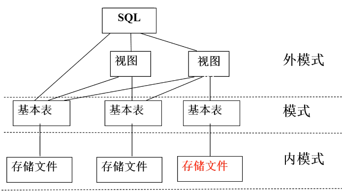

- 在SQL中，关系模式被称为基本表。所有基本表的集合形成数据库模式，对应三级模式结构的模式。
- 基本表在物理上与存储文件对应，存储文件的集合形成物理数据库，对应内模式。
- 外模式由视图组成。

基本表独立存在，一个关系模式对应一个基本表；而视图是从一个或多个基本表导出的表，不实际存储数据，是一种虚表。它只有一个定义，根据视图从中取出一个临时表.

### SQL的数据定义

一、SQL的数据定义功能

定义表、视图、索引，在SQL2中又添加了模式。

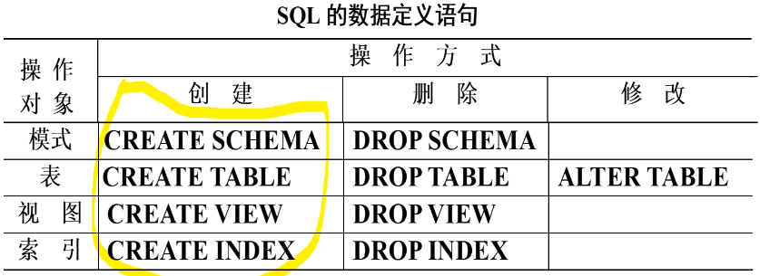

二、SQL模式的定义

SQL模式由模式名、权限标识符和模式中元素的描述符组成。权限标识符指明该模式的用户或账号，模式元素包含一个数据库应用的表、视图和索引等。

模式实际上相当于一个命名空间，可以进一步定义该模式包含的数据库对象，如表、视图和索引。

```SQL
CREATE SCHEMA 模式名 AUTHORIZATION 用户名;
CREATE SCHEMA 模式名 AUTHORIZATION 用户名 
[表定义子句 | 视图定义子句 | 授权定义子句];
```

> 定义学生数据库模式SST，用户SDBA
>
> ```sql
> CREATE SCHEMA SST AUTHORIZATION SDBA;
> ```
>
> 如果不指定模式名，则默认使用用户名。

> 创建模式时顺便定义
>
> ```sql
> CREATE SCHEMA SST AUTHORIZATION SDBA
> 	CREATE TABLE t1 (c1 INT PRIMARY KEY,
>                     c2 INT);
> ```

三、SQL模式的删除

```SQL
DROP SCHEMA 模式名 [CASCADE | RESTRICT]
```

CASCADE：级联式，把基本表、视图和索引等元素全部一并删除

RESTRICT：只有模式没有任何元素才能删除该元素

四、定义基本表

```sql
CREATE TABLE 表名
	(列名 数据类型 [列级完整性约束条件]
     列名 数据类型 [列级完整性约束条件]
     ...
     [表级完整性约束条件])
```

例如，*建立学生表Student*

```sql
CREATE TABLE Student (
	Sno CHAR(6) NOT NULL UNIQUE, -- 列级完整性约束
    Sname CHAR(8),
    Sage Int,
    Sdept Char(12),
    CONSTRAINT C1 CHECK(Ssex IN('男','女')), -- 表级完整性约束
    CONSTRAINT S_PK PRIMARY KEY(Sno) -- S_PK 主键约束
);
```

（1）`CONSTRAINT 约束名 约束` 表示约束

（2）SQL的数据类型

- SMALLINT
- INTEGER(INT)
- REAL 浮点数
- DOUBLE PRECISION 双精度浮点数
- FLOAT(n) n位精度浮点数
- NUMBER(p[,q]) p位定点数，小数点后q位
- CHAR(n) 长度为n的定长字符串
- VARCHAR(n) 最大长度为n的变长字符串
- BIT(n) 长度为n的二进制位串
- DATE 日期
- TIME 时间
- TIMESTAMP 日期时间

也可以自定义数据类型

```sql
CREATE DOMAIN 域名 数据类型;
```

例如

```sql
CREATE DOMAIN Sdept_TYPE CHAR(12); -- 可以将Sdept类型用域名代替
```

> ```sql
> CREATE TABLE SC(
> 	Sno CHAR(6) NOT NULL,
>     Cno CHAR(6) NOT NULL,
>     Grade INT CHECK (Grade BETWEEN 0 AND 100),
>     CONSTRAINT SC_PK PRIMARY KEY(Sno, Cno), -- 主键
>     CONSTRAINT SC_FK1 FOREIGN KEY(Sno) REFERENCES Student(Sno)  -- 外键
> );
> ```

可以简化

```sql
CREATE TABLE SC(
	Sno CHAR(6) NOT NULL,
    Cno CHAR(6) NOT NULL,
    Grade INT CHECK (Grade BETWEEN 0 AND 100),
    PRIMARY KEY(Sno, Cno), -- 简化主键
    FOREIGN KEY(Sno) REFERENCES Student(Sno)  -- 简化外键
);
```

在定义表的时候，也可以指明模式名。

（3）常用的完整性约束

- PRIMARY KEY
- UNIQUE 唯一性
- NOT NULL 非空
- 参照完整性

五、修改基本表

```sql
ALTER TABLE 表名
	[ADD 列名 数据类型 完整性约束] -- 增加新列
	[DROP 列名 [CASCADE | RESTRICT]] -- 删除列
	[ALTER 列名 数据类型] -- 修改列定义，比如数据类型
```

例如

```sql
ALTER TABLE Student
	ADD Class CHAR(8) -- 新增加的列一律为空，不能指定NOT NULL
	ALTER Sname CHAR(20); -- 可能破坏已有数据
```

六、删除基本表

```sql
DROP TABLE 表名 [RESTRICT | CASCADE]
```

缺省为RESTRICT。

七、建立索引

索引是一种数据结构。

索引技术是数据库管理系统的核心问题。它本质是表上的一种查询路径，由DBA或表的创建者建立删除。其更新维护由DBMS自动完成，系统在存储数据时会自动选择是否使用。

在PRIMARY KEY或UNIQUE等，有些DBMS会自动建立索引。

```sql
CREATE [UNIQUE] [CLUSTER] INDEX 索引名 ON 表名 (
    列名 [次序], 
    [列名, [次序]
]...) 
```

次序是索引值排列次序，ASC为升序，DESC为降序，ASC缺省

UNIQUE表示每个索引值对应唯一数据，CLUSTER表示建立聚集索引。

例如，

```sql
CREATE UNIQUE INDEX S_SNO ON Student(Sno) -- 在学生表Student学号列按升序建立唯一索引
```

唯一值索引需要用UNIQUE修饰。这个索引对应数据记录是唯一的，所以有重复值的属性列不能建UNIQUE索引。建立UNIQUE索引相当于增加UNIQUE约束。

聚集索引的次序和元组物理次序一致，并且建立索引后，基表中数据需要按指定聚集属性值升序或降序存放。对某些类型的查询，聚集索引可以提高查询效率，尤其是经常搜索范围值的列，或是需要排序。在一个基本表上最多只能建立一个聚集索引，可以包含多个列。它一般适用下面两个条件：

- 很少对基表增删操作
- 很少对变长列修改操作

八、删除索引

```sql
DROP INDEX 索引名
```

不影响表的内容

索引为性能带来的好处是有代价的。对某个属性建立索引，能提高对属性上的值的检索效率，进行连接操作也能加快连接速度。但是带索引的表会占据更多空间，同时完成增删改操作时，花费时间会增长。

### 单表查询

一、单表查询的基本格式

```sql
SELECT [ALL|DISTINCT] <目标列表达式>[,<目标列表达式>]
FROM <表名或视图名>[,<表名或视图名>] ... | (SELECT 语句) [AS] <别名>
[WHERE <条件表达式>]
[GROUP BY <列名1> [HAVING <条件表达式>]]
[ORDER BY <列名2> [ASC|DESC]]
```

这是SQL的基本架构。具体来说，

- SELECT子句指定查询属性列
- FROM子句表明查询对象
- WHERE表明查询条件
- GROUP BY对查询结果按指定列的值分组，该属性列值相等的元组为一个组
- HAVING满足指定条件才输出
- ORDER BY对查询结果指定列值升序或降序

二、查询列

查询指定列：

```sql
SELECT Sno,Sname FROM Student;
```

查询所有列，可以用通配符表示

```sql
SELECT * FROM Student;
```

也可以查询某个表达式，查询“虚列”

```sql
SELECT Sname, 2014-Sage FROM Student;
```

> 例 *查询全体学生姓名、出生年份和所在院系，要求用小写字母表示系名*
>
> ```sql
> SELECT Sname, 'Year of birth', 2014-Sage, LOWER(Sdept) FROM Student;
> ```

在查询过程中，可以给出别名，比如

```sql
SELECT Sname NAME, 'Year of birth' BIRTH, 2014-Sage BIRTHDAY, LOWER(Sdept) DEPARTMENT FROM Student;
```

那么得到的新表属性就发生了改变。

如果希望对查询结果进行去重，可以加上`Distinct`。比如

```sql
SELECT DISTINCT Sno FROM SC;
```

三、条件查询

常见的查询条件有

| 查询条件 |                 谓词                 |
| :------: | :----------------------------------: |
|   比较   | =,>,<,>=,<=,!=,<>,!>,!<;NOT + 比较符 |
| 确定范围 |     BETWEEN AND, NOT BETWEEN AND     |
| 确定集合 |              IN, NOT IN              |
| 字符匹配 |            LIKE, NOT LIKE            |
|   空值   |         IS NULL, IS NOT NULL         |
| 多重条件 |             AND, OR, NOT             |

（1）比较大小

*查询计算机系全体学生名单*

```sql
SELECT Sname FROM Student WHERE Sdept = 'CS';
```

*查询所有年龄在20岁以下的学生姓名和年龄*

```sql
SELECT Sname, Sage FROM Student WHERE Sage < 20;
```

*查询考试成绩有不及格的学生的学号*

```sql
SELECT DISTINCT Sn FROM SC WHERE Grade < 60;
```

（2）确定范围

*查询20-23岁的学生姓名、系别和年龄*

```sql
SELECT Sname, Sdept, Sage FROM Student BETWEEN 20 AND 23;
```

（3）确定集合

*查询CS、MA和IS系学生姓名和性别*

```sql
SELECT Sname, Ssex FROM Student WHERE Sdept IN ('CS', 'MA', 'IS');
```

*查询不是CS、MA、IS系的学生姓名和性别*

```sql
SELECT Sname, Ssex FROM Student WHERE Sdept NOT IN ('CS', 'MA', 'IS');
```

（4）字符匹配

可以是一个完整的字符串，也可以有通配符

- `%` 表示任意长度字符串，`a%b`表示a开头b结尾字符串
- `_` 代表任意单个字符，`a_b`表示a开头b结尾任意字符串

*查询学号为201215xxx学生的情况*

```sql
SELECT * FROM Student WHERE Sname LIKE 201215%
```

*查询姓欧阳且为三个汉字学生的姓名*

```sql
SELECT Sname FROM Student WHERE Sname LIKE '欧阳_'
```

*查询第二个字为阳的学生姓名学号*

```sql
SELECT Sname, Sno FROM Student WHERE Sname LIKE '_阳%'
```

*查询所有不姓刘的学生姓名、学号和性别*

```sql
SELECT Sname, Sno, Ssex FROM Student WHERE Sname NOT LIKE '刘%'
```

注意某些条件下需要进行转义

```sql
SELECT Cno, Ccredit FROM Course WHERE Cname LIKE 'DB\_Design' ESCAPE '\'
```

这里的ESCAPE表示将`\`定义为转义字符

（5）空值查询

注意区分IS和=。

*查询缺少成绩的学生的学号和课程号*

```sql
SELECT Sno, Cno FROM SC WHERE Grade IS NULL;
```

*查询有成绩的学生的学号和课程号*

```sql
SELECT Sno, Cno FROM SC WHERE Grade IS NOT NULL;
```

（6）多重条件查询

*查询计算机系年龄20岁以下的学生姓名*

```sql
SELECT Sname FROM Student WHERE Sdept='CS' AND Sage<20;
```

四、排序子句

`ASC`升序，`DESC`降序

*查询选修3号课程学生的学号和成绩，查询结果按分数降序排列*

```sql
SELECT Sno, Grade FROM SC WHERE Cno = '3' ORDER BY Grade DESC;
```

*查询全体学生情况，结果按系系号升序排列，同一系学生按年龄降序排列*

```sql
SELECT * FROM Student ORDER BY Sdept, Sage DESC;
```

五、聚集函数

常见的聚集函数包括：

- 统计元组个数 `COUNT(*)`
- 统计一列中值的个数 `COUNT([DISTINCT|ALL] <列名>)`
- 计算一列值综合 `SUM([DISTINCT|ALL] <列名>)`
- 计算一列值平均 `AVG([DISTINCT|ALL] <列名>)`
- 计算最大值 `MAX([DISTINCT|ALL] <列名>)`
- 计算最小值 `MIN([DISTINCT|ALL] <列名>)`

查询学生总人数

```sql
SELECT COUNT(*) FROM Student;
```

*查询选修了课程的学生人数*

```sql
SELECT COUNT(DISTINCT Sno) FROM SC;
```

*计算1号课程的学生平均成绩*

```sql
SELECT AVG(Grade) FROM SC WHERE Cno = '1';
```

*计算选修1号课程的学生最高分数*

```sql
SELECT MAX(Grade) FROM SC WHERE Cno = '1';
```

*查询学生201215012选修课程总分数*

```sql
SELECT SUM(CCredit) FROM SC, Course WHERE Sno='201215012' AND SC.Cno = Course.Cno
```

六、GROUP BY子句

GROUP BY子句可以细化聚集函数的作用对象，作用于查询结果，对查询结果分组后分别作用于每个组，按指定的一列或多列值分组，值相等的为一组。

*求各个课程号及对应的选课人数*

```sql
SELECT Cno, COUNT(Sno) FROM SC GROUP BY Cno;
```

结果可能是这样：

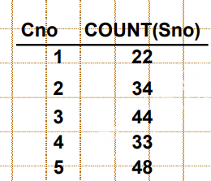

如果在GROUP BY中使用条件判断，一般使用HAVING子句。考虑下面一个情形：

*查询选修了3门以上课程的学生学号*

```sql
SELECT Sno FROM SC GROUP BY Sno HAVING COUNT(*) > 3
```

我们不能使用

```sql
SELECT Sno FROM SC WHERE COUNT(*) > 3 GROUP BY Sno
```

一方面，`WHERE`中不允许引入聚集函数。另一方面，这里的条件是对分组结果的筛查，所以直接用`WHERE`在语义上也是错误的。

*查询平均成绩大于或等于90分的学生学号和平均成绩*

```sql
SELECT Sno, AVG(Grade) FROM SC GROUP BY Sno HAVINg AVG(Grade) >= 90
```

这里只需要记住，HAVING的作用对象是 **组**，WHERE的作用对象是 **基表**。

### 连接查询

SQL中的连接是对连接条件而言，因此，总体来说其具有这样的形式：

```sql
[<表名1>.]<列名1> <比较运算符> [<表名2>.]<列名2>
```

一、等值与非等值连接查询

*查询每个选修和选修课程的情况*

```sql
SELECT Student.*, SC.* FROM Student, SC WHERE Student.Sno = SC.Sno;
```

这样的结果是直接的连接：

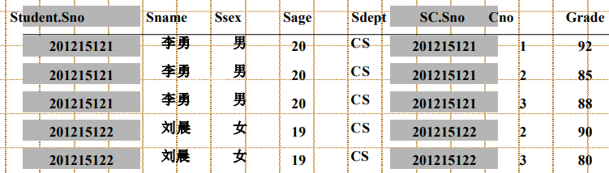

如果需要自然连接，可以通过

```sql
SELECT Student.Sno, Sname, SSex, Sage, Sdept, Cno, Grade FROM Student, SC WHERE Student.Sno = SC.Sno;
```

*查询选修2号课程且成绩90分以上的学生学号姓名*

```sql
SELECT Student.Sno, Sname FROM Student, SC WHERE 	
		Student.Sno = SC.Sno,
		AND SC.Cno = '2'
		AND SC.Grade > 90;
```

二、自身连接

将表和自身进行连接，称为自身连接，是一种特殊的连接。比如对于下面这张表

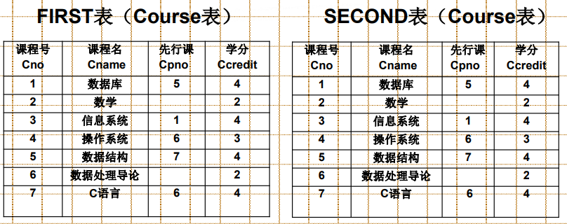

查询对象是每一门课的直接先修课的名称。这样的查询需要起别名，

```sql
SELECT FIRST.Cname, SECOND.Cname 
	FROM Course FIRST, Course Second
	WHERE FIRST.Cpno = SECOND.Cpno;
```

三、外连接

外连接以指定表为连接主体，将**主体表中不满足条件的元组一并输出**。这种连接分成左外连接和右外连接。

比如

```sql
SELECT Student, Sno, Sname, Ssex, Sage, Sdept, Cno, Grade FROM Student LEFT OUT JOIN SC ON (Student.Sno = SC.Sno);
```

那么将得到这样的表

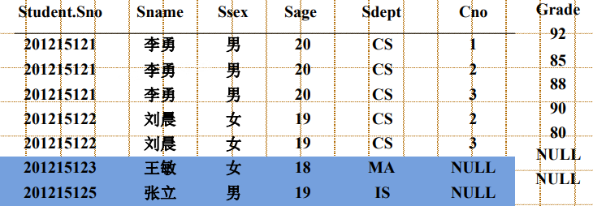

四、多表连接

两个以上的表连接

```sql
SELECT Student.Sno, Sname, Cname, Grade FROM Student, SC, Course
	WHERE Student.Sno = SC.Sno
	   AND SC.Cno = Course.Cno
```

### 嵌套查询

一个`SELECT-FROM-WHERE`语句称为一个查询块，将一个查询块嵌套在另一个查询块的语句称为嵌套查询。

典型的嵌套查询：

```sql
SELECT Sname FROM Student WHERE Sno IN
	(SELECT Sno FROM SC WHERE Cno = '2')
```

外层的也叫父查询，内层的也叫子查询。注意，子查询不能使用`ORDER BY`。

嵌套查询分成不相关子查询和相关子查询两类。如果子查询不依赖于父查询，子查询结果用于建立父查询条件，就称作不相关子查询。如果子查询查询条件依赖于父查询，那么会经过如下过程：

- 取外层查询中表的第一个元组
- 根据其与内层查询相关属性值处理内层查询
- 如果`WHERE`子句返回是真，就放入结果表
- 重复这一过程

一、带有IN谓词的子查询

*查询与刘晨在同一个系学习的学生*

```sql
SELECT Sname FROM Student WHERE Sdept IN (
	SELECT Sdept FROM Student WHERE Sname='刘晨'
)
```

如果不进行子查询，也可以使用自身连接

```sql
SELECT S1.Sname FROM Student S1, Student S2 
	WHERE S1.Sdept = S2.Sdept AND S2.Sname = '刘晨' 
```

*查询选修了课程名为信息系统的学生学号姓名*

```sql
SELECT Sno, Sname FROM Student WHERE Sno IN (
	SELECT Sno FROM SC WHERE Cno IN (
    	SELECT Cno FROM Course WHERE Cname = '信息系统'
    )
)
```

也可以用连接实现

```sql
SELECT Sno, Sname FROM Student, SC, Course
	WHERE Student.Sno = SC.Sno
		AND SC.Cno = Course.Cno
		AND Course.Cname = '信息系统'
```

二、带有比较运算符的子查询

如果内层查询一定返回**单值**，可以使用比较运算符。

*查询与刘晨在同一个系学习的学生*

```sql
SELECT Sname FROM Student WHERE Sdept = (
	SELECT Sdept FROM Student WHERE Sname ='刘晨'
)
```

*找出每个学生超过他选修课程平均成绩的课程号*

```sql
SELECT Sno, Cno FROM SC S1 
	WHERE Grade >= (
    	SELECT AVG(Grade) FROM SC S2 
        	WHERE S1.Sno = S2.Sno
    )
```

这个过程可以如下举例：首先取出SC的元组x，将Sno比如`201215121`传入内层查询，这个时候内层查询转换为

```sql
SELECT AVG(Grade) FROM SC S2 WHERE S2.Sno = '201215121'
```

此时得到88，作为学生的近似成绩。传回外层，转化为

```sql
SELECT Sno, Cno FROM SC S1 WHERE Grade >= 88;
```

这个时候就得到了该生的结果。

三、带有ANY或ALL的子查询

ANY和ALL需要配合比较运算使用：

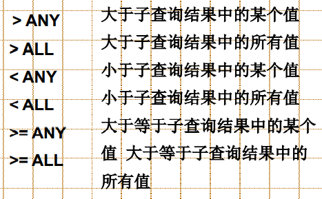

*查询非科班中比计算机任意一个学生年龄小的姓名和年龄*

```sql
SELECT Sname, Sage FROM Student WHERE Sage < ANY (
	SELECT Sage FROM Student WHERE Sdept = 'CS'
) AND Sdept <> 'CS';
```

*查询非科班中比计算机所有学生年龄小的姓名和年龄*

```sql
SELECT Sname, Sage FROM Student WHERE Sage < ALL (
	SELECT Sage FROM Student WHERE Sdept = 'CS'
) AND Sdept <> 'CS';
```

由于ANY/ALL表示恒成立/恒存在，可以转换为聚集函数

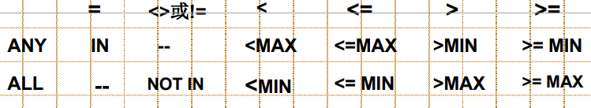

例如，上述查询可以转化为

```sql
SELECT Sname, Sage FROM Student WHERE Sage < (
	SELECT MIN(Sage) FROM Student WHERE Sdept = 'CS'
) AND Sdept <> 'CS';
```

四、带有Exists谓词的子查询

只返回True和False。

*查询所有选修1号课程的学生姓名*

```sql
SELECT Sname FROM Student WHERE EXISTS (
	SELECT * FROM Sno WHERE Sno = Stundent.Sno AND Cno = '1'
)
```

*查询没有选修1号课程的学生姓名*

```sql
SELECT Sname FROM Student WHERE NOT EXISTS (
	SELECT * FROM Sno WHERE Sno = Stundent.Sno AND Cno = '1'
)
```

可以通过谓词转换实现全称量词。

### 集合查询

集合操作包括交并差。各查询结果列数必须相同，数据类型也必须相同。

*查询计算机科学系的学生及年龄不大于19岁的学生*

```sql
SELECT * FROM Student WHERE Sdept = 'CS' 
	UNION SELECT * FROM Student WHERE Sage <= 19; 
```

UNION表示系统自动去重，UNION ALL不去重。

*查询计算机科学系的学生与年龄不大于19岁学生的交集*

```sql
SELECT * FROM Student WHERE Sdept = 'CS' 
	INTERSECT SELECT * FROM Student WHERE Sage <= 19; 
```

*查询计算机科学系的学生与年龄不大与19岁的学生的差集*

```sql
SELECT * FROM Student WHERE Sdept = 'CS' 
	EXCEPT SELECT * FROM Student WHERE Sage <= 19; 
```

### 数据插入

一、元组插入

```sql
INSERT INTO <表名> [<属性列1>[, <属性列2>...]] VALUES (<常量1>[, <常量2>])
```

INTO子句指定表名和属性列，不指定属性列则插入完整元组。

*将新学生元组插入Student表中*

```sql
INSERT INTO Stuent(Sno, Sname, Ssex, Sdept, Sage) VALUES ('201215128, '陈东', '男', 'IS', 18)
```

插入选课记录

```sql
INSERT INTO SC VALUES('201215128', '1', NULL);
```

二、插入子查询结果

```sql
INSERT INTO <表名> [(<属性列1>[, <属性列2>]]) 子查询;
```

*对每一个系，求平均年龄，并将结果存入数据库*

```sql
CREATE TABLE Dept_age (
	Sdept CHAR(15)
    Avg_age SMALLINT
);
INSERT INTO Dept_age(Sdept, Avg_Age)
	SELECT Sdept, AVG(Sage) FROM Student GROUP BY Sdept;
```

### 数据修改

```sql
UPDATE <表名> SET <列名>=<表达式>[,<列名>=<表达式>] ... [WHERE <条件>];
```

一、修改元组值

*将201215121年龄修改为22岁*

```sql
UPDATE Student SET Sage = 22 WHERE Sno='201215121';
```

二、修改所有值

*将所有年龄增加1岁*

```sql
UPDATE Student SET Sage = Sage + 1;
```

三、带子查询的修改语句

*将所有科班学生成绩置零*

```sql
UPDATE SC SET Grade = 0 WHERE Sno IN (
	SELECT Sno FROM Student WHERE Sdept = 'CS'
);
```

### 数据删除

其实类似

```sql
DELETE FROM <表名> [WHERE <条件>];
```

一、删除元组

*删除学号201215121*

```sql
DELETE FROM Student WHERE Sno = 201215121;
```

二、删除多个元组

*删除所有选课信息*

```sql
DELETE FROM SC;
```

三、带子查询的删除

*删除科班选课记录*

```sql
DELETE FROM SC WHERE Sno IN(
	SELECT Sno FROM Student WHERE Sdept = 'CS'
)
```

### 视图

视图是一个或多个基本表导出的表，不存放数据，基表中数据变化也会引起视图查询结果变化。

一、视图建立

建立视图的语句：

```sql
CREATE VIEW <视图名> [(<列名> [, <列名>])] AS <子查询> [WITH CHECK OPTION];
```

如果指定`WITH CHECK OPTION`，更新操作不能带来二义性。子查询可以是任意一个SELECT语句，但能否包含ORDER BY和DISTINCT有不同约定。

建立视图，属性列名要么全部省略，要么全部指定。如果基本表中需要计算属性，那么就需要显式指出属性名。

视图是虚表，只保存数据定义，而不保存数据。所以当我们CREATE视图，这个定义会保存在数据字表中，并在需要用的时候将定义语句和操作语句合并，按照合并结果给出运算结果。

*建立信息系学生的视图*

```sql
CREATE VIEW IS_Student AS
	SELECT Sno, Sname, Sage FROM Student WHERE Sdept = 'IS'
```

这个视图中属性全部省略，因此结果是`Sno`, `Sname`和`Sage`。像这样的只去掉某些行列、保留主码构成的视图叫做**行列子集视图**，可以直接更新。

如果我们还需要在此基础上，保持修改和插入操作的时候保证该视图只有信息系的学生，那么需要加上`WITH CHECK OPTION`

```sql
CREATE VIEW IS_Student AS
	SELECT Sno, Sname, Sage FROM Student WHERE Sdept = 'IS'
WITH CHECK OPTION;
```

这个时候，如果我们想要让一个人从IS转到CS，就会违反定义条件，也就是对视图发生修改。

下面看一个多表视图的例子。

*创建信息系选修了1号课程的学生的视图（学号、姓名、成绩）*

```sql
CREATE VIEW IS_S1(Sno, Sname, Grade) AS 
	SELECT Student.Sno, Sname, Grade FROM Student, SC
		WHERE Sdept = 'IS' AND Student.Sno = SC.Sno AND SC.Sno = '1'; 
```

由于多表查询有二义性，所以需要指明视图属性名称。

也可以从视图中建立视图。

*建立信息系选修了1号课程且成绩在90分以上的学生的视图。*

```sql
CREATE VIEW IS_S2 AS 
	SELECT Sno, Sname, Grade FROM IS_S1 WHERE Grade >= 90;
```

某些时候需要从现有属性中建立一些表达式产生新视图

```sql
CREATE VIEW BT_S(Sno, Sname, Sbirth) AS 
	SELECT Sno, Sname, 2014-Sage FROM Student
```

`Sbirth`属性的更新无法对应到原表，所以会受到限制。

类似的，也可以用分组

```sql
CREATE VIEW S_G(Sno, Gavg) AS
	SELECT Sno, AVG(Grade) FROM SC GROUP BY Sno;
```

这样的属性也无法更新。

二、视图删除

删除语句是

```sql
DROP VIEW <视图名> [CASCADE];
```

如果加上CASCADE，会把从该视图导出的视图一并删除。比如有视图BT_S由IS_S1导出，删除IS_S1需要加上CASCADE。

三、视图查询

对于用户而言，查询视图和查询基本表是相同的。所有的IDUS都可以执行，但是需要注意其中的数据参照。

在数据库中，其实际操作过程经过了视图消解法。这一过程包括有效性检查、对基本表查询和执行修正后查询的过程，最终转换为对基本表的查询。

总体来说，视图有如下优势：

- 能够简化用户操作
- 使用户能用多种角度看到同一数据
- 对重构数据库提供一定程度逻辑独立性
- 对机密数据提供安全保护
- 更清晰的表达查询

### 安全控制机制

一、权限

通过语句授权

```sql
GRANT <权限>[, <权限>] ...
	[ON <对象类型> <对象名>]
	TO <用户>[, <用户>]
	[WITH GRANT OPTION];
```

WITH GRANT OPTION决定授权对象是否有GRANT权限。

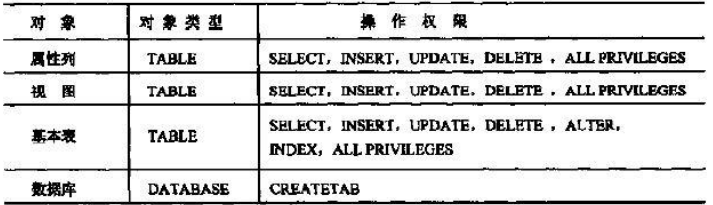

上图列出了常见权限。

如果希望收回权限，可以使用

```sql
REVOKE <权限>[, <权限>]...
	[ON <对象类型> <对象名>]
	FROM <用户>[, <用户>]...
```

收回操作会级联下去。

二、嵌入式SQL

将SQL嵌入高级语言中，称为嵌入式SQL。

一般形式SQL前加EXEC SQL，后跟END EXEC或主语言分隔符。

三、通讯区SQLCA

SQLCA是一个预先定义好的数据结构，SQL语言执行状态会保存在其中。

比如多少条记录发生了改变，可以方便程序根据结果做下一步处理。

四、主变量

在SQL语言中，主变量要加一个`:`，作为和主语言通信的工具。输入主变量，应用程序赋值，SQL语句引用；输出主变量，反馈给主程序。

五、游标

可以引入一个缓冲区来保存中间结果，这样的缓冲区也称作游标。当我们查询某个信息，会把所有结果放在缓冲区保存起来。SQL会对缓冲区进行处理，这个指针就叫做游标。

说明语句、数据定义语句、数据控制语句，这些语句只需要执行状态而不产生结果；查询结果为单值的select语句，通过into子句，可以直接把结果转给主变量；INSERT子句和非CURRENT形式的UPDATE和DELETE，也不涉及结果集。上述语句都不需要游标。

查询结果为多条记录和Current形式的Update和Delete会产生游标。比如，我们需要读出某个班男同学的信息，然后判断年龄值是不是大于20.根据结果情况再去做Update和Delete，就会产生中间的查询结果，这里就需要使用游标。这种Update和Delete叫做Current形式。

声明一个游标使用下面的格式：

```sql
EXEC SQL DECLARE <游标名> CURSOR FOR <SELECT语句>
```

接下来打开游标

```sql
EXEC SQL OPEN <游标名>
```

这个时候会执行SQL语句，然后把结果放在缓冲区中，让游标指向第一条记录。接下来进行查询：

```sql
EXEC SQL FETCH <游标名> INTO <主变量> [<指示变量>][,<主变量>[<指示变量>]]
```

这个时候会把游标指针推到主变量里，然后游标取下一个值。最后关闭游标：

```sql
EXEC SQL CLOSE <游标名>
```

对于Current形式，首先要声明

```sql
For update of <列名>
```

然后open、fetch游标。接下来需要检查当前记录并执行操作，使用

```sql
where current of <游标名>
```

最后关闭游标。

下面是一个嵌入式SQL的例子：

```c
#include <stdio.h>
EXEC SQL BEGIN DECLARE SECTION;
CHAR uid(20);
CHAR pwd(20);
CHAR hsno(6);
CHAR hcno(6);
INT hgrade;
EXEC SQL END DECLARE SELECTION;
EXEC SQL INCLUDE SQLCA;
main() {
    char g(6);
    strcpy(uid, 'SA');
    strcpy(pwd, 'CRT');
    EXEC SQL CONNECT :uid INDENTIFIED BY :pwd;
    scanf("%s", &hcno);
    EXEC SQL DECLARE C1 CURSOR FOR
        SELECT Sno, Grade FROM SC
        WHERE Cno=:hcno;
    EXEC SQL OPEN C1;
    while(1) {
        EXEC SQL FETCH C1 INTO :hsno, :hgrade;
        if (sqlca.sqlcode != 0) break;
        if (hgrade >= 85) g='优';
        else if(hgrade >= 75) g='良';
        else if(hgrade >= 60) g='中';
        else g='差';
        printf("sno:%s, grade:%s", hsno, g);
    }
    	EXEC SQL CLOSE C1;
    EXEC SQL COMMIT WORK RELEASE;
    exit(0);
}
```

六、动态SQL

静态SQL语句的变量个数和数据类型在预编译之前是确定的，有些DBMS则支持动态SQL技术。

