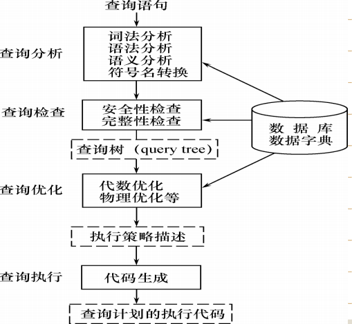
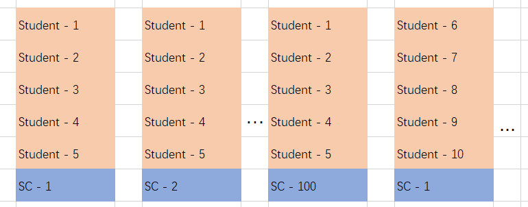
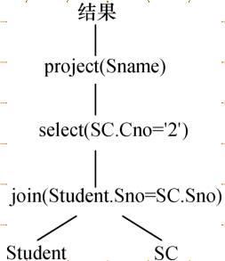
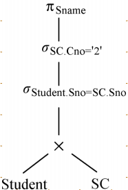
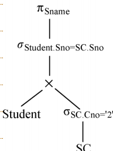

## 关系查询处理和查询优化

### 关系数据库系统的查询处理

一、查询处理的步骤

关系数据库查询处理分成几个阶段：




- 查询分析
  - 查询分析对语句进行扫描、词法分析和语法分析，从查询语句中识别语言符号，进行语法分析和语法检查。
- 查询检查
  - 包括依据数据字典对合法查询语句进行的语义检查，和根据数据字典中用户权限与完整性约束定义对数据存取权限进行检查。
  - 检查后，一般将SQL语句表示为等价的关系代数表达式。
  - RDBMS通过查询数（语法分析树）表示扩展的关系代数表达式，将数据库对象外部名称转换为内部表示。
- 建立查询内部表示
- 查询优化
  - 查询优化是选择一个高效执行的查询处理策略。
  - 查询优化分成两种：
    - 代数优化，对关系代数表达式进行优化
    - 物理优化，存取路径和底层操作算法进行选择
  - 基于优化方法选择的依据有三种：基于规则、基于代价和基于语义。
- 查询执行
  - 依据优化器得到的执行策略生成查询计划。
  - 代码生成器会生成执行查询计划的代码。

二、选择操作的实现

考虑下面几个条件的选择操作：

- C1 无条件
- C2 Sno="114514"
- C3 Sage>20
- C4 Sdept='CS' AND Sage>20

那么有两种典型实现方法：

- 全表扫描。直接顺序进行遍历，选择所有符合条件的元组。这种方法适合小表，但是不适合大表。
- 索引或散列扫描方法。首先读取索引，然后根据索引值判断有哪些元组符合条件，得到记录的指针，把符合条件的记录读取出来。这个读取得到的就是一个索引，效率比较快。

对于C1，必须使用全表扫描。

对于C2，如果Sno上有索引或者Sno是散列码，那么可以直接根据索引查找到元组指针，进而找到目标元组。

对于C3，如果Sage上有B+树索引，那么可以先找到Sage=20的索引项，然后再B+树顺序集上找到Sage>20的元组指针。

对于C4，有两种思路：先通过两种方法，然后求交集；也可以先找到Sdept='CS'的指针，在结果集合中进行遍历。两种算法孰优孰劣要依据数据情况而定。

三、连接操作的实现

连接是最耗时的操作之一。考虑下面这个最简单的例子：

```sql
SELECT * FROM Student, SC WHERE Student.Sno = SC.Sno
```

连接操作有这样几种实现方法

1. 嵌套循环方法。对外层循环中的每一个元组，检查内层循环的每一个元组在连接属性上是否相等。如果相等则进行串接，这样复杂度是$O(nm)$的。

2. 排序合并方法。首先对两个表在Sno上进行排序，然后在Student表中取Sno，依次在SC表中找出有相同Sno的元组。扫描到Sno不相同的第一个SC元组时，回退到Student表的下一个元组，再一次开始扫描。这样，Student和SC表事实上只需要扫描一次，复杂度变成了$O((n+m)\log n + n + m)$。

3. 索引连接方法。首先在SC表上建立Sno的索引，接下来对Student中每一个元组，由Sno通过Sno索引查找对应元组，然后再把元组连接起来。

4. Hash Join方法。把连接属性作为hash码，用同一个hash函数把R和S的元组散列到同一个hash文件中。分成两个步骤：

   1. 划分阶段，把包含较少元组的表进行处理，按照hash结果分散；
   2. 试探阶段，对另一个表进行处理，将元组与桶中的匹配元组进行连接。

   这一算法需要表能完全放在内存hash桶中。

### 关系数据库系统的查询优化

一、查询优化概述

查询优化是影响RDBMS性能的关键因素。使用关系系统可以从关系表达式分析查询语义，提供了执行查询优化的可能性。

查询优化往往比用户程序的查询做的更好。这主要体现在几个方面：

- 优化器可以获得更多统计信息，用户程序难以获得
- 物理统计信息改变之后，系统可以进行重新优化，而对于用户需要重写程序，这是不可能的
- 优化器可以考虑很多种计划并权衡
- 优化器中包括了很多复杂的优化技术

对于集中式数据库，执行的开销包括磁盘存取块数（I/O）、处理机时间（CPU）、查询的内存开销。内存与外村之间通信是很慢的，所以 **IO代价是最主要代价**。对于分布式数据库，还需要考虑通信代价。

二、一个实例

考虑下面的例子：

```sql
SELECT Student.Sname FROM Student, SC
	WHERE Student.Sno = SC.Sno AND SC.Cno = '2';
```

假定学生-课程数据库有1000个学生记录，10000个选课记录，选修2号课程的有50个。

可以有三种情况来完成这一查询：
$$
Q_1 = \Pi_{Sname}(\sigma_{Student.Sno=SC.Sno \and SC.Cno='2'}(Student \times SC))
$$

$$
Q_2 = \Pi_{Sname}(\sigma_{SC.Cno='2'}(Student \Join SC))
$$

$$
Q_3 = \Pi_{Sname}(Student \Join \sigma_{SC.Cno='2'}(SC))
$$

对于Q1，我们不妨这样分析：



如果RAM有6段，每段能容纳10个Stundet表记录或100个SC表记录，那么首先选其中5段来存放Student元组，1段存放SC元组。在这组SC处理完之后，再读取下一段SC；处理完五段Student元组后，再读取下面的5段Student。这样，需要读取的总块数是
$$
\frac{1000}{10} + \frac{1000}{10\times 5} \cdot \frac{10000}{100} = 2100
$$
如果每秒能读写20块，这样的花费是105s.接下来，笛卡尔积的中间结果是$10^7$个记录，而每块如果能装10个中间记录，需要$10^6$块，这样写出块的时间是$5\cdot 10^4s$。

接下来做选择，由于需要把中间文件进行读取，所以花费时间是$5\cdot 10^4$。得到的结果是50个元组，可以放在内存中。最后做投影操作，查询总时间大约是$10^5s$。

接下来分析Q2.

首先计算自然连接，读取表的时间还是105s.接下来进行自然连接，由于结果最多只有$10^4$个（SC和Student的对应性），所以写出的时间变成
$$
\frac{1}{10} \cdot frac{1}{20} \cdot 10^4 = 50s
$$
接下来读取中间文件块，进行选择，需要50s。最后把投影输出，那么总执行时间就是205s.这样，我们看到了中间文件的影响：中间文件越少越好。

最后看Q3。

首先做选择运算，需要对SC表进行100块内存来读取，时间是5s。结果只有50个，无需使用中间文件。

接下来读取Student表，读入的Student表100块也需要5s。

将结果加起来，总时间只需要10s。

这个例子比较极端，但是我们看到了对同一个SQL语句的性能差异究竟有多大。同时，总体而言，选择操作越先做，越有助于性能提高。先进性投影也有类似的效果。这就是启发式规则。

如果还能建立索引，时间还可以进一步优化。

总体来说，优化有两种思路：

- **代数优化**。先进行选择和投影操作，让参与连接的元组尽可能减小，就是代数优化。
- **物理优化**。使用索引进行index join，而不是全表扫描，这样能减少存取复杂度。

### 代数优化

一、关系代数表达式等价变换规则

如果用相同的关系代替相应关系得到相同的结果，就称为关系等价，记作$E_1 \equiv E_2$。

常见的等价变换规则：

（1）连接与笛卡尔积交换律
$$
E_1 \times E_2 \equiv E_2 \times E_1, E_1 \Join E_2 \equiv E_2 \Join E_1,E_1 \Join_F E_2 \equiv E_2 \Join_F E_1 
$$
（2）连接与笛卡尔积结合律
$$
(E_1\times E_2) \times E_3 \equiv E_1 \times(E_2 \times E_3)
$$

$$
(E_1\Join E_2) \Join E_3 \equiv E_1 \Join(E_2 \Join E_3)
$$

$$
(E_1\Join_F E_2) \Join_F E_3 \equiv E_1 \Join_F(E_2 \Join_F E_3)
$$

（3）投影串接
$$
\Pi_{A_1, A_2, \cdots, A_n}(\Pi_{B_1,B_2,\cdots ,B_n}(E)) = \Pi_{A_1, \cdots , A_n}(E)
$$
其中$\{A\} \subseteq \{B\}$

（4）选择串接
$$
\sigma_{F_1}(\sigma_{F_2}(E)) = \sigma_{F_1\and F_2}(E) 
$$
（5）选择投影交换律
$$
\sigma_F(\Pi_{A_1, \cdots, A_n}(E)) \equiv \Pi_{A_1, \cdots, A_n}(\sigma_F(E))
$$
这里要求$F$只涉及$A_1, \cdots, A_n$。否则需要推广到
$$
 \Pi_{A_1, \cdots, A_n}(\sigma_F(E))\equiv \Pi_{A_1, \cdots, A_n}( \sigma_F(\Pi_{F}(E)) )
$$
（6）选择和笛卡尔积分配率

如果$F$涉及的都是$E_1$的属性，
$$
\sigma_F(E_1\times E_2) \equiv \sigma_F(E_1)\times E_2
$$
如果$F=F_1 \cup F_2$，且$F_1$只涉及$E_1$属性，$F_2$只涉及$E_2$属性，那么
$$
\sigma_F(E_1\times E_2) \equiv \sigma_{F_1}(E_1)\times \sigma_{F_2}( E_2)
$$
如果$F=F_1 \cup F_2$，且$F_1$只涉及$E_1$属性，$F_2$涉及$E_1,E_2$属性，那么
$$
\sigma_F(E_1\times E_2) \equiv  \sigma_{F_2}(\sigma_{F_1}(E_1)\times E_2)
$$
（7）选择与并的分配率
$$
\sigma_F(E_1\cup E_2) = \sigma_F(E_1)\cup \sigma_F(E_2)
$$
（8）选择与差的分配率
$$
\sigma_F(E_1- E_2) = \sigma_F(E_1)- \sigma_F(E_2)
$$
（9）选择与自然连接的分配率
$$
\sigma_F(E_1\Join E_2) = \sigma_F(E_1)\Join \sigma_F(E_2)
$$
要求$F$只涉及$E_1, E_2$公共属性。

（10）投影对笛卡尔积分配率

如果$\{A\}$为$E_1$属性，$\{B\}$为$E_2$属性，那么
$$
\Pi_{A\cup B} (E_1 \times E_2) = \Pi_A (E_1) \times \Pi_B (E_2)
$$
（11）投影对并的分配率
$$
\Pi_{A_1, \cdots, A_n} (E_1\cup E_2) = \Pi_{A_1, \cdots, A_n} (E_1) \cup \Pi_{A_1, \cdots, A_n} (E_2)
$$
二、查询树的启发式优化

首先介绍几条最典型的启发式规则：

1. **选择规则尽可能先做**。这是最基本的一条。
2. 投影和选择同时进行。如果投影和选择对同一个关系操作，可以扫描关系的同时完成所有运算。
3. 投影同前后的双目运算结合。
4. 把选择和前面的笛卡尔积结合成一个连接。
5. 找出公共子表达式。如果子表达式结果不大，但是计算耗时，可以先进行记录。如果查询视图，视图的表达式可能是公共子表达式。

那么，我们可以根据等价变换公式来进行优化：

1. 利用规则4，把$\sigma_{F_1\and F_2}(E)$变换到$\sigma_{F_1}(\sigma_{F_2}(E))$
2. 对每个选择，用规则4-9移到树的叶端
3. 对每个投影，利用3、5、10、11移到树叶端。3可以让投影消失，5则可以把投影分成可移向树叶端的部分和不可移的两部分。
4. 利用3-5，把选择投影串接合并成单个选择、单个投影或依次选择后接一个投影，使多个选择或投影能同时执行。
5. 再语法树中进行内节点分组。对于双目运算符$\times, \Join, \cup, -$，将其和直接祖先分成一组，这些直接祖先是$\sigma, \Pi$。如果后代直到叶子都是单目运算，那可以一并并入这一组；如果双目运算是笛卡尔积，并且后面不是等值连接的选择，那么就无法组成一组。

下面举个例子。考虑上面的问题，可以用这样的树表示：



接下来，表示为关系代数



将投影移到叶端



### 物理优化

