## 关系查询处理和查询优化

### 关系数据库系统的查询处理

一、查询处理的步骤

关系数据库查询处理分成几个阶段：


- 查询分析
  - 查询分析对语句进行扫描、词法分析和语法分析，从查询语句中识别语言符号，进行语法分析和语法检查。
- 查询检查
  - 包括依据数据字典对合法查询语句进行的语义检查，和根据数据字典中用户权限与完整性约束定义对数据存取权限进行检查。
  - 检查后，一般将SQL语句表示为等价的关系代数表达式。
  - RDBMS通过查询数（语法分析树）表示扩展的关系代数表达式，将数据库对象外部名称转换为内部表示。
- 建立查询内部表示
- 查询优化
  - 查询优化是选择一个高效执行的查询处理策略。
  - 查询优化分成两种：
    - 代数优化，对关系代数表达式进行优化
    - 物理优化，存取路径和底层操作算法进行选择
  - 基于优化方法选择的依据有三种：基于规则、基于代价和基于语义。
- 查询执行
  - 依据优化器得到的执行策略生成查询计划。
  - 代码生成器会生成执行查询计划的代码。

二、选择操作的实现

考虑下面几个条件的选择操作：

- C1 无条件
- C2 Sno="114514"
- C3 Sage>20
- C4 Sdept='CS' AND Sage>20

那么有两种典型实现方法：

- 全表扫描。直接顺序进行遍历，选择所有符合条件的元组。这种方法适合小表，但是不适合大表。
- 索引或散列扫描方法。首先读取索引，然后根据索引值判断有哪些元组符合条件，得到记录的指针，把符合条件的记录读取出来。这个读取得到的就是一个索引，效率比较快。

对于C1，必须使用全表扫描。

对于C2，如果Sno上有索引或者Sno是散列码，那么可以直接根据索引查找到元组指针，进而找到目标元组。

对于C3，如果Sage上有B+树索引，那么可以先找到Sage=20的索引项，然后再B+树顺序集上找到Sage>20的元组指针。

对于C4，有两种思路：先通过两种方法，然后求交集；也可以先找到Sdept='CS'的指针，在结果集合中进行遍历。两种算法孰优孰劣要依据数据情况而定。

三、连接操作的实现

连接是最耗时的操作之一。考虑下面这个最简单的例子：

```sql
SELECT * FROM Student, SC WHERE Student.Sno = SC.Sno
```

连接操作有这样几种实现方法

1. 嵌套循环方法。对外层循环中的每一个元组，检查内层循环的每一个元组在连接属性上是否相等。如果相等则进行串接，这样复杂度是$O(nm)$的。

2. 排序合并方法。首先对两个表在Sno上进行排序，然后在Student表中取Sno，依次在SC表中找出有相同Sno的元组。扫描到Sno不相同的第一个SC元组时，回退到Student表的下一个元组，再一次开始扫描。这样，Student和SC表事实上只需要扫描一次，复杂度变成了$O((n+m)\log n + n + m)$。

3. 索引连接方法。首先在SC表上建立Sno的索引，接下来对Student中每一个元组，由Sno通过Sno索引查找对应元组，然后再把元组连接起来。

4. Hash Join方法。把连接属性作为hash码，用同一个hash函数把R和S的元组散列到同一个hash文件中。分成两个步骤：

   1. 划分阶段，把包含较少元组的表进行处理，按照hash结果分散；
   2. 试探阶段，对另一个表进行处理，将元组与桶中的匹配元组进行连接。

   这一算法需要表能完全放在内存hash桶中。

### 关系数据库系统的查询优化

一、查询优化概述

查询优化是影响RDBMS性能的关键因素。使用关系系统可以从关系表达式分析查询语义，提供了执行查询优化的可能性。

查询优化往往比用户程序的查询做的更好。这主要体现在几个方面：

- 优化器可以获得更多统计信息，用户程序难以获得
- 物理统计信息改变之后，系统可以进行重新优化，而对于用户需要重写程序，这是不可能的
- 优化器可以考虑很多种计划并权衡
- 优化器中包括了很多复杂的优化技术

对于集中式数据库，执行的开销包括磁盘存取块数（I/O）、处理机时间（CPU）、查询的内存开销。内存与外村之间通信是很慢的，所以 **IO代价是最主要代价**。对于分布式数据库，还需要考虑通信代价。

二、一个实例

考虑下面的例子：

```sql
SELECT Student.Sname FROM Student, SC
	WHERE Student.Sno = SC.Sno AND SC.Cno = '2';
```

假定学生-课程数据库有1000个学生记录，10000个选课记录，选修2号课程的有50个。

可以有三种情况来完成这一查询：
$$
Q_1 = \Pi_{Sname}(\sigma_{Student.Sno=SC.Sno \and SC.Cno='2'}(Student \times SC))
$$

$$
Q_2 = \Pi_{Sname}(\sigma_{SC.Cno='2'}(Student \Join SC))
$$

$$
Q_3 = \Pi_{Sname}(Student \Join \sigma_{SC.Cno='2'}(SC))
$$

对于Q1，我们不妨这样分析：


如果RAM有6段，每段能容纳10个Stundet表记录或100个SC表记录，那么首先选其中5段来存放Student元组，1段存放SC元组。在这组SC处理完之后，再读取下一段SC；处理完五段Student元组后，再读取下面的5段Student。这样，需要读取的总块数是
$$
\frac{1000}{10} + \frac{1000}{10\times 5} \cdot \frac{10000}{100} = 2100
$$
如果每秒能读写20块，这样的花费是105s.接下来，笛卡尔积的中间结果是$10^7$个记录，而每块如果能装10个中间记录，需要$10^6$块，这样写出块的时间是$5\cdot 10^4s$。

接下来做选择，由于需要把中间文件进行读取，所以花费时间是$5\cdot 10^4$。得到的结果是50个元组，可以放在内存中。最后做投影操作，查询总时间大约是$10^5s$。

接下来分析Q2.

首先计算自然连接，读取表的时间还是105s.接下来进行自然连接，由于结果最多只有$10^4$个（SC和Student的对应性），所以写出的时间变成
$$
\frac{1}{10} \cdot frac{1}{20} \cdot 10^4 = 50s
$$
接下来读取中间文件块，进行选择，需要50s。最后把投影输出，那么总执行时间就是205s.这样，我们看到了中间文件的影响：中间文件越少越好。

最后看Q3。

首先做选择运算，需要对SC表进行100块内存来读取，时间是5s。结果只有50个，无需使用中间文件。

接下来读取Student表，读入的Student表100块也需要5s。

将结果加起来，总时间只需要10s。

这个例子比较极端，但是我们看到了对同一个SQL语句的性能差异究竟有多大。同时，总体而言，选择操作越先做，越有助于性能提高。先进性投影也有类似的效果。这就是启发式规则。

如果还能建立索引，时间还可以进一步优化。

总体来说，优化有两种思路：

- **代数优化**。先进行选择和投影操作，让参与连接的元组尽可能减小，就是代数优化。
- **物理优化**。使用索引进行index join，而不是全表扫描，这样能减少存取复杂度。

### 代数优化

一、关系代数表达式等价变换规则

如果用相同的关系代替相应关系得到相同的结果，就称为关系等价，记作$E_1 \equiv E_2$。

常见的等价变换规则：

（1）连接与笛卡尔积交换律
$$
E_1 \times E_2 \equiv E_2 \times E_1, E_1 \Join E_2 \equiv E_2 \Join E_1,E_1 \Join_F E_2 \equiv E_2 \Join_F E_1 
$$
（2）连接与笛卡尔积结合律
$$
(E_1\times E_2) \times E_3 \equiv E_1 \times(E_2 \times E_3)
$$

$$
(E_1\Join E_2) \Join E_3 \equiv E_1 \Join(E_2 \Join E_3)
$$

$$
(E_1\Join_F E_2) \Join_F E_3 \equiv E_1 \Join_F(E_2 \Join_F E_3)
$$

（3）投影串接
$$
\Pi_{A_1, A_2, \cdots, A_n}(\Pi_{B_1,B_2,\cdots ,B_n}(E)) = \Pi_{A_1, \cdots , A_n}(E)
$$
其中$\{A\} \subseteq \{B\}$

（4）选择串接
$$
\sigma_{F_1}(\sigma_{F_2}(E)) = \sigma_{F_1\and F_2}(E) 
$$
（5）选择投影交换律
$$
\sigma_F(\Pi_{A_1, \cdots, A_n}(E)) \equiv \Pi_{A_1, \cdots, A_n}(\sigma_F(E))
$$
这里要求$F$只涉及$A_1, \cdots, A_n$。否则需要推广到
$$
 \Pi_{A_1, \cdots, A_n}(\sigma_F(E))\equiv \Pi_{A_1, \cdots, A_n}( \sigma_F(\Pi_{F}(E)) )
$$
（6）选择和笛卡尔积分配率

如果$F$涉及的都是$E_1$的属性，
$$
\sigma_F(E_1\times E_2) \equiv \sigma_F(E_1)\times E_2
$$
如果$F=F_1 \cup F_2$，且$F_1$只涉及$E_1$属性，$F_2$只涉及$E_2$属性，那么
$$
\sigma_F(E_1\times E_2) \equiv \sigma_{F_1}(E_1)\times \sigma_{F_2}( E_2)
$$
如果$F=F_1 \cup F_2$，且$F_1$只涉及$E_1$属性，$F_2$涉及$E_1,E_2$属性，那么
$$
\sigma_F(E_1\times E_2) \equiv  \sigma_{F_2}(\sigma_{F_1}(E_1)\times E_2)
$$
（7）选择与并的分配率
$$
\sigma_F(E_1\cup E_2) = \sigma_F(E_1)\cup \sigma_F(E_2)
$$
（8）选择与差的分配率
$$
\sigma_F(E_1- E_2) = \sigma_F(E_1)- \sigma_F(E_2)
$$
（9）选择与自然连接的分配率
$$
\sigma_F(E_1\Join E_2) = \sigma_F(E_1)\Join \sigma_F(E_2)
$$
要求$F$只涉及$E_1, E_2$公共属性。

（10）投影对笛卡尔积分配率

如果$\{A\}$为$E_1$属性，$\{B\}$为$E_2$属性，那么
$$
\Pi_{A\cup B} (E_1 \times E_2) = \Pi_A (E_1) \times \Pi_B (E_2)
$$
（11）投影对并的分配率
$$
\Pi_{A_1, \cdots, A_n} (E_1\cup E_2) = \Pi_{A_1, \cdots, A_n} (E_1) \cup \Pi_{A_1, \cdots, A_n} (E_2)
$$
二、查询树的启发式优化

首先介绍几条最典型的启发式规则：

1. **选择规则尽可能先做**。这是最基本的一条。
2. 投影和选择同时进行。如果投影和选择对同一个关系操作，可以扫描关系的同时完成所有运算。
3. 投影同前后的双目运算结合。
4. 把选择和前面的笛卡尔积结合成一个连接。
5. 找出公共子表达式。如果子表达式结果不大，但是计算耗时，可以先进行记录。如果查询视图，视图的表达式可能是公共子表达式。

那么，我们可以根据等价变换公式来进行优化：

1. 利用规则4，把$\sigma_{F_1\and F_2}(E)$变换到$\sigma_{F_1}(\sigma_{F_2}(E))$
2. 对每个选择，用规则4-9移到树的叶端
3. 对每个投影，利用3、5、10、11移到树叶端。3可以让投影消失，5则可以把投影分成可移向树叶端的部分和不可移的两部分。
4. 利用3-5，把选择投影串接合并成单个选择、单个投影或依次选择后接一个投影，使多个选择或投影能同时执行。
5. 再语法树中进行内节点分组。对于双目运算符$\times, \Join, \cup, -$，将其和直接祖先分成一组，这些直接祖先是$\sigma, \Pi$。如果后代直到叶子都是单目运算，那可以一并并入这一组；如果双目运算是笛卡尔积，并且后面不是等值连接的选择，那么就无法组成一组。

下面举个例子。考虑上面的问题，可以用这样的树表示：


接下来，表示为关系代数


将投影移到叶端


### 物理优化

物理优化大致有三种：

1. 基于规则的启发式优化
2. 基于代价估算的优化
3. 两者结合的优化方法

一、基于启发式规则的存取路径选择优化

（1）选择操作

1. 对于小的关系，可以直接**全表扫描**。这里的关系大小主要是看关系表占用的块数。
2. 如果查询条件是主码=值的查询，直接使用**主码索引**。
3. 如果查询条件是非主属性=值的查询，并且选择列上有索引，此时要估计查询结果的元组数目。如果**比例较小**（一般<10%），可以使用**索引扫描**；否则一般还是使用**全表扫描**。
4. 如果查询条件是属性上的非等值查询或范围查询，并且选择列上有索引，方法同上。
5. AND连接的合取选择条件，如果有涉及这些属性的**组合索引**，优先使用组合索引扫描；吐过某些属性有一般索引，方法和之前一样，依据比例选取索引扫描和全表扫描。
6. OR连接的析取选择条件使用**全表扫描**。

（2）连接操作的启发式规则

1. 2个表都已经按照连接属性排序，使用**排序合并**方法。
2. 如果一个表在连接属性上有索引，使用**索引连接**方法。
3. 如果前2个都不适用，且一个表较小，使用**Hash Join**法。
4. 如果以上都不满足，不得不使用嵌套连接法，那么将较小表作为外层循环的表，也就是**外表**。

1-3非常显然，这里对4进行解释。假如$R,S$占用块数是$B_r, B_s$，内存缓冲区块数$K$，分配$K-1$块给外表，此时循环存取块数是
$$
B_r + \frac{B_r}{K-1}B_s
$$
因此，需要让$B_r$尽可能小，也就是取较小的表，可以让块数尽可能少。

二、基于代价估算的优化

进行代价优化，依赖于统计信息，同时也需要一定的算法。启发式规则的优化是定性的选择，适合解释执行的系统；而编译执行的系统查询优化和执行是分开的，可以使用精细一些的基于代价的优化方法。

（1）统计信息

数据字典是关于数据的数据。统计信息大多来自数据字典中，包含的信息包括以下几类：

对每个基本表：

- 表元组总数$N$
- 元组长度$l$，单个元组所占存储空间大小
- 占用块数$B$，数据库在运行过程中对存储空间使用可能不连续，所以实际占用块数并不一定是$Nl$，而有随机分配的情况。

对基本表中的每个列：

- 列中不同值的个数$m$，比如学号列的取值是$N$，性别列的取值个数是$2$。
- 选择率$f$，如果分布均匀那么$f=\frac{1}{m}$，否则每个值的选择率是具有该值的元组$\div N$
- 该列的max、min
- 该列是否建立了索引和索引类型

如果建立了索引，以$B+$树为例：

- 索引的层数$L$
- 不同索引值的个数
- 索引的选择基数$S$（有多少个元组有某个索引值）
- 索引的叶节点树$Y$

（2）代价估算示例

下面举几个实例。

I. 全表扫描算法的代价估计公式

如果基本表大小是$B$块，全表扫描算法代价$cost = B$

如果选择条件是码=值，平均搜索代价$cost = \frac{B}{2}$

II. 索引算则算法的代价估算公式

如果选择条件是码=值，这个时候使用B+树，那么需要读取的是$L+1$块

如果选择条件涉及非码属性，选择条件是相等比较，这个时候最坏情况下满足条件的元组保存在不同块上，时间开销是$L+S$。

如果比较条件是$\ge, >, \le, <$等操作，如果有一半元组满足条件就要存取一半叶节点，时间开销是$cost=L+\frac{Y}{2}+\frac{B}{2}$

III. 嵌套循环连接算法的代价估算公式

我们已经讨论过$cost=B_r+B_s\dfrac{B_r}{K-1}$。如果还需写回磁盘，那么
$$
cost=B_r+B_s\frac{B_r}{K-1}+\frac{Frs\cdot N_rN_s}{Mrs}
$$
其中$Frs$表示连接结果中元组数的比例，叫做连接选择性；$Mrs$是存放连接结果的块因子，表示每块可以存放的结果元组数目。

IV. 排序-合并算法代价估算公式

如果已经排好序，那么
$$
cost=B_r+B_s+\frac{Frs\cdot N_rN_s}{Mrs}
$$
如果必须对文件排序，还需要加上排序代价。这个代价是
$$
2B+2B\log_2B
$$

作业：6

## 数据库的安全性

数据库的安全性是指保护数据库防止不合法使用造成的数据库的泄露、更改和破坏。它的核心是防止不合法的好坏，它的安全性也是评判数据库优劣的一大指标。

并不是每种数据库都有相同的安全级别，并且它的安全与操作系统的安全、网络安全等连成一个整体，整个计算机系统是安全防范的目标。

1985年的时候，美国国防部DOD提出了安全标准《可信计算机系统的评估标准》（橘皮书），对计算机系统安全性进行了评估。1991年美国国家计算机安全中心NCSC提出了《TCSEC关于可信数据库系统的解释》（紫皮书），是对数据库安全的标准解释。

它把系统分成4组7级。

- D级：最低级别，保留给不符合安全要求的系统
- C1级：提供初级的自主安全保护
- C2级：提供受控的存取保护（用户基础上同时受到某些约束设置）
- B1级：标记安全保护 提供强制存取控制和审计等安全机制
- B2级：结构化保护 通过安全模型对系统所有主体和客体实行DAC和MAC
- B3级：安全域 提供访问监控器功能，设计跟踪以及系统恢复功能
- A1级：验证设计 在B3基础上给出形式化设计说明并得到验证各安全功能的真正实现

现在的所有商业化系统，一般能达到B2级的标准。A1级主要停留在理论验证阶段，实际中很少使用。

### 数据库的安全性控制

数据库安全和计算机系统的安全是密不可分的。当用户提出访问请求，首先需要用户标识和鉴别，来得到用户身份。接下来由数据管理系统根据存取控制策略，确定有无访问权限。数据库系统访问底层硬件的时候，需要经过操作系统的安全防护。访问物理存储的时候，也可以有物理存储上的安全性，比如对数据进行加密。

这里最基本的因素，就是用户的鉴别。常见的机制有用户名和口令、数字证书和动态口令。

SQL中的存取控制通过授权-回收命令来给予用户某些权限，这一权限会放到数据字典当中。这完全由用户来决定，数据资源的安全性完全由用户控制，称为**自主存取控制（DAC）**。如果这种控制不完全由用户确定，也由数据本身确定，对每个数据对象标以一个密级，每个用户授予一个级别的访问许可，这种客体的保密级别叫做**强制存取控制**。

如今的自主存取控制，除了grant和revoke，有些提供了更细化的控制级别。有些数据库支持对字段级别进行访问控制，有些系统根据数值取值来提供权限控制，有些系统有对时间段、终端号的控制机制，有些系统引入了角色概念来标识某种职能。

在MAC中，引入了主体和客体的概念。主体是活动的实体，客体是被操作的对象；主体的敏感度标记叫做许可证级别，客体的敏感性叫做密级。当主体的许可证级别大于等于客体密级，才能读取相应客体；当主体的许可级别**等于**客体密级的时候，才能写相应客体。MAC的实现首先依赖于DAC。

除此之外，还有一些机制来保证安全性：

- 视图机制
- 审计，对访问操作记录在审计日志
- 数据加密，从明文加密到密文
- 统计功能安全性，防止用户使用聚集函数获得不被授权的单记录信息

## 数据库完整性

数据库完整性包含**正确性、有效性和相容性**，主要是为了防范不合语义的、不正确的数据。

这种完整性约束条件分成几类。按照约束条件对象关系，区分为关系-元组间的约束、元组-元组间的约束和列-字段的约束；按照约束的状态，可以分成静态条件（某个确定状态时数据的约束条件）和动态（从一个状态到另一个状态的新旧值约束条件）条件。

DBMS需要完成：

1. 定义完整性约束条件机制
2. 提供完整性检查的方法
3. 违约处理

通过这样的机制，就可以保证数据库完整性。

### 实体完整性

对于关系模型，使用`PRIMARY KEY`来定义实体完整性。实体完整性要求主码不能取空。对于单属性构成的码，可以定义为列级，也可以定义为表级；多个属性构成的码只能有一种说明方法。

```sql
CREATE TABLE S {
	Sno CHAR(9) PRIMARY KEY, /*列级定义主码*/
	...
}
CREATE TABLE S {
	Sno CHAR(9), 
	...
	PRIMARY KEY(Sno) /*表级定义主码*/
}
```

对于插入和更新操作，要检查主码是否唯一，并且每个属性不为空。

### 参照完整性

```sql
CREATE TABLE SC (
    Sno CHAR(9) NOT NULL，
    Cno CHAR(4) NOT NULL，
    Grade SMALLINT，
    PRIMARY KEY (Sno， Cno)， /*在表级定义实体完整性*/
    FOREIGN KEY (Sno) REFERENCES Student(Sno)，
    /*在表级定义参照完整性*/
    FOREIGN KEY (Cno) REFERENCES Course(Cno)
    /*在表级定义参照完整性*/
);
```

对于参照完整性的违约，情况如下：

| 被参照表           | 参照表             | 违约处理               |
| ------------------ | ------------------ | ---------------------- |
| 可能破坏参照完整性 | 插入元组           | 拒绝                   |
| 可能破坏参照完整性 | 修改外码值         | 拒绝                   |
| 删除元组           | 可能破坏参照完整性 | 拒绝/级联删除/设置为空 |
| 修改主码值         | 可能破坏参照完整性 | 拒绝/级联修改/设置为空 |

如果设置为空，还需要设置外码列是否为空。对于其设置可以使用这样的方法：

```sql
FOREIGN KEY (Sno) REFERENCES Student(Sno) 
    ON DELETE CASCADE /*级联删除SC表中相应的元组*/
    ON UPDATE SET NULL， /*级联更新SC表中相应的元组*/
FOREIGN KEY (Cno) REFERENCES Course(Cno) 
    ON DELETE NO ACTION /*当删除course 表中的元组造成了与SC表不一致时拒绝删除*/
    ON UPDATE CASCADE  /*当更新course表中的cno时，级联更新SC表中相应的元组*/
```

### 用户自定义完整性

一、属性级别的约束条件

对于属性级别，分成三种：

- NOT NULL
- UNIQUE
- CHECK

下面进行举例。

NOT NULL：

```sql
CREATE TABLE SC (
	Sno CHAR(9) NOT NULL,
    Cno CHAR(4) NOT NULL,
    Grade SMALLINT NOT NULL
)
```

UNIQUE：

```sql
CREATE TABLE DEPT(
	Deptno NUMERIC(2),
    Dname CHAR(9) UNIQUE
)
```

CHECK：

```sql
CREATE TABLE Student (
	Sno CHAR(9) PRIMARY KEY,
    Ssex CHAR(2) CHECK (SSex IN ('男','女'))
)
```

如果约束不满足则会拒绝执行。

二、元组级别的约束条件

使用CHECK。

```sql
CREATE TABLE Student (
	Sno CHAR(9) PRIMARY KEY,
    Sname CHAR(8) NOT NULL,
    SSex CHAR(2) CHECK (SSex IN ('男','女')),
    CHECK(SSex = '女' OR Sname NOT LIKE 'Ms.%')
    /*男性不能以Ms.打头*/
)
```

如果约束不满足则会拒绝执行。

三、约束子句

使用CONSTRAINT进行约束。

```sql
CONSTRAINT <约束名> [
    PRIMARY KEY 短语
    |FOREIGN KEY 短语
    |CHECK 短语
]
```

比如建立Student表，要求学号在90000-99999之间，姓名不能取空，年龄小于30，性别为男或女。

```sql
CREATE TABLE Student(
	Sno NUMERIC(6)
    CONSTRAINT C1 CHECK(Sno BETWEEN 90000 AND 99999),
    Sname CHAR(20)
    CONSTRAINt C2 NOT NULL,
    Sage NUMERIC(3)
    CONSTRAINT C3 CHECK(Sage < 30),
    Ssex CHAR(2)
    CONSTRAINT C4 CHECK(SSex IN('男','女')),
    CONSTRAINT StudentKey PRIMARY KEY(Sno)
)
```

如果需要修改完整性限制，使用ALTER TABLE语句

比如把之前的SSex进行修改：

```sql
ALTER TABLE Student
DROP CONSTRAINT C4;
ALTER TABLE Student
CONSTRAINT C4 CHECK(SSex IN('男','女','其它'))
```

四、域的完整性约束

可以创建一个域进行取值贤治。

```sql
CREATE DOMAIN GenderDomain VARCHAR(2)
CHECK(VALUE IN('男','女','其它'))
```

这个时候，对SSex说明可以直接使用`SSex GenderDomain`

也可以对其域进行一定的修改：

```sql
/*建立*/
CREATE DOMAIN GenderDomain CHAR(2)
CONSTRAINT GD CHECK(VALUE IN('男','女'));
/*删除*/
ALTER DOMAIN GenderDomain
DROP CONSTRAINT GD;
/*增加*/
ALTER DOMAIN GenderDomain
ADD CONSTRAINT GDD CHECK(VALUE IN('1', '0'))
```

### 触发器

触发器是用户顶i有的一类事件驱动的特殊过程，由服务器自动激活。对触发器的定义使用下面的形式：

```sql
CREATE TRIGGER <触发器名>
 {BEFORE|AFTER} <触发事件(INSERT|DELETE|UPDATE)> ON <表名>
 FOR EACH {ROW | STATEMENT}
 [WHEN <触发条件>]
 <触发动作体>
```

事实上，可以用五元组$(D,O,A,C,P)$来表示一个完整性规则，其中

- D：数据
- O：触发完整性约束的操作
- A：约束条件
- C：选择数据对象值的谓词
- P：违反完整性约束时出发的处理

这里要注意的是，触发器类型可以分成行级(ROW)或者语句级(STATEMENT)。比如下面的语句

```sql
UPDATE Teacher SET Deptno = 5
```

那么语句级触发级只执行一次，行级有多少行就执行多少次。

考虑下面的例子：一个BEFORE行级触发器，让Teacher定义规则：教授工资不得低于4000，低于就自动改成4000.这个时候，可以使用下面的语句：

```sql
CREATE TRIGGER Insert_Or_Update_Sal
	BEFORE INSERT OR UPDATE ON Teacher
	FOR EACH ROW
	AS BEGIN
		IF (new.Jpb = '教授') AND (new.Sal < 4000) THEN
			new.sal := 4000;
		END IF;
	END;
```

再看一个例子。我们试图实现在教师表的工资变化的时候自动在工资变化表Sal_log增加相应记录。为此，先建立Sal_log表

```sql
CREATE TABLE Sal_log(
	Eno NUMERIC(4) references teacher(eno),
    Sal NUMERIC(7,2),
    Username CHAR(10),
    Date TIMESTAMP
);
```

然后定义触发器

```sql
CREATE TRIGGER Insert_Sal
	AFTER INSERT ON Teacher
	FOR EACH ROW
	AS BEGIN
		INSERT INTO Sal_log VALUES(
        	new.Eno, new.Sal, CURRENT_USER, CURRENT_TIMESTAMP;
        );
    END;
CREATE TRIGGER Update_Sal
	AFTER UPDATE ON Teacher
	FOR EACH ROW
	AS BEGIN
		IF (new.Sal <> old.sal) THEN 
			INSERT INTO Sal_log VALUES(
        		new.Eno, new.Sal, CURRENT_USER, CURRENT_TIMESTAMP;
        	);
        END IF;
    END;
```

触发器是自动激活的，一般遵循BEFORE触发器-SQL语句-AFTER触发器的执行顺序。

删除触发器使用DROP语句：

```sql
DROP TRIGGER <触发器名> ON <表名>
```

作业：10 12 13

## 数据库恢复技术

实现恢复的核心是使用冗余，也就是根据冗余数据重建不正确数据。

### 事务

事务是一个数据库操作序列，是一个不可分割的工作单位，是恢复和并发的基本单位。

在关系数据库中，一个事务是一条或多条SQL语句，也可以包含一个或多个程序。一个程序通常包含多个事务。

可以显式的定义一个事务：

```sql
BEGIN TRANSACTION 
	SQL 语句1
	SQL 语句2
	……
COMMIT|ROLLBACK
```

COMMIT是提交事务，ROLLBACK是回滚。

事务具有四个非常重要的特性，即ACID特性：

- 原子性（Atomicity） 原子性是指，事务要不全部完成，要不全部取消。如果事务失败，会回滚到事务之前。
- 一致性（Consistency） 一致性是指，只有合法的数据才能写入数据库。
- 隔离性（Isolation） 隔离性是指，如果两个事务同时执行，那么执行顺序不影响执行结果。
- 持续性（Durability） 持久性是指，一旦事务提交，数据必须保存在数据库之中。

事务一般有五种状态，其状态图如下：

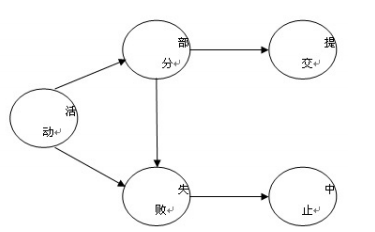


### 故障和恢复

常见的故障有四种：事务内部的故障、系统故障、介质故障、计算机病毒。

事务内部的故障有些是通过事务程序本身发现的，有些是非预期的。比如，有一个事务，从A转账给B。有下面的事务程序：

```sql
BEGIN TRANSACTION
	BALANCE = BALANCE - 100
	IF (BALANCE < 0) THEN {
		ROLLBACK
	} ELSE {
		读取用户乙的余额BALANCE1
		BALANCE1 = BALANCE + AMOUNT
		写回BALANCE1
		COMMIT
	}
```

如果出现了余额不足，就可以回滚，保证数据库状态正常，而不是只减了甲的钱却不影响乙的钱。

有的时候事务故障是非预期的，比如运算溢出、死锁、违反完整性限制。这类故障一般使用撤销事务（UNDO）。

系统故障是造成系统停止运转的任何事件，使得系统要重新启动。这个时候，系统运行被破坏，事务非正常终止，不破坏数据库，缓存区信息丢失。

这种系统故障可能是硬件错误或操作系统故障引起的。如果发生故障的时候事务未提交，那么直接UNDO未完成事务；如果已提交但缓冲区未写入磁盘，那么进行REDO。

介质故障是外存故障，比如磁盘损坏、磁头碰撞、操作系统潜在错误、瞬时强磁场干扰。一般需要装入介质故障前某个时刻的数据副本，重做所有成功事务。

计算机病毒是人为故障或破坏。

### 数据转储

一、静态转储和动态转储

在没有运行事务的时候，进行的就是**静态转储**。转储开始前数据库一致，并且期间不能对数据库进行存取和修改。这种方法实现简单，但是降低了数据库的可用性，因为新的事务必须等转储结束。

如果将转出操作和用户事务并发执行，进行的就是**动态转储**。转储期间可以进行存取修改，这种方法无需等待正在运行的用户事务，也不会影响新事务运行。但是动态转储不能保证副本中数据的正确性。

因此，做动态转储需要把各事务的修改活动记下来，建立日志，用后备副本加上日志使得数据库恢复。

二、海量转储与增量转储

海量转储是每次转储所有数据库，增量转储是只转储上次转储后的数据。

从恢复角度来看，海量转储更方便，但是数据库很大的时候增量转储更有效。

### 日志

日志是记录事务对数据库更新操作的文件。

一、日志文件的格式和内容

一般来说，日志有记录为单位，也有以数据块为单位。

以记录为单位的日志内容包含：

- 事务开始标记
- 事务结束标记
- 事务所有更新操作

这样的称为一个日志记录。每条日志记录又分成

- 事务标识（表明事务种类）
- 操作类型（插入、删除、修改）
- 操作对象（记录内部标识）
- 更新前数据的旧值（对插入操作来说是空）
- 更新后数据的新值（对删除操作来说是空）

以数据块为单位的日志文件，每条日志记录内容是

- 事务标识
- 被更新的数据块

二、日志文件的作用

日志文件可以进行事务故障恢复、系统故障恢复、协助后备副本进行介质故障恢复。

下面是一个用静态转储副本和日志文件进行恢复的例子。

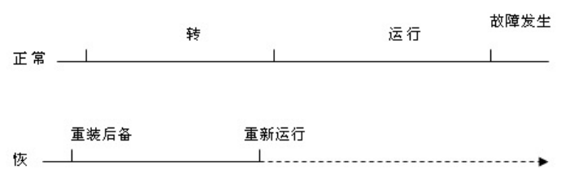

在静态转储的基础上，得到一个一致性副本，然后发生故障。那么重新运行所有事务，就可以把数据库恢复到一致状态。

三、登记日志文件

登记日志的次序需要严格按照并行事务执行的时间次序。必须**先写日志文件，后写数据库**。

这是因为，如果在二者之间故障发生了，先写数据库，这个记录就无法恢复；如果先写日志，只需要做一次UNDO。

四、故障的恢复

（1）事务故障

恢复事务故障，首先反向扫描文件日志，然后查找事务的更新操作。接下来，对事务更新操作进行逆操作，把更新前的值重新写入。

继续扫描文件日志，查找事务其它操作，直到读到事务开始标记。

（2）系统故障

首先正向扫描日志，然后建立两个队列。第一个叫做REDO队列，第二个叫做UNDO队列。REDO队列存放故障发生前的已经COMMIT的事务，UNDO队列存放尚未发生的队列。

对UNDO队列的事务统一进行UNDO处理，也就是在数据库中储存更新前的值；对REDO队列的事务统一做REDO处理，把更新后的值写入数据库。

（3）介质故障

介质故障一般先重装数据库，然后重做已完成的事务。

一般来说，可以装入最新的后备数据库副本。静态副本可以直接装入，动态副本还需要装入转储时的日志文件副本。

介质故障恢复往往需要DBA的介入，重装最近转储的副本和各日志文件副本，执行系统提供的恢复命令。

### 检查点

之前的日志恢复技术，搜索日志需要大量时间，同时REDO也大量耗费了时间。因此，具有检查点的恢复技术是常见的技术。

建立检查点一般有两种，可以是按固定时间间隔定期建立，也可以按照某种规则，比如日志文件写满一半建立一个检查点。检查点实际上就是一个标记，事务$T$在检查点之前提交，那么$T$已经写入了数据库，无需进行REDO。

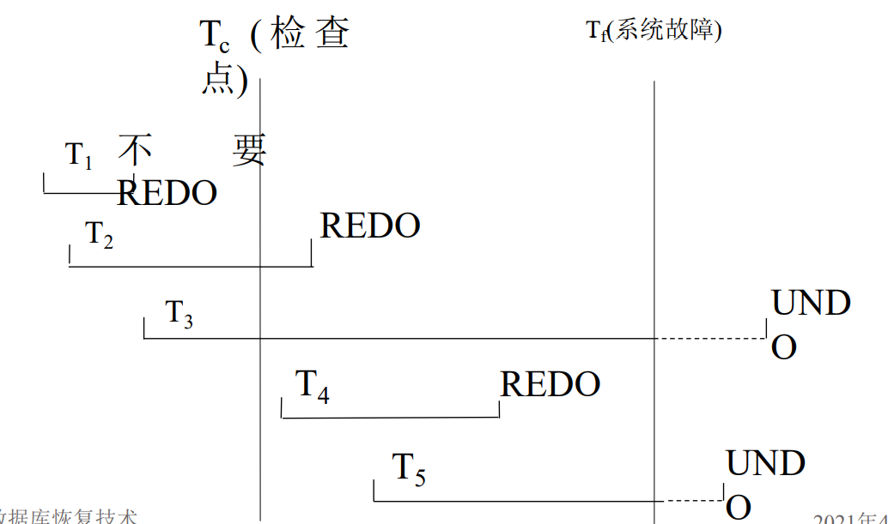

T3、T5在故障发生时未完成，所以撤销；T2、T4在检查点之后提交，需要REDO；T1则无需REDO。

用检查点的恢复步骤如下：

- 找到最后一个检查点记录的地址
- 由检查点记录得到正在执行的事务ACTIVE-LIST，建立UNDO和REDO LIST，并把ACTIVE LIST放入UNDO LIST
- 正向扫描日志文件，新开始的事务放入UNDO LIST，提交事务放到REDO LIST
- UNDO LIST进行UNDO，REDO LIST进行REDO

### 数据库镜像

DBMS自动把整个数据库或其中关键数据复制到另一个磁盘上，由DBMS保证镜像数据和主数据库的一致性。在出现介质故障的时候，可以由镜像磁盘继续使用，同时DBMS利用磁盘数据进行恢复，而无需重装数据库副本。

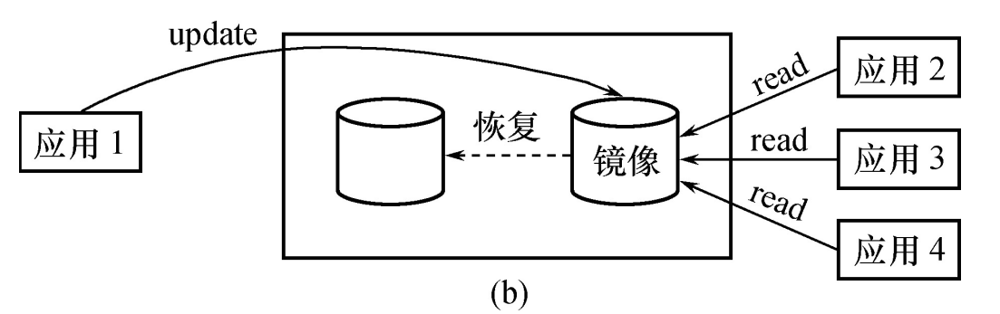

同时，在没有出现故障的时候，数据库镜像也可以用于并发操作，如果一个用户对数据加排他锁，其他用户可以读镜像数据库的数据。

频繁的复制数据会降低效率，所以一般只对关键数据和日志进行镜像。

## 并发控制

在数据库系统，经常需要多个用户同时使用。同一时间并发的事务可达数百个，这就是并发引入的必要性。

常见的并发系统有三种：

- 串行事务执行，每个时刻只有一个事务运行，不能充分利用系统资源
- 交叉并发，并行事务并行操作轮流交叉运行
- 同时并发，多个处理机同时运行多个事务

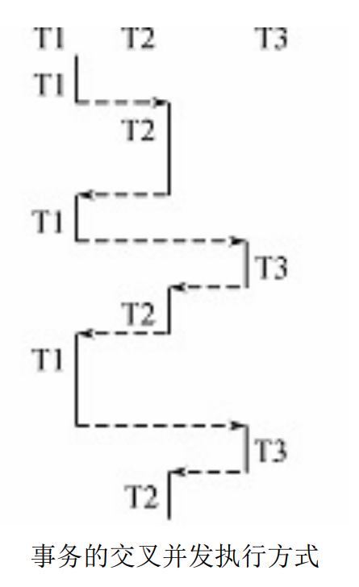

但是并发控制可能导致一些问题，所以主要有三个任务：

- 对并发操作的正确调度
- 保证事务隔离性
- 保证数据库的一致性

### 并发操作的后果

并发控制可能导致的数据不一致性有三类：

- 丢失修改
- 不可重复读
- 读脏数据

为了说明这三种情况，我们用$R(x)$表示读数据$x$，$W(x)$表示写数据$x$.

一、丢失修改

考虑下面的情况：

| $T_1$           | $T_2$             |
| --------------- | ----------------- |
| $R(A)=16$       |                   |
|                 | $R(A)=16$         |
| $A=A-1,W(A)=15$ |                   |
|                 | $A=A-1$,$W(A)=15$ |

那么$T_1$对$A$的修改丢失了。

二、不可重复读

不可重复读是在$T_1$读取数据后，$T_2$更新，导致$T_1$无法再现读取结果。

（1）RUR(Read, Update, Read)

| $T_1$                     | $T_2$                |
| ------------------------- | -------------------- |
| $R(A)=50,R(B)=100, S=150$ |                      |
|                           | $R(B)=100, W(B)=200$ |
| $R(A)=50,R(B)=200, S=250$ |                      |

（2）RDR(Read, Delete, Read)

| $T_1$                     | $T_2$                 |
| ------------------------- | --------------------- |
| $R(A)=50,R(B)=100, S=150$ |                       |
|                           | 将B记录从数据库中删除 |
| 无法读取到B的记录         |                       |

（3）RAR(Read, Add, Read)

| $T_1$                           | $T_2$                 |
| ------------------------------- | --------------------- |
| A中有两条记录，$\sum A_i = 100$ |                       |
|                                 | 将记录50插入到集合A中 |
| A中有三条记录，$\sum A_i = 150$ |                       |

三、读脏数据

事务$T_1$修改某一数据，并写回磁盘，然后$T_2$读取之后，$T_1$因为某种原因被撤销，这个时候$T_2$的数据可能不一致。

| $T_1$                  | $T_2$      |
| ---------------------- | ---------- |
| $R(C)=100, W(C)=200$   |            |
|                        | $R(C)=200$ |
| ROLLBACK C，C恢复为100 |            |

### 封锁

一、封锁的概念

封锁是指事务在某个数据对象操作前先对系统请求进行加锁。加锁之后，事务就有了数据对象控制权。

基本封锁类型有两种：排它锁（Exclusive Locks, X锁）和共享锁（Share Locks, S锁）

排它锁又称写锁，如果$T$对$A$加X锁，那么其它事务不能加任何其他锁。这个时候，其它事务不能读取和修改。

共享锁又称读锁，如果$T$对$A$加S锁，那么其它事务只能对$A$加$S$锁。这个时候，其它事务可以读$A$，但是在$T$释放锁之前不能进行修改。

换言之，存在锁的相容矩阵：

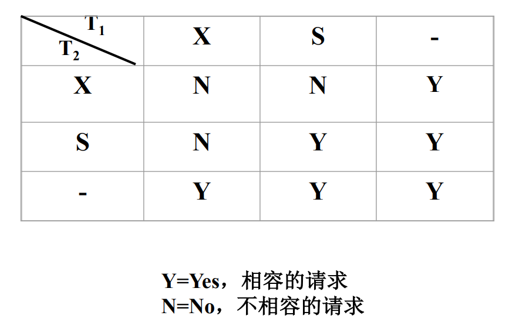

二、封锁协议

申请锁、持有锁、释放锁的规则，叫做封锁协议。

一级封锁协议是事务中队数据修改之前必须对其加排它锁直到事务结束。

一级封锁协议可以有效防止丢失更新。

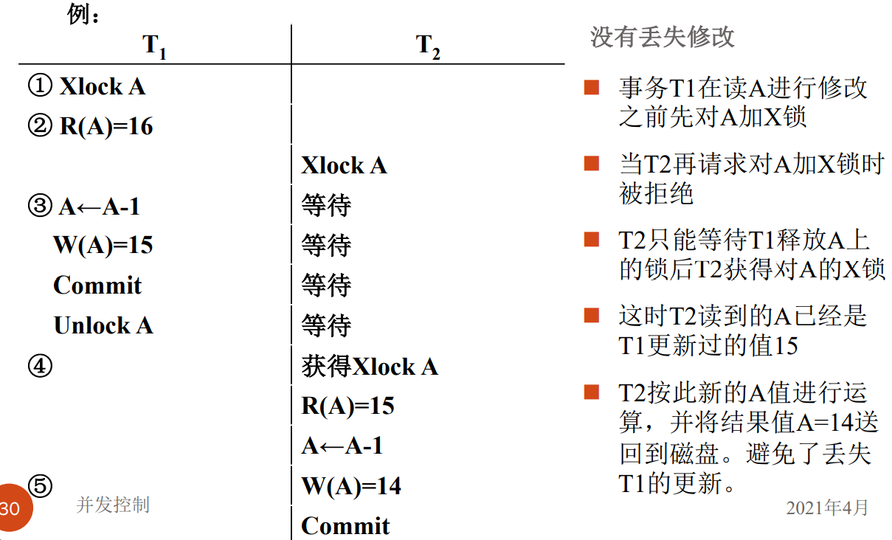

二级封锁协议是在一级协议的基础上，要求读取数据之前必须加共享锁，读完再释放。这样可以防止读脏数据。

二级封锁协议可以有效防止读脏数据。

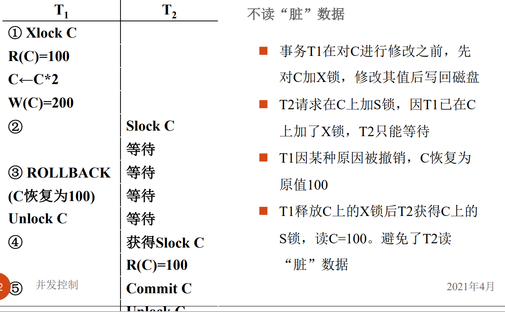

三级封锁协议是在二级基础上，增加某事务施加的共享锁，保持到事务结束再释放。

三级封锁协议可以解决不可重复得问题。

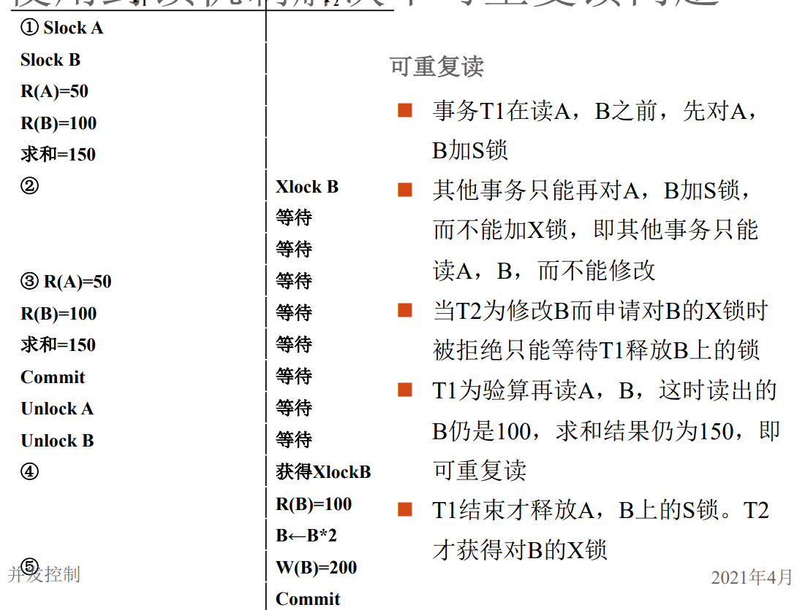

### 活锁和死锁

一、活锁

考虑有四个事务T1,T2,T3,T4

T1封锁数据R，T2请求R，所以T2等待。T3也请求R，然后T1释放R的锁之后系统调度给T3，T4请求R，T3释放R的锁之后系统调度给T4，导致T2永远等待。这就是活锁。

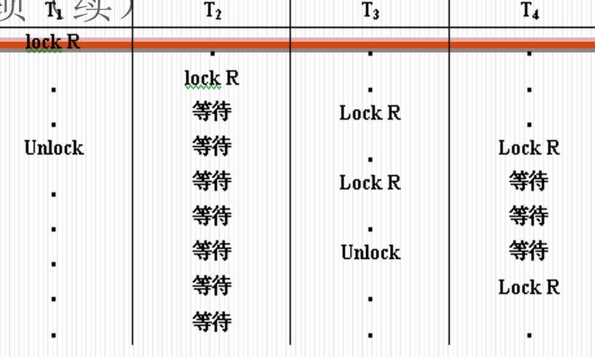

避免活锁比较简单，只需要采取先来先服务的策略，在多个事务请求封锁同一个数据对象的时候按照请求封锁的先后次序对事务排序。

二、死锁

考虑两个事务T1、T2。T1封锁R1，T2封锁R2。T1此时请求封锁R2，而T2封锁R2，所以T1等待T2释放R2的锁。此时T2又申请R1，T1已经封锁R1，T2只能等待T1释放R1的锁。此时，T1、T2形成死锁。

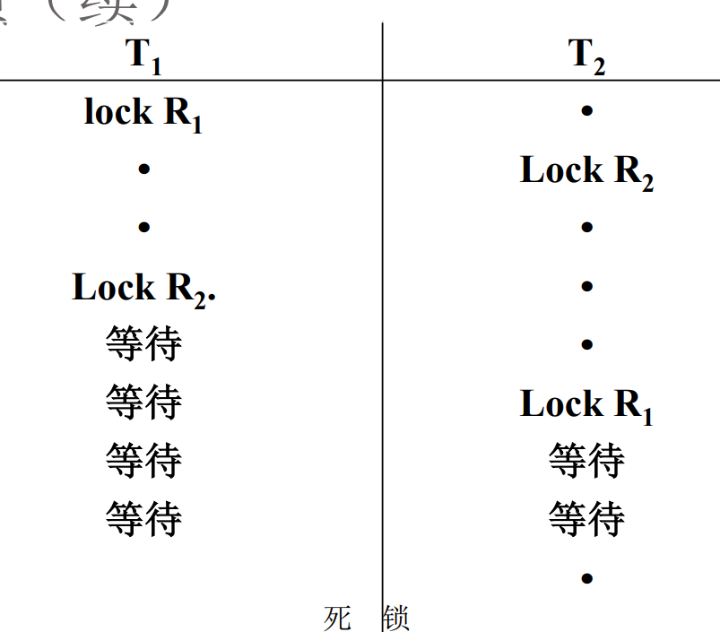

如果希望预防死锁，一般有两个思路：

- 一次封锁法。要求每个事务必须一次将所有要使用的数据全部 加锁，否则就不能继续执行。但是这样比较难确定封锁对象，也会导致并发度降低。
- 顺序封锁法。对数据对象规定封锁顺序，按照顺序进行封锁。但是这样难以确定事务要封锁哪些对象。

因此，死锁的预防比较难，多采用诊断解决的思路。

最简单的诊断方法就是使用超时法，如果事务等待时间超过规定时限，就说明发生死锁。这样实现简单，但是可能误判，并且如果时限过长，可能会让死锁无法及时发现。

等待图法是一个比较好的方式。设$G=\langle V,E\rangle$，$V$是正运行的事务，$E$是事务等待情况，如果$T_1$等待$T_2$，就连接$T_1T_2$。如果图中存在回路，说明系统出现死锁。

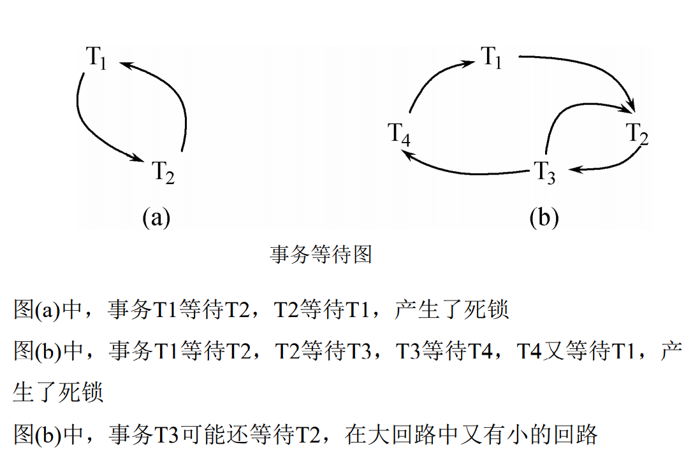

检测到死锁后，选择一个处理死锁代价最小的事务，将其撤销。释放事务持有的所有锁，让其他事务能运行下去。

### 可串行性

多个事务的并发执行想要保证正确性，需要结果和某一次序串行执行结果相同。

一、可串行化的判定

可串行性是并发事务正确调度的准则，只有并发调度是可串行化的才能认为是正确调度。

考虑下面的两个事务：

- T1：读B，A=B+1，写回A
- T2：读A，B=A+1，写回B

对于下面的这些策略：

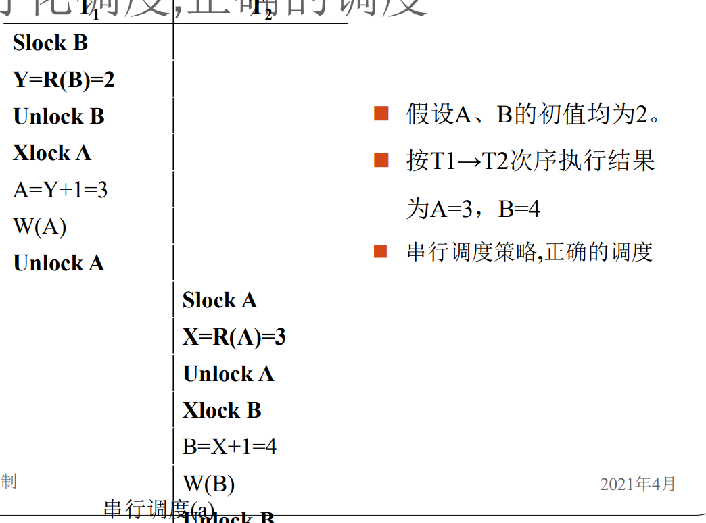

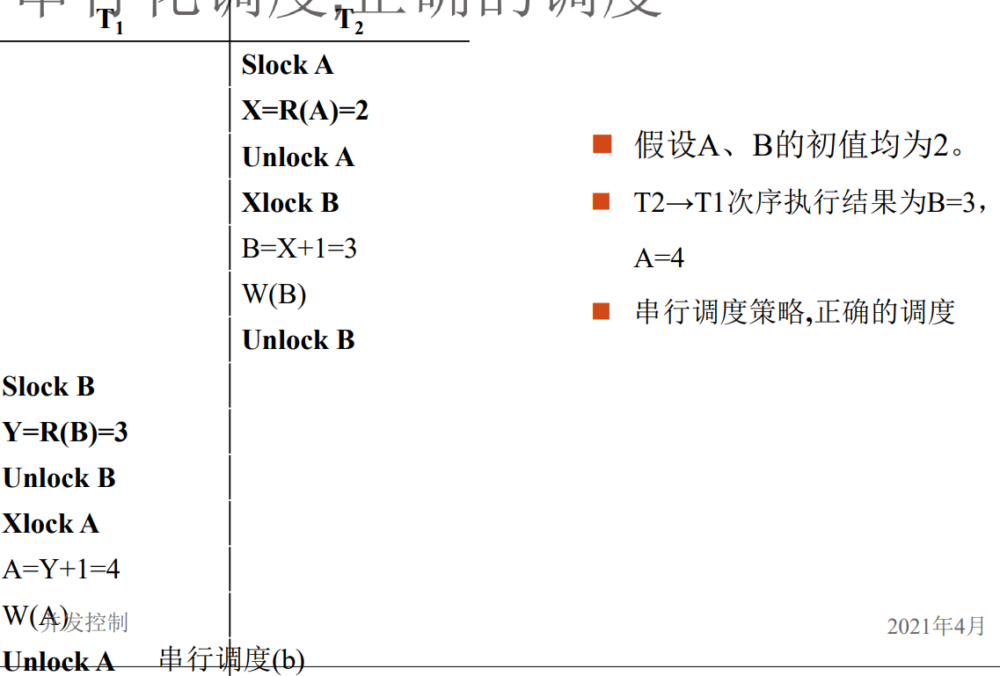

这两种策略相当于串行执行，因此并行执行的结果应当和二者之一相同。而对于下面的例子：

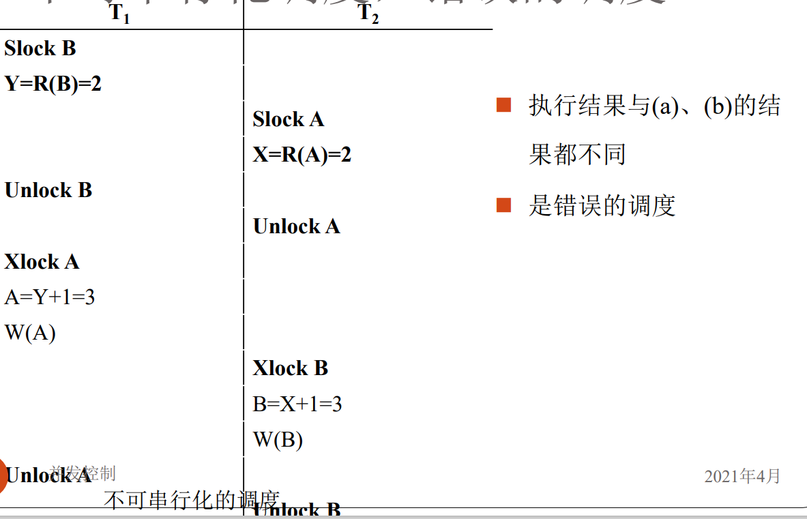

不可串行化。

二、冲突可串行化

冲突可串行化给出了一个可串行化的充分条件：

一个调度Sc在保证**冲突操作**次序不变的情况下，通过交换两个事务不冲突操作的次序得到另一个调度Sc'。如果Sc'是串行的，称调度Sc为冲突可串行化的调度。

这里需要先引入冲突操作的概念。所谓冲突操作是指如下操作：

- 事务Ti读x，Tj写x
- 事务Ti写x，Tj写x

下面举一个例子。

> 证明：调度Sc1=r1(A)w1(A)r2(A)w2(A)r1(B)w1(B)r2(B)w2(B)可串行化。

r1(A)、w1(A)、w2(A)不可交换，r1(B)、w1(B)、w2(B)不可交换。

这样，可以交换为r1(A)w1(A)r1(B)w1(B)r2(A)w2(A)r2(B)w2(N)

这是一个串行调度T1T2，所以Sc1是冲突可串行化调度。

需要注意的是，这个条件并不是必要的。下面举一个反例。

> T1=W1(Y)W1(X), T2=W2(Y)W2(X), T3=W3(X)

调度W1(Y)W2(Y)W2(X)W1(X)W3(X)结果与T1T2T3相同，可串行化，但并非冲突可串行化。

### 两段锁

在封锁的时候，对数据对象加锁需要遵守约定，比如何时申请加锁、锁持续时间和何时释放。两段封锁协议（2PL）是最常用的封锁协议，并且能产生可串行化调度。

两段锁协议是指所有事务需要分两个阶段对数据项加锁和解锁：

- 在数据读写之前，事务需要先取得封锁
- 释放封锁之后，事务不再申请和获得其它封锁

这里的两段，具体来说就是事务的两个阶段：

- 扩展阶段，获得封锁，可以申请获得数据项上任何类型的锁，但是不能释放任何锁
- 收缩阶段，释放封锁，可以释放任何数据线上的任何类型的锁，但是不能申请任何锁。

比如事务A按照两段锁协议的封锁序列是：

Slock A, Slock B, Xlock C, Unlock B, Unlock A, Unlock C

如果多个调度都符合两段锁协议，一定是一个可串行化调度。

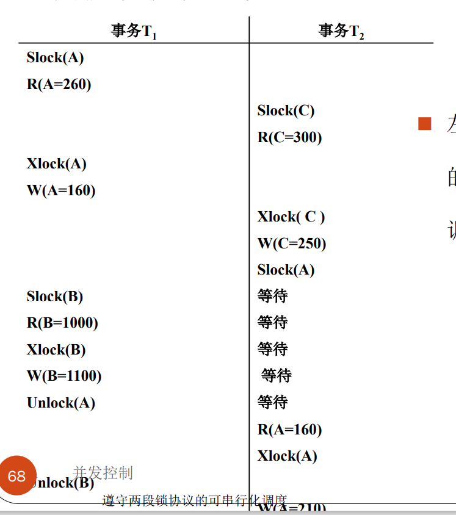

但是两段锁可能会出现死锁，所以还需要引入**一次封锁法**。也就是事务必须一次将所有使用数据全部加锁，否则就不能继续执行，这样可以回避死锁。

### 封锁粒度

封锁对象的大小称为封锁粒度。封锁对象分成逻辑单元和物理单元。

在关系数据库中，逻辑单元包括属性值、属性值集合、元组、关系、索引项、整个索引、整个数据库；物理单元包括页和物理记录。

封锁粒度和系统并发度与并发控制的开销密切相关。

- 粒度大，封锁数据单元少，并发度低，开销小
- 粒度小，并发度高，开销大

下面举两个例子。

（1）若封锁粒度是数据页，事务T1需要修改元组L1，则T1必 须对包含L1的整个数据页A加锁。如果T1对A加锁后事务T2要修改A中元组L2，则T2被迫等待，直到T1释放A。如果封锁粒度是元组，则T1和T2可以同时对L1和L2加锁，不需要互相等待，提高了系统的并行度。

（2）事务T需要读取整个表，若封锁粒度是元组，T必须对表中的每一个元组加锁，开销极大。

因此，在一个系统中需要同时支持多种封锁粒度供不同事务选择，也就是 **多粒度封锁**。在选择粒度的时候，要同时考虑封锁开销和并发度：

- 对处理多个关系大量元组的事务，以数据库为封锁单位
- 对处理大量元组的事务，以关系为封锁单位
- 对少量元组的用户事务，以元组为封锁单位。

可以用一颗树来表示粒度，称作多粒度树：

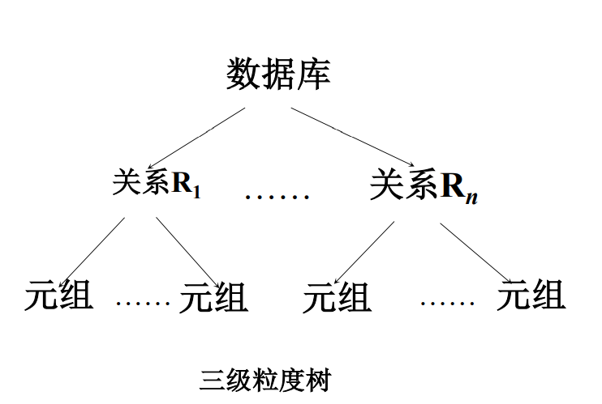

在这个树中，对一个结点加锁相当于节点所有子孙加同类型的锁。这里就引入了显式封锁和隐式封锁：显式封锁是直接加到数据对象上的封锁，隐式封锁是由于上级结点加锁导致的子节点加锁。

因此，系统在检查封锁冲突的收，需要检查显式封锁和隐式封锁。具体来说就是：

- 数据对象有没有显式封锁与之冲突
- 本事务显式封锁是否与上级节点隐式封锁冲突
- 上面的显式封锁是否与本事务隐式封锁冲突

### 意向锁

在此基础上，引入意向锁，来提高对某个数据对象加锁时系统的检查效率。

如果对一个结点加意向锁，说明其下层节点正在被加锁；对任意结点加基本锁，必须对上层节点加意向锁。

常用的意向锁有三种：

- 意向共享锁（IS锁），表示后裔节点拟（意向）加S锁
- 意向排它锁（IX锁），表示后裔节点拟（意向）加X锁
- 共享意向排它锁（SIX锁），表示对它加S锁，再加IX锁。

对于这些锁，相容矩阵如下：

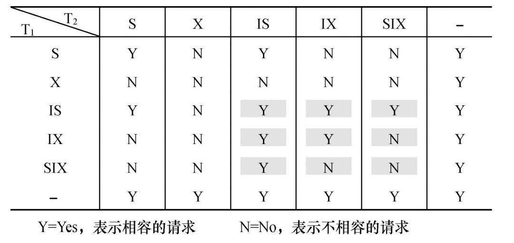

锁强度的哈斯图如下：

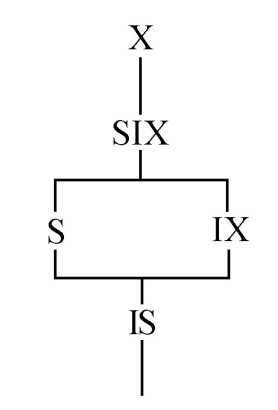

这里锁强度是对其他所的排斥程度，强锁对弱锁是安全的。

在引入意向锁之后，执行封锁操作：

- 申请时按照从上到下的次序
- 释放时按照从下到上的次序

例如，T1对R1加S锁，需要下面的操作

- 对数据库加IS锁
- 检查数据库和R1是否加了不相容锁，也就是X或IX锁
- 无需搜索R1中元组是否加了X锁。

这样，意向锁提高了系统并发度，减少了加减锁的开销，得到广泛应用。