## 关系数据库设计理论

### 关系模型的存储异常

$\newcommand\FD{\operatorname{FD}} \newcommand\NF{\text{NF}} \newcommand\BCNF{\text{BCNF}} \newcommand\tt{\to\to}$ 数据库模式的设计是数据库应用系统的核心问题。首先考虑下面一个数据库表：

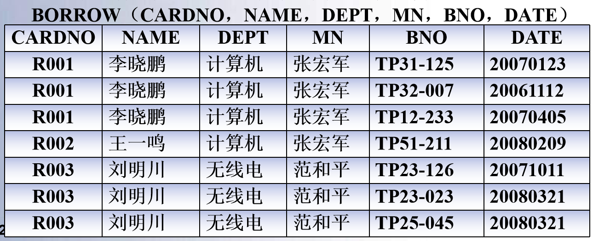

这个数据表存在下面一些问题：

（1）数据冗余

借书人每借一本书，信息重复存储，造成空间浪费，而且可能导致潜在数据不一致

（2）插入异常

由于主键是`(CARDNO,BNO)`，所以无法插入借书人信息

（3）删除异常

当借书人归还所借的书，需要从解约关系删除相关信息；但如果借书人还清所有书，所有信息就一起删除了

（4）更新异常

比如单位负责人发生改变，需要修改MN属性值，这样所有元组中的信息都需要修改，增加了更新代价

这些问题被统称为 **存储异常**。这些异常的出现是因为数据之间存在一定的依赖关系，但这个表并没有体现出这种依赖关系。我们把实体和实体间以及实体内部的属性之间的依赖关系叫做 **数据依赖**。

### 函数依赖

函数依赖（Functional Dependency, FD）是现实世界中最广泛的数据依赖。他是现实世界属性中相互联系的抽象，是数据内在的性质，表示了关系中属性间的制约关系。

这里引入四个定义：

- 函数依赖
- 函数依赖的平凡性
- 函数依赖的完全性
- 函数依赖的传递性

**定义10.1** 设关系模式$R(U)$，$X, Y \sube U$，$r$是$R(U)$上的一个关系

对$\forall t_1, t_2 \in r$，若$t_1,t_2$在$X$上属性值相等，在$Y$上的属性值也相等，则称X**函数决定**Y，或Y**函数依赖**X，记为$\operatorname{FD} X \to Y $。$X$为**决定因素**或函数依赖的**左部**，$Y$为函数依赖的**右部**。

> Example 在BORROW关系中，
>
> CARDNO → NAME
>
> CARDNO → DEPT
>
> CARDNO → MN
>
> DEPT → MN
>
> (CARDNO,BNO) → DATE

函数依赖是指R的**所有关系实例**均要满足的约束条件，而不是R的某个或某些盥洗室里满足的约束条件。它是语义范畴的概念，需要从现实世界中数据的语义来确定。比如，对于姓名→年龄，需要前提为不存在同名同姓的人。

**定义10.2** 设$\FD X \to Y$，若$Y \not \sub X$，则称$\FD X\to Y$是**非平凡函数依赖**；否则，若$Y \sube X$，则称$\FD X\to Y$为平凡的函数依赖。

> Example 在关系SC(Sno, Cno, Grade)中，
>
> (Sno, Cno)→Grade是非平凡函数依赖，(Sno,Cno)→Sno是平凡函数依赖

对于任一关系模式，平凡函数依赖**必然成立**。所以我们总是讨论非平凡函数依赖。

**定义10.3** 设$\FD X\to Y$，若$\forall X' \sub X$，$X' \to Y$都不成立，则称$\FD X\to Y$是完全函数依赖。若$X$的真子集$X'$有$X' \sub X$而$X' \to Y$成立，则称$\FD X\to Y$是部分函数依赖，即$Y$依赖$X$的一部分。

> Example 在关系BORROW中，
>
> (CARDNO,BNO)→DATE、CARDNO→NAME、CARDNO→DEPT、CARDNO→MN、DEPT→MN是完全函数依赖
>
> (CARDNO,BNO)→NAME、(CARDNO,BNO)→DEPT是部分函数依赖。

**定义10.4** 设关系模式$R$，$X,Y,Z$为$R$的属性子集，若$\FD X\to Y, Y \not \to X, Y \to Z$，则必有$\FD X\to Z$，称$\FD X\to Z$为传递函数依赖。

> Example 在关系BORROW中，
>
> CARDNO→DEPT，DEPT→MN，DEPT$\not\to$CARDNO，则有传递依赖CARDNO→MN。

特别的，如果$Y\to X, X\to Y$，则$X\leftrightarrow Y$，此时$X\to Z$，称$Z$**直接依赖**于X。

### 关系模式的规范化

为了设计好的数据模式，可以用规范化理论改造关系模式。通过分解关系模式，消除不合理的数据依赖，就可以解决存储异常。

1971年，E.F.Codd提出了范式（Normal Form, NF）的概念，给出了1NF、2NF、3NF.1974年，Codd和Boyce提出了BCNF(Boyce-Codd Normal Form)，之后又研究了4NF、5NF。

范式就是规范化的关系模式。从低到高，范式为1NF、2NF、3NF、BCNF、4NF。从低一级的范式通过模式分解，可以转化为若干高一级的范式的关系模式的集合，称为**关系模式的规范化**。

一、第一范式

**定义10.5** 若关系模式$R$中每个属性对应的域值都是不可再分的，则称$R$属于第一范式，记为$R \in 1\NF$。若数据库模式$R$中每个关系模式都是1NF，则记$R\in 1\NF$。

数据库系统中的关系至少是$1\NF$的，这是二维表的基本要求。

二、第二范式

**定义10.6** 设关系模式$R$，$A$是$R$中的属性，$F$是$R$上的函数依赖集。若$A$包含在$R$某个候选键中，称$A$为主属性，否则称$A$为非主属性。

**定义10.7** 如果$R \in 1\NF$，所有非主属性都**完全依赖于**$R$的每个候选键，则$R\in 2\NF$。

> Example 在关系BORROW中，
>
> CARDNO→NAME，但候选键是(CARDNO,BNO)→DATE。换言之，NAME部分依赖于主属性(CARDNO,BNO)。所以BORROW$\notin 2\NF$。 
>
> 因此，BORROW不是一个好的关系模式，是因为NAME、DEPT、MN部分函数依赖于候选键。
>
> 为此，可以将其分解成两个关系模式：
>
> 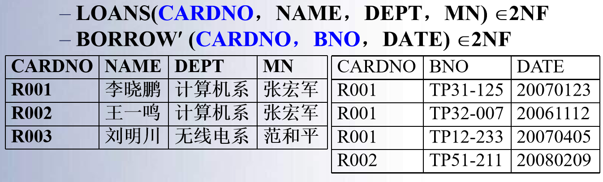
>
> 此时，LOANS和BORROW'都是$2\NF$的。
>
> 但此时DEPT和MN的插入异常问题仍然存在，所以不能完全消除存储异常。

三、第三范式

**定义10.8** 设$R \in 1\NF$，若$R$中**没有非主属性传递依赖于R的候选键**，那么$R \in 3\NF$。

> Example 在关系模式LOANS(CARDNO, NAME, DEPT, MN)中，由于CARDNO→DEPT，DEPT→MN，且DEPT$\not \to$CARDNO，则$\FD \text{CARDNO}\to \text{MN}$是传递依赖。
>
> 所以LOANS不是$3\NF$，将其进一步分解：
>
> 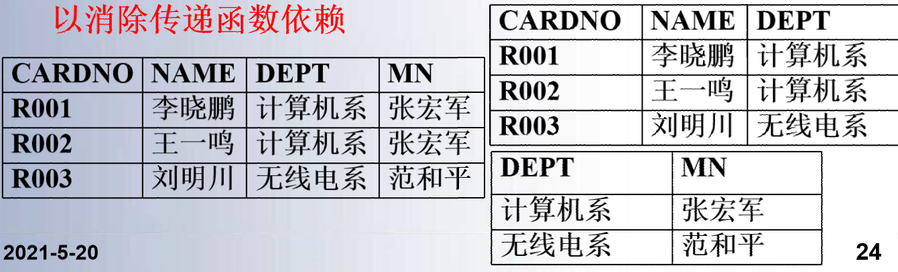

下面证明：$R \in 3\NF \to R \in 2\NF$。

证明 使用反证法。设$R$上函数依赖集为$F$，$R$的键为$K$，假设$R \in 3\NF \and R \notin 2\NF$，则$R$中非主属性$A$部分依赖于关键字$K$。那么存在$K$的真子集$K'$，使得$F |= K' \to A$。由于$K' \sub K$，有$\FD K\to K'$但$K' \not \to K$。于是，$K \to K', K' \not \to K, K' \to A, A \notin K$，则有$A$传递依赖于$K$，所以$R \notin 3\NF$，矛盾。

第三范式消除了非主属性和主属性间的部分函数依赖和传递函数依赖，但是没有解决主属性间的函数依赖。

四、BCNF范式

**定义10.9** 若$R \in 1\NF$，且$R$中没有任何属性传递依赖于R中的任意关键字，则$R \in \BCNF$。

它有一个等价定义：

**定义10.10** 若$R \in 1\NF$，$F$是$R$上的函数依赖集，对于$F$中每一个函数依赖$X \to Y$，必有$X$是$R$的一个候选键，则$R \in \BCNF$。

BCNF消除了主属性间的传递依赖。

> Example 在关系模式R(City, Street, Zip)中，函数依赖是(City,Street)→Zip和Zip→City。
>
> 在这个关系中，候选键是(City, Street)或(Street, Zip)。
>
> R没有非主属性，所以不存在部分函数依赖，$R \in 3\NF$。但是对候选键(Street, Zip)→City为部分函数依赖，同样存在存储异常。

BCNF具有的性质为

1. 所有非主属性完全函数依赖于每个候选码
2. 所有主属性完全函数依赖于每个不包含它的候选码
3. 没用任何属性完全依赖于非码的任何一组属性

在函数依赖范围内，BCNF已经达到了关系模式的最大分离。

### 多值依赖和4NF

考虑下面的一个关系：

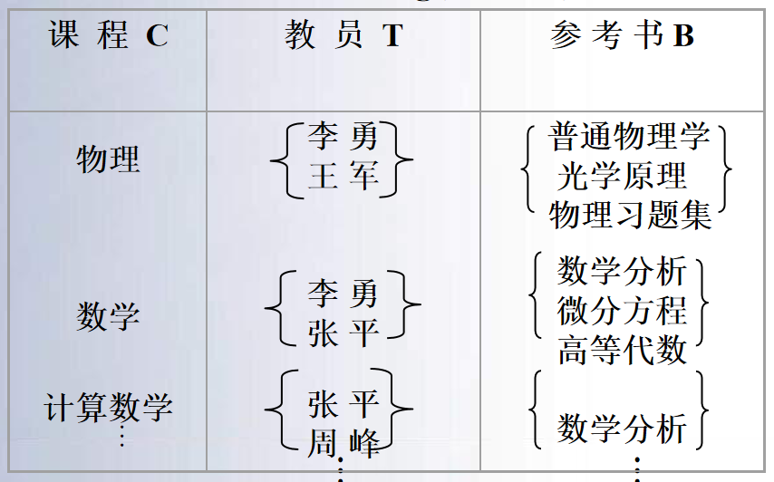

如果用二维表进行表示，

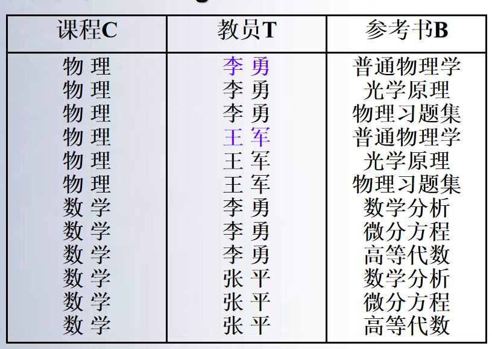

这个表存在唯一候选键$(C,T,B)$。但是如果在(C,T)或者(C,B)做投影，存在(C,T)→B等函数依赖。它具有如下问题：

- 数据冗余度大，多少名任课教师就要存储多少次参考书
- 插入操作复杂，增加一名老师就要增加对应参考书个元组
- 删除操作复杂
- 修改操作复杂

为此，我们引入多值依赖。

**定义10.11** $R(U)$为关系模式，$X,Y \sub U$，$Z = U - (XY)$。如果对$r(R)$中的任意两个元组$s,t$，若$s[X]=t[X]$，$r$中存在元组$u$，有
$$
u[X] = s[X], u[Y]=s[Y],u[Z]=t[Z]
$$
则关系$r(R)$满足**多值依赖**(MVD)X→→Y，称X多值决定Y或Y多值依赖X。

> Example 在上面的例子中，存在多值依赖课程→→教员和课程→→参考书。
>
> 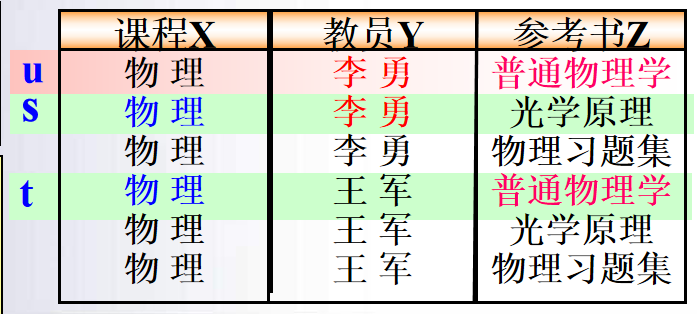

同时，也有一个等价定义：

**定义10.12** $R(U)$是一个关系模式，$X, Y, Z \sube U$，$Z = U - X - Y$。$r$是$R$上的一个关系。当且仅当对于给定的一个$x$值，有一组$y$的值，且这组$y$值仅仅取决于$x$值，而与$r$中其他属性$z$无关，则称$X$多值决定$Y$，记作$X \to\to Y$。

**定义10.13** 若$X\to\to Y$而$Z=\Phi$，则称$X\to\to Y$是平凡的多值依赖，否则为非平凡的多值依赖。

下面介绍多值依赖的性质。

- 对称性 如果$X \to \to Y$，则$X \to \to Z$，其中$Z = U - X - Y$。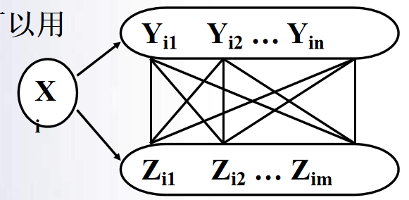
- 传递性 如果$X\to\to Y$，$Y\to \to Z$，则$X \to\to Z-Y$
- 和函数依赖的关系 若$X\to Y$，则$X \to\to Y$

对于多值依赖，再给出9公理。设$W,X,Y,Z$为$R$子集，那么

1. **自反率** $Y \sube X \Rightarrow X \to\to Y$
2. **增广率** $X\to\to Y, W \sube Z \Rightarrow XZ \to\to YW$
3. **相加律** $X\to\to Y, X \to\to Z \Rightarrow X\to\to YZ$
4. **投影率** $X\tt Y, X \tt Z \Rightarrow X\tt Y\cap Z, X \tt Y-Z$
5. **传递率** $X\tt Y, Y\tt Z \Rightarrow X \tt Z-Y$
6. **伪传递率** $X \tt Y, YW \tt Z \Rightarrow XW \tt Z-YW$
7. **互补率** $X\tt Y, Z = R-(XY) \Rightarrow X\tt Z$
8. **重复率** $X \to Y \Rightarrow X\tt Y$
9. **结合律** $X \tt Y, Z \to W, W \sube Y, Y \cap Z = \Phi \Rightarrow X \to W$

再多值依赖的基础上，可以定义4NF：

**定义10.14** 设$R \in 1\NF$。$F$是R上的FD集和MVD集。若$R$上任何一个非平凡的多值依赖$X\tt Y$，$X$都含义键，则称$R \in 4\NF$。

可以使用分解的方法消去非平凡非函数依赖的多值依赖。

> Example 对于Teaching(C,T,B)来说，存在非平凡多值依赖$C\tt T$。
>
> 用投影分解法把Teaching分解成CT(C,T)和CB(C,B)，则$C\tt T, C\tt B$为平凡多值依赖。

**规范化是范式的升高，连接是范式的降低。**

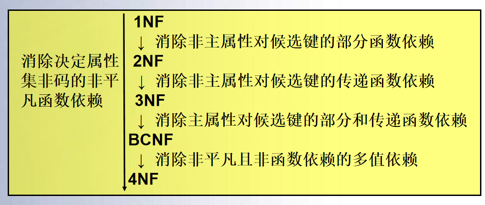

### 函数依赖公理

一、函数依赖的蕴含性

**定义10.15** 若$R$上的任意关系都满足一个确定的函数依赖集F，则称F为$R$满足的**函数依赖集**。

**定义10.16** 设函数依赖集$F$和关系模式$R(U)$，属性集$X,Y \sube U$，关系模式$R$满足$F$。如果关系模式$R$满足$\FD X\to Y$，则$F$**逻辑蕴含**$\FD X\to Y$，或称$X\to Y$逻辑蕴含于$F$，记作$F \models X\to Y$。

**定义10.17** 设函数依赖集$F$，所有被$F$逻辑蕴含的函数依赖为$F$的**闭包**，记为$F^+$。即：
$$
F^+ = \{X\to Y \mid F \models X \to Y\}
$$

> Example F={AB→C, C→B}是R(A, B, C)上的一组函数依赖，那么$F^+=${A→A，AB→A，AC→A，ABC→A，B→B，AB→B，BC→B，ABC→B， C→C，AC→C，BC→C，ABC→C， AB→AB，ABC→AB，AC→AC，ABC→AC，BC→BC，ABC→BC，ABC→ABC，AB→C，AB→AC，AB→BC，AB→ABC， C→B，C→BC，AC→B，AC→AB，AC→ABC }

**定义10.18** 设关系模式$R(U,F)$，$U$是$R$的属性全集，$F$是$R$的函数依赖集，$X$是$U$的子集。如果满足条件：

1. $X \to U \in F^+$
2. 不存在$X' \sub X \and X' \to U \in F^+$成立

则称$X$为$R$的一个**候选键**。

为了从函数依赖求得蕴含的函数依赖，就需要一套推理规则。这套规则有Armstrong给出。

二、Armstrong公理系统

函数依赖的公理系统是模式分解算法的理论基础。

**定理10.1** 设关系模式$R(U,F)$，$X, Y, Z, W \sube U$，则Armstrong公理为：

1. **自反率**  $Y \sube X \sube U$，则$F \models X \to Y$
2. **增广率** $X \to Y, Z \sube U$，则$F \models XZ \to YZ$
3. **传递率** $X \to Y, Y \to Z$，则$F \models X \to Z$

下面给出证明。

自反率：若$t_1[X] = t_2[X]$，则$X$的任意子集在$t_1, t_2$上属性相同。由于$Y \sube X$，$t_1[Y] = t_2[Y]$。故$F \models X \to Y$。

增广率：设$t_1[XZ]=t_2[XZ]$，则有$t_1[X]t_1[Z] = t_2[X]t_2[Z]$。进而$t_1[X]=t_2[X], t_1[Z]=t_2[Z]$。由于$X \to Y$，故$t_1[YZ]=t_2[YZ]$。所以$t_1[XZ]=t_2[XZ] \to t_1[YZ]=t_2[YZ]$，即$XZ\to YZ$。

传递率：$t_1[X]=t_2[X] \to t_1[Y]=t_2[Y] \to t_1[Z]=t_2[Z]$，所以$X \to Z$。

根据这三条定理，给出三个重要推论。

**定理10.2** Armstrong公理的推论

1. **合成规则** $X \to Y, X \to Z$，则$X \to YZ$ 
2. **分解规则** $X \to Y, Z \sube Y$，则$X \to Z$
3. **伪传递规则** $X \to Y, YZ \to W$，则$XZ \to W$

其证明比较简单：

合成规则：$X\to Y$ 则$XX \to XY$，$X \to Z$则$XY \to YZ$，所以$X \to YZ$

分解规则：$X \to Y$，$Y \to Z$，则$X \to Z$

伪传递规则：$XZ \to YZ$，$YZ \to W$，则$XZ \to W$

由合成规则和分解规则，得到：

**定理10.3** Armstrong公理的推论

$X \to A_1A_2 \cdots A_k$的充要条件是$X \to A_i$成立。

三、Armstrong的完备性和闭包的计算

对于一个公理系统，我们还需要讨论其完备性。

**定理10.4** Armstrong公理的完备性：根据公理，可以从已知的一组函数依赖$F$推出它所蕴含的所有函数依赖。

为了证明这一定理，首先给出属性闭包的概念。

**定义10.19** 设关系模式$R(U,F)$，$U=\{A_1,A_2,\cdots,A_n\}$，$X \sube U$，所有用公理推出函数依赖$X \to A_i$中$A_i$的属性集合称为**属性集$X$关于函数依赖集$F$的属性闭包**，记为$X_F^+$。即：
$$
X_F^+ = \{A_i \mid \text{用公理由F推出的}X \to A_i\}
$$

> Example $R$上依赖集$F = \{A\to D, AB \to DE, E \to H\}$，则
>
> $(A)_F^+ = AD$
>
> $(AB)_F^+ = ABDEH$

**引理10.4.1** 设关系模式$R(U,F)$，$X, Y \sube U$，由Armstrong公理从$F$导出$X \to Y$的充要条件是$Y \sube X_F^+$ 

证明：设$Y = \{A_1,A_2, \cdots, A_k\}$，$A_i \in U$

充分性：若$Y \sube X_F^+$，$X \to A_i$由Armstrong公理从$F$中导出，因此$X \to Y$成立

必要性：若$X \to A_i$成立，则$A_i \in X_F^+$

这一引理表明，判定$X \to Y$是否由$F$根据Armstrong公理导出的问题转换成求$X_F^+$，判定$Y$是否是$X_F^+$子集的问题。也就是属性闭包$X_F^+$和函数依赖集的闭包$F^+$是等价的。

因此，对于一个关系模式$R$，只需要求解$X_F^+$，然后判定$Y\sube X_F^+$是否成立。这就说明了Armstrong公理完备。

下面给出求属性闭包的一个算法。

**算法10.1** 计算属性闭包

*INPUT* $R$的属性全集$U$，$U$上的函数依赖集$F$和属性集$X$

*OUTPUT* $X$的闭包$X_F^+$

*STEPS* 计算$X^{(i)}$

1. 初值：$X^{(0)}=X$，$i=0$
2. $X^{(i+1)}=X^{(i)} \cup Z$，其中$Z=\{A \mid \exists V \to W \in F, V \sube X^{(i)} \wedge A \in W \wedge A \notin X^{(i)} \}$ 。也就是把所有未出现在右部属性$A$并入$X^{(i)}$
3. 判断$X^{(i+1)}=X^{(i)}$或$X^{(i+1)}$是否成立，若成立转(5)
4. $i=i+1$，转(2)
5. 输出$X_F^+$的结果$X^{(i+1)}$

> Example $F = \{AB \to C, BC \to D, ACD \to B, D \to EG, BE \to C, CE \to AG\}$，求$(BD)^+$
>
> 由于$X=\{BD\}$，$X^{(0)}=\{BD\}$
>
> $D \to EG$，则$X^{(1)}=\{BDEG\}$
>
> $BE \to C$，则$X^{(2)} = \{BCDEG\}$
>
> $CE \to AG$，则$X^{(3)} = \{ABCDEG\}$
>
> $X^{(4)} = \{ABCDEG\}$。所以$(BD)^+ = \{ABCDEG\}$

### 函数依赖集的等价与覆盖

引入覆盖的定义：

**定义10.20** 若$G^+=F^+$，就说$F$**覆盖**$G$，或$F$与$G$**等价**

可以用下面的定理证明覆盖：

**定理10.5** $F^+=G^+$的充要条件是$F \sube G^+$且$G \sube F^+$

证明：必要性显然，只证充分性。

1. 若$F \sube G^+$，则$X_F^+ \sube X_{G+}^+$
2. $\forall X\to Y \in F^+$，$Y \in X_F^+ \in X_{G+}^+$。因此，$X \to Y \in (G^+)^+ = G^+$，$F^+ \sube G^+$
3. 同理，$G^+ \sube F^+$，则$F^+ = G^+$

**定义10.21** 如果函数依赖集$F$满足以下条件，则称$F$是一个**最小函数依赖集或最小覆盖**：

1. $F$中的所有函数依赖右部是单属性
2. $\forall X \to A \in F$，$F - \{X \to A\}$与$F$不等价
3. 若$Z \sub X$，则对$\forall X \to A \in F$，$F - \{X - A\}\cup \{Z \to A\}$与$F$不等价

> Example
>
> 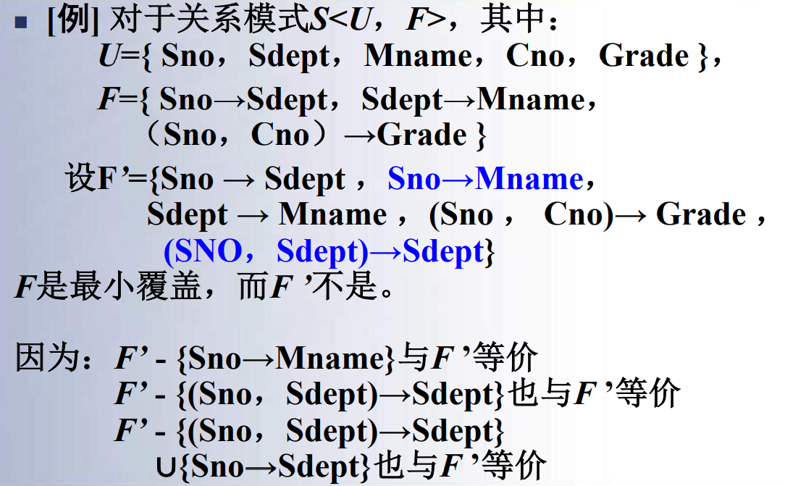

**定理10.6** 每一个函数依赖集均等价于一个最小的函数依赖集$F_m$

*证明*：采用构造性证明。

1. 逐一检查$F$中各个函数依赖$FD_i:X \to A$，令$G = F - \{X \to A\}$，若$A \in X_G^+$，则从$F$中去掉函数依赖。
2. 逐一检查$F$中各个函数依赖$FD_i : X \to Y$，若$Y = \{A_1A_2\cdots A_k\}, k > 2$，则用$\{X \to A_j\}$取代
3. 逐一取出$F$中各个函数依赖$FD_i:X \to A$，设$X = \{B_1B_2\cdots B_m\}$，若$A \in (X-B_i)_F^+$，则以$X-B_i$取代$X$

$F$的最小函数依赖集不一定唯一，给出$F$将其极小化称为极小化过程。

> Example $R(U,F)$，$U = \{A,B,C,D,E\}$，$F =\{AB \to C, B \to D, C \to E, EC \to B, AC \to B\}$，求$F_m$
>
> 1. 取代右部单属性，无需转换
> 2. 检查函数依赖包含性
>    1. $F - \{AB\to C\}$，则$C \not \in AB_F^+$，因此$AB \to C$不能去掉
>    2. $F - \{B\to D\}$，则$D \not \in B_F^+$，因此$B \to D$不能去掉
>    3. $F - \{C\to E\}$，则$E \not \in C_F^+$，因此$C \to E$不能去掉
>    4. $F - \{EC\to B\}$，则$B \not \in EC_F^+$，因此$EC \to B$不能去掉
>    5. $F - \{AC\to B\}$，则$B  \in AC_F^+$，因此$AC \to B$可以去掉
> 3. 去掉左部属性
>    1. 函数依赖$AB\to C$，$A \notin B_F^+$，$B \notin A_F^+$
>    2. 函数依赖$EC \to B$，$E \in C_F^+$
>
> 综上所述，其极小化$F_m=\{AB \to C, B \to D, C \to E, C \to B\}$

### 模式分解

**定义10.22** 设关系模式$R(U)$，$\rho = \{R_1(U_1)m \cdots, R_k(U_k)\}$，若$\bigcup_{i=1}^k U_i = U$，则称$\rho$是$R(U)$一个分解

> Example 关系模式E(A, B, C)，
>
> $\rho_1=${E1(A,B), E2(B,C)}
>
> $\rho_2=${E1(A,B), E2(A,C)} 

分解需要满足两个条件：无损连接分解和依赖性。

**定义10.23** 设关系模式$R(U)$，$F$是$R$上的函数依赖集，$\rho = \{R_1,R_2,\cdots, R_k\}$是$R$的一个分解，若$\forall r$满足$F$，
$$
r = \Pi_{R_1(r)} \Join \Pi_{R_2(r)} \Join \cdots \Join \Pi_{R_k(r)}
$$
则称$\rho$是满足$F$的**无损连接分解**

> Example
>
> 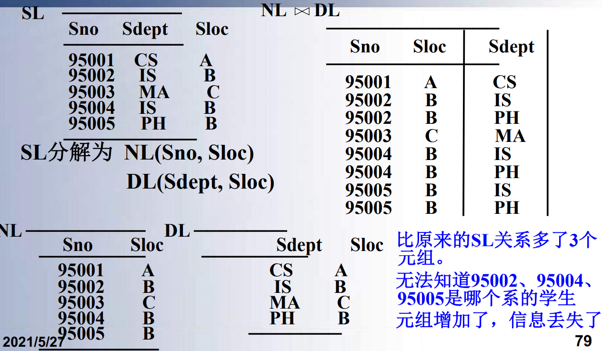
>
> 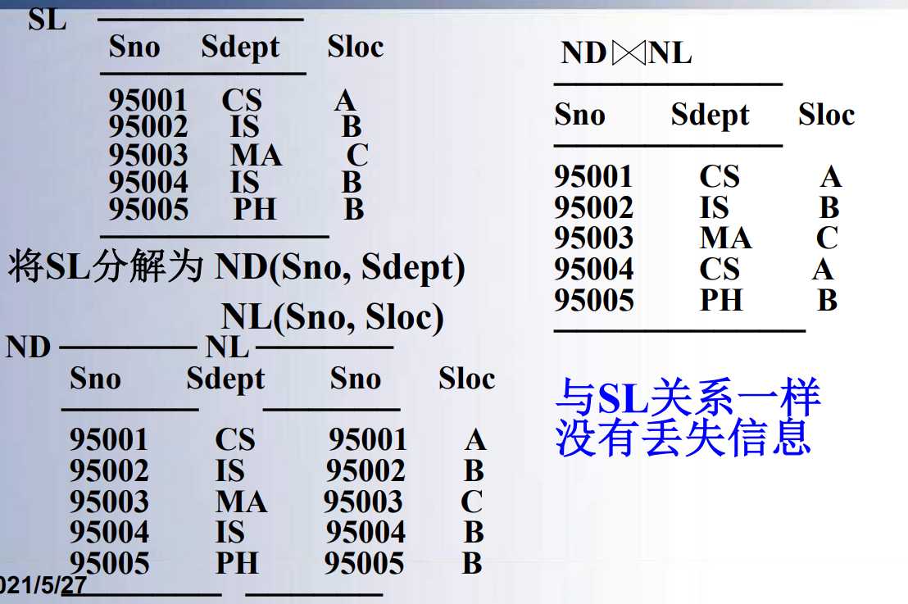

此外，分解还需要保持依赖性。

> Example
>
> 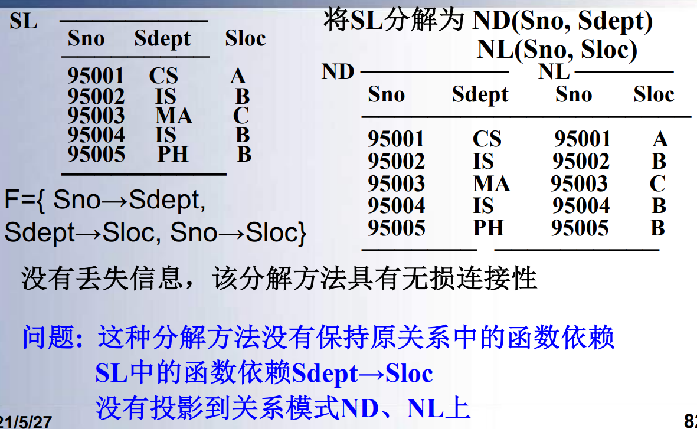
>
> 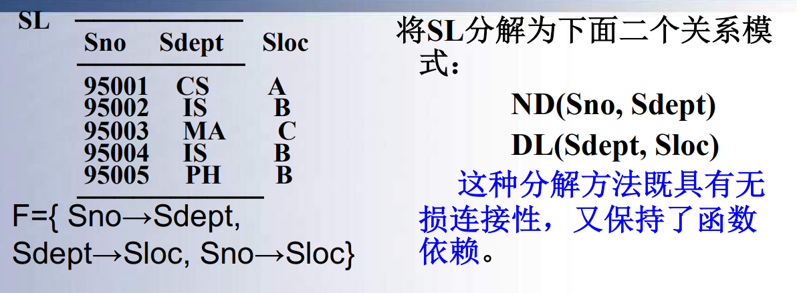

如果分解有无损连接性，那么不会丢失信息；如果保持函数依赖，可以减轻异常。

## 数据库设计

### 数据库设计概述

数据库设计是指对一个给定的应用，构造优化的数据库逻辑模式和物理结构，并据此建立数据库及其应用系统，使之有效的存储和管理数据，满足各种用户的应用需求。

在数据库设计中，结构设计和行为设计要相结合。

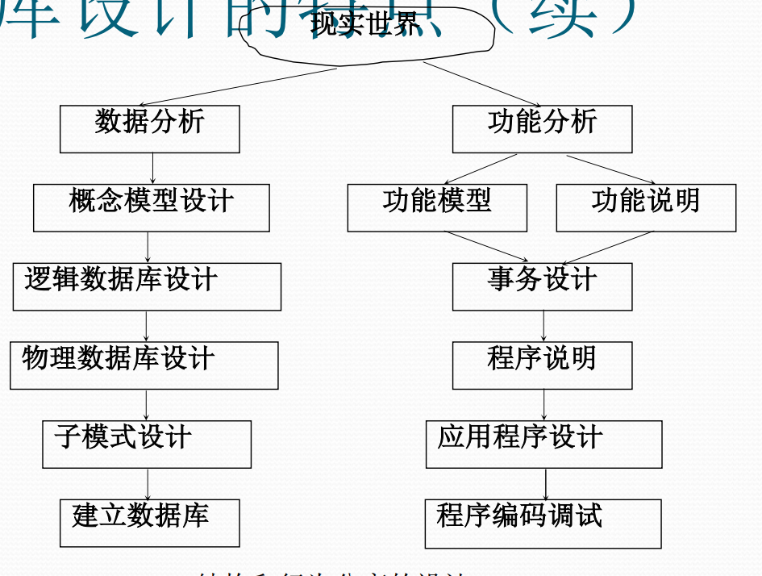

设计数据库有下面这些方法：

- 新奥尔良方法，将数据库设计分为若干阶段和步骤
- 基于E-R模型的数据库设计方法
- 3NF设计方法
- ODL方法，面向对象的设计方法
- Barker方法

数据库设计分成六个阶段：

- 需求分析
- 概念结构设计
- 逻辑结构设计
- 物理结构设计
- 数据库实施
- 数据库运行和维护

下面先对数据库设计的基本步骤进行概述。

1. 数据库设计的准备工作：选定参加设计的人
   1. 系统分析人员和数据库设计人员，自始至终参与数据库设计
   2. 用户和数据库管理员，参与需求分析和数据库运行维护
   3. 应用开发人员，在系统实施阶段参与
2. 数据库设计的过程
   1. 需求分析
      1. 准确了解分析用户需求
      2. 最困难的一步
   2. 概念结构设计
      1. 数据库设计关键
      2. 对用户需求综合归纳抽象，形成独立于DBMS的概念模型
   3. 逻辑结构设计
      1. 将概念结构转换为DBMS支持的数据模型
      2. 对其进行优化
   4. 数据库物理设计阶段
      1. 为逻辑数据模型选取一个最适合应用环境的物理结构
   5. 数据库实施阶段
      1. 根据DBMS的数据库语言和宿主语言，根据逻辑设计和物理设计结果
         1. 建立数据库
         2. 编制和调试应用程序
         3. 组织数据入库
         4. 试运行
   6. 数据库运行和维护阶段
      1. 试运行后投入正式运行
      2. 不断评价、调整、修改

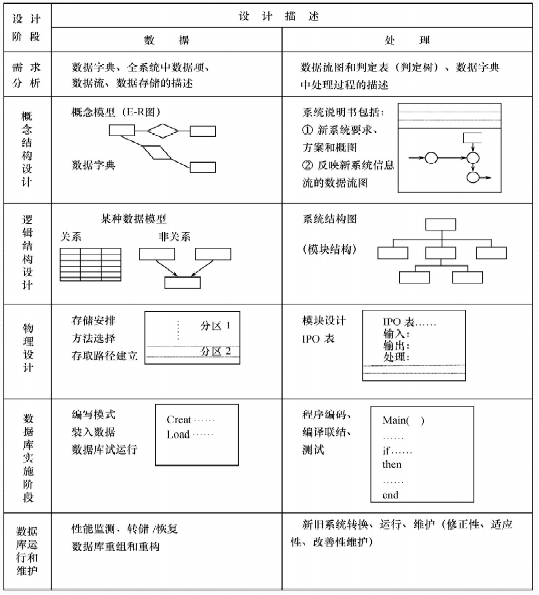

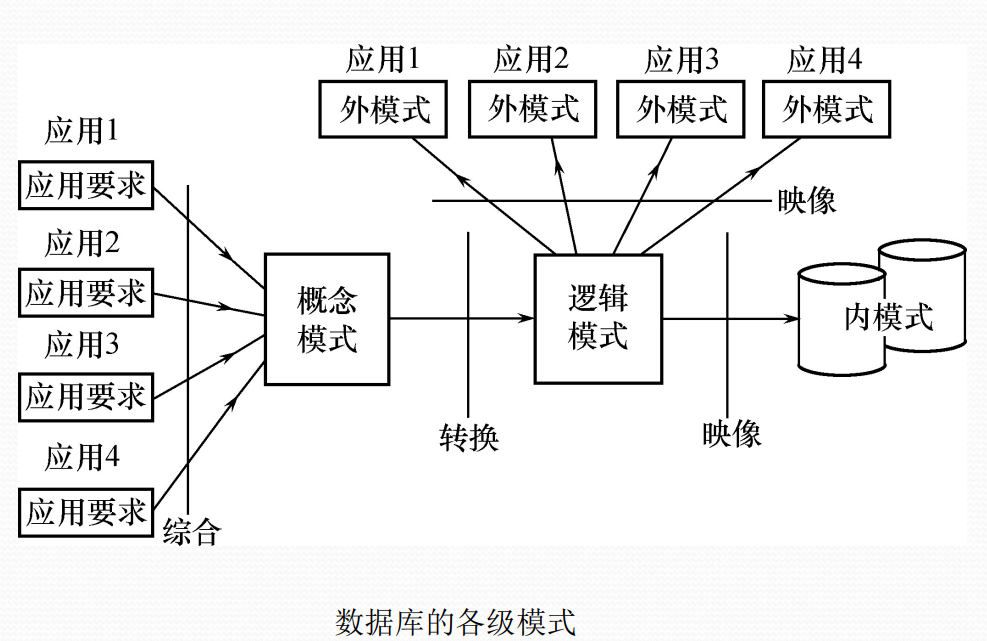

### 需求分析

